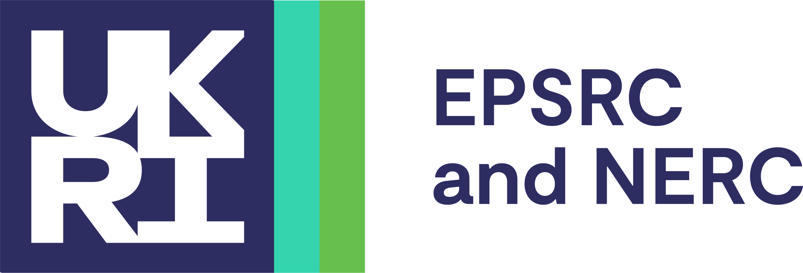

The ARCHER2 Service is a world class advanced computing resource for UK researchers. ARCHER2 is provided by [UKRI](https://www.ukri.org/), [EPCC](https://www.epcc.ed.ac.uk/), the [University of Edinburgh](https://www.ed.ac.uk/) and [Cray](https://www.cray.com/) a Hewlett Packard Enterprise company.

	

		
	

	

		<h3>
			<a href="https://www.ukri.org/">UKRI</a>
		</h3>

		

         
	<!--	UKRI info   -->

UKRI is the managing agent for the ARCHER2 service. This is a non-departmental, public body sponsored by the UK Government Department for Science, Innovation and Technology (DSIT). UKRI brings together the seven disciplinary research councils, Research England, and the UK's innovation agency, Innovate UK.
		 

		

	

	

		
	

	

		<h3>
			<a href="https://www.epcc.ed.ac.uk/">EPCC</a>
		</h3>

		

     
EPCC, part of the University of Edinburgh, hosts ARCHER2 and is responsible for the delivery of the Service Provision contract and Computational Science and Engineering contract. EPCC is the UK's leading centre of supercomputing and data science expertise. The centre provides world-class Supercomputing and data facilities and services for science and business. The goal is to accelerate the effective exploitation of novel computing throughout industry, academia, and commerce.

	

	

		
	

	

		<h3>
			<a href="https://www.ed.ac.uk/">University of Edinburgh</a>
		</h3>

		

     
The University of Edinburgh is a world-leading university of academic excellence. Opened in 1583, it is one of the UK’s oldest Universities. The University is home to the Advanced Computing Facility (ACF), EPCC’s high-performance-computing data centre. The facility hosts a range of HPC and data equipment with associated plant rooms for the power and infrastructure.

		

	

	

		
	

	

		<h3>
			<a href="https://www.cray.com/">Hewlett Packard Enterprise</a>
		</h3>

The ARCHER2 hardware is provided by a Cray EX supercomputer system that was procured from Cray. In late 2019, Cray was acquired by Hewlett Packard Enterprise (HPE). There are two HPE teams directly involved in supporting the ARCHER2 service. The on-site support team is based at the ACF and manages hardware and system software support on a 7×24 basis, liaising closely with EPCC and the HPE Centre of Excellence team to provide comprehensive support for the user community. The Centre of Excellence (CoE) supports the ARCHER2 service by providing, for example, in-depth support accessed through helpdesk channels, tailored training, and specific community support.

		
<a href="coe">Additional details on the CoE</a>.

	

