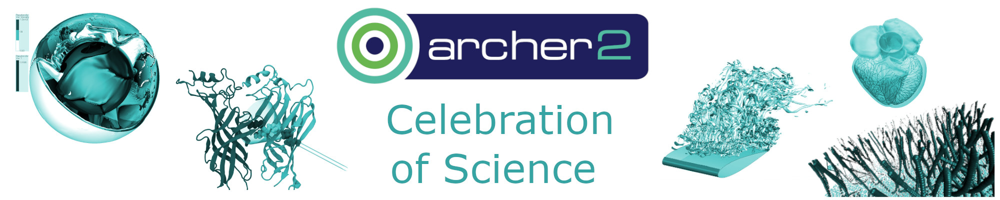

## Day 1: Thursday 7th March 2024

- 09:30 - 10:00	Day 1 Register and Welcome Coffee
- 10:00 - 10:10	Welcome (Dr Lorna Smith, EPCC)
- 10:10 - 11:10	Talk Session 1 
  -	10:10 - 10:30 Prof. Scott Woodley (UCL, MCC)
  -	10:30 - 10:50 Adrian Jackson (EPCC, NetZero)
  -	10:50 - 11:10 Prof. Tom Penfold (Newcastle University, HPC-CONEXS)
- 11:10 - 11:30	Coffee Break 
- 11:30 - 12:00	Keynote on Exascale (Prof. Mark Parsons, EPCC)
- 12:00 - 13:00	Panel Session - Ensuring Exascale Benefit UK Research
- 13:00 - 14:00	Lunch
- 14:00 - 15:20	Talk Session 2 
  -	14:00 - 14:20 Prof. Sylvain Laizet (Imperial College, UKTC)
  -	14:20 - 14:40 Dr Andrew Coward (University of Southampton, NOC)
  -	14:40 - 15:00 Prof. Syma Khalid (University of Oxford, HECBioSim)
  -	15:00 - 15:20 Dr Katy Clough (Queen Marry University of London, DiRAC)
- 15:20 - 15:40	Coffee Break
- 15:40 - 17:00	Lightning Talk Session
- 17:00 - 18:30	Drink Reception + Poster Session
- 18:30	Day 1 Finish

## Day 2: Friday 8th March 2024

- 9:00	Day 2 Start
- 09:00 - 10:00	User Group Session (hybrid)
- 10:00 - 10:20	Coffee Break
- 10:20 - 11:20	Talk Session 3 
  -	10:20 - 10:40 Dr Phil Hasnip (University of York, UKCP) / Talk from UKCP 
  -	10:40 - 11:00 Talk from Plasma HEC
  -	11:00 - 11:20 Dr Grenville Lister (University of Reading, Atmospheric and Polar Sciences Consortium)
- 11:20 - 11:50	Coffee Break
- 11:50 - 12:50	Talk Session 4 
  -	11:50 - 12:10 Prof. Kai Luo (UCL, UKCOMES) 
  -	12:10 - 12:30 Prof. John Brodholt (UCL, Mineral and Geophysics Consortium)
  -	12:30 - 12:50 Talk from HEC WSI
- 12:50 - 13:00	ARCHER2 Celebration of Science Wrap-up (Dr Lorna Smith, EPCC)
- 13:00 - 14:00	Lunch
- 14:00 - 16:00	Women in HPC Session - Diversity in Science
  -	13:40 - 14:10 Arrival and Coffee
  -	14:10 - 14:30 Intro and Welcome (Eleanor Broadway, EPCC and Jenny Wong, 2i2c)
  -	14:30 - 15:20 Interactive session
  -	15:20 - 16:00 Networking session (including nibbles and drinks)
- 16:00	Day 2 Finish

[Download agenda as PDF](ARCHER2_Celebration_of_Science_Agenda_draft.pdf)