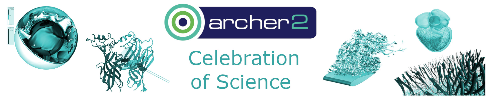

<!--

{: .img-center style="width: 40%" alt="Celebration of Science"  }
-->

## Registration and Call for Posters 

We are pleased to announce that the ARCHER2 Celebration of Science will take place on 7th – 8th March 2024 in Edinburgh at South Hall, The University of Edinburgh. 

The event will provide ARCHER2 users with the opportunity to showcase their science achievements on ARCHER2. The two-day programme will include a variety of talks from members of the ARCHER2 research consortia and other invited presenters involved in the ARCHER2 service, a poster session and a panel session focusing on preparing the UK science community for future Exascale systems. All attendees are welcome to join the drink reception on the evening of the first day.  

The event is in-person and there is no registration fee. Please [register here](https://bit.ly/ARCHER2-Celebration-of-Science-Registration "Registration form") to participate.  

**The registration deadline is 29th February 2024**. 

<h2><a name="materials">Registration</a></h2>
	

Event: **ARCHER2 Celebration of Science**

Date: **7th - 8th March 2024**

Location: South Hall, Pollock Halls, The University of Edinburgh, 18 Holyrood Park Road, Edinburgh EH16 5AY 

[Accessible Guide](https://www.accessable.co.uk/venues/south-hall-complex )

<iframe src="https://www.google.com/maps/embed?pb=!1m14!1m8!1m3!1d8938.63510169289!2d-3.1696381!3d55.9379531!3m2!1i1024!2i768!4f13.1!3m3!1m2!1s0x4887b880c677627b%3A0x35e0a7189a01b57c!2sSouth%20Hall%20Complex%2C%20Pollock%20Halls%2C%20University%20of%20Edinburgh!5e0!3m2!1sen!2suk!4v1699281768140!5m2!1sen!2suk" width="600" height="450" style="border:0;" allowfullscreen="" loading="lazy" referrerpolicy="no-referrer-when-downgrade"></iframe>

<section id="service">

    
	
 		
      

        <a class="ar2_linkbox ar2_linkbox-green" 
          href=" https://bit.ly/ARCHER2-Celebration-of-Science-Registration   ">
          Please complete the Registration form to attend the  <strong>Celebration of Science</strong>         
        </a>
      

 	

</section>

## Call for Posters 

We would like to invite the ARCHER2 community to submit posters for presentation at the ARCHER2 Celebration of Science on the 7th - 8th March 2024. Please complete the [Poster Abstract Submission Form ](ARCHER2_Celebration_of_Science_Poster_Abstract_Submission_Form.docx) and email it to events@archer2.ac.uk by **Tuesday 23rd January 2024**. 

 

###   Poster Contents: 

Posters should demonstrate your work on ARCHER2, showcasing the science outcomes and impact achieved.  

 

###    Submission Process and Key Dates: 

-    Please complete the [Poster Abstract Submission Form](ARCHER2_Celebration_of_Science_Poster_Abstract_Submission_Form.docx) and send it to [events@archer2.ac.uk](mailto:events@archer2.ac.uk) by **Tuesday 23rd January 2024**.  
-    All submissions received will be reviewed and the abstracts for the accepted posters will be published on the ARCHER2 website.  
-    Notifications of acceptance will be sent out by Tuesday 6th February 2024.  
-    An electronic version of your poster (PDF file) should be submitted to [events@archer2.ac.uk](mailto:events@archer2.ac.uk) by **Thursday 7th March 2024**.  
-    Posters will be uploaded to the ARCHER2 repository on [Zenodo ](https://zenodo.org/communities/archer2). DOIs can be arranged as requested in your Poster Abstract Submission From <link>.  

###    Poster Format and Readability 

We recommend you produce a poster of A0 portrait paper size (841 mm x 1189 mm) or A1 landscape paper size (841 mm x 594 mm). Please use accessible and easily readable fonts as well as accessible colour palettes to make it clear and easy to read for everyone.  

###    Attending and Presenting at the ARCHER2 Celebration of Science 

All poster presenters should register to attend the event using the [Registration Form](https://bit.ly/ARCHER2-Celebration-of-Science-Registration "Registration form")

 

Each poster presenter will need to print your own poster and bring it to the event. Boards and hanging materials will be provided at the event venue. 

 

All posters will be displayed during the 2-day event. A Lightning Talk session will be scheduled when each poster presenter will give a brief (~3-5 mins) talk on the content of their poster. There will also be a poster session when the poster presenters will be able to stand beside their posters and discuss their work with other event attendees. 

###    Prize 

A prize of £200 will be awarded to the Best Poster. The winner will be announced on the 8th March 2024.  

###    Contact 

If you have any questions about the ARCHER2 Celebration of Science, and/or for the poster submission, please do not hesitate to contact the [Event Organisers by email events@archer2.ac.uk](mailto:events@archer2.ac.uk). 

 

 

<!--

## Draft Agenda

	
### Day 1: Wednesday 18th October 2023	
- 10:00 - 10:30	Day 1 Register and Welcome Coffee
- 10:30 - 10:40	Welcome (from EPCC)
- 10:40 - 11:40	Talk Session 1 (3 talks, 20mins each)
- 11:40 - 12:00	Coffee Break 
- 12:00 - 13:00	Talk Session 2 (3 talks, 20mins each)
- 13:00 - 14:00	Lunch (at cafeteria)
- 14:00 - 14:30	Keynote on Exascale (Mark Parsons)
- 14:30 - 15:30	Panel Session - Preparing for Exascale
- 15:30 - 16:00	Coffee Break
- 16:00 - 17:00	Talk Session 3 (3 talks, 20mins each)
- 17:00 - 18:30	Drink Reception / Women in HPC Session
- 18:30	Day 1 Finish
	
	
	
### Day 2: Thursday 19th October 2023	
- 09:00 - 09:30	Day 2 Arrival
- 09:30 - 10:30	Talk Session 4 (3 talks, 20mins each)
- 10:30 - 11:00	Coffee Break
- 11:00 - 11:40	Talk Session 5 (2 talks, 20mins each)
- 11:40 - 12:30	Lightning Talk Session (50mins in total, ~3-5mins each, for all poster presenters)
- 12:30 - 13:00	eCSE Poster Session
- 13:00 - 14:00	Lunch (Bowl lunch)
- 14:00 - 15:00	User Group Session (hybrid)
- 15:00 - 15:10	Wrap-up 
- 15:10	Day 2 Finish
	
-->

We look forward to seeing many of you at the ARCHER2 Celebration of Science in Edinburgh!