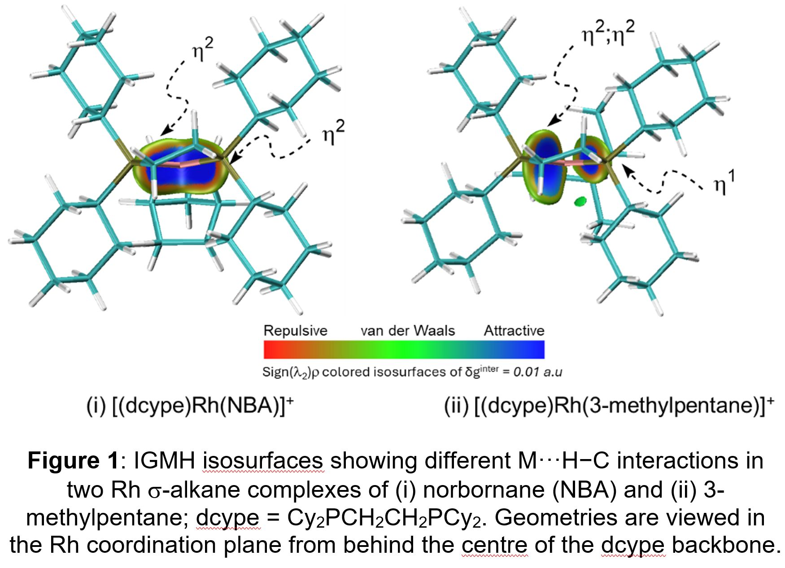

 

## Draft agenda 

### Day 1: Wednesday 14th May 2025

- 09:30 - 10:00 Day 1 Register and Welcome Coffee
- 10:00 - 10:10 Welcome from EPCC
- 10:10 - 11:25 Talk Session 1
- 11:25 - 11:45 Coffee Break
- 11:45 - 12:45 [Lightning Talk Session 1](#lightning-talk-session-1) (Poster 1 - 20, 3 mins each)
- 12:45 - 13:45 Lunch
- 13:45 - 14:45 Women in HPC Session
- 14:45 - 14:55 Mini break
- 14:55 - 16:10 Talk Session 2
- 16:10 - 16:30 Coffee Break
- 16:30 - 17:30 [Lightning Talk Session 2](#lightning-talk-session-2) (Poster 21 - 38, 3 mins each)
- 17:30 - 19:30 Poster Session / Drink Reception
- 19:30 Day 1 Finish

### Day 2: Thursday 15th May 2025

- 9:00 Day 2 Start
- 09:00 - 09:50 User Group Session
- 09:50 - 10:00 Mini Break
- 10:00 - 11:15 Talk Session 3
- 11:15 - 11:30 Coffee Break
- 11:30 - 12:00 Prof. Mark Parsons (EPCC, The University of Edinburgh) - Keynote
- 12:00 - 13:00 Panel Session
- 13:00 - 14:00 Lunch
- 14:00 - 15:40 Talk Session 4
- 15:40 - 15:50 Poster winner announcement & ARCHER2 Celebration of Science 2025 wrap-up
- 15:50 Day 2 Finish

## Confirmed  speakers and talk titles

| Speaker | Title  |
| --- | --- |
| Dr Abouzied Nasar (University of Manchester)	| SWIFT: Optimising GPU acceleration of Smoothed Particle Hydrodynamics with task-based parallelism  | 
| Prof. Andrew Morris (University of Birmingham)	| WAM! Fishing for the energy landscape of framework materials without a topological net  | 
| Dr Andrew Orr (British Antarctic Survey)	| Improving snowfall prediction in mountain regions by running a regional atmospheric model at kilometre grid-scales over the Himalayas and Alps  | 
| Annabel Basford (Imperial College London)	| Streamlining the automated discovery of supramolecular cage assemblies  | 
| Dr Bo Liu (STFC)	| Leveraging Large-Scale CFD to Improve Nuclear Reactor Safety and Support the Development of Engineering Modelling Tools.  | 
| Dr Chris Cantwell (Imperial College London)	| TBC, talk on Nektar++  | 
| Dr Chris Maynard (Met Office)	| Building Momentum: Developing a weather and climate modelling system for the Met Office and partners.  | 
| Dr Chris Richardson (University of Cambridge)	| FEniCSx Finite Element Methods on HPC  | 
| Dr Derek Groen (Brunel University of London)	| Migration modelling using HPC for UNHCR: challenges in doing it timely and robustly  | 
| Dr Eric Breard (University of Edinburgh)	| Modelling Volcanic Hazards with Supercomputers  | 
| Prof. Garth Wells (University of Cambridge)	| UKRI Living Benchmarks  | 
| Kaitao Tang (University of Oxford)	| Direct Numerical Simulations of Droplet Bag Breakup  | 
| Katherine Turner (British Antarctic Survey)	| TBC  | 
| Prof. Phil Biggin (University of Oxford)	| TBC, talk from HECBioSim  | 
| Dr Phil Hasnip (University of York)	| TBC, talk on CASTEP  | 

## Lightning Talk Session 1 

| ID | Poster presenter | Poster title 
| 1  | Chi Cheng (Cecilia) Hong, University of Edinburgh | [Insight into the Correlated Disorder of Fumarate-Based MIL-53 Frameworks: A Computational Study of Free-Energy Landscapes](#1) |
| 2 | Holly Lavery, Queen’s University Belfast  | [Computational Pump-Probe Spectroscopy for XFEL Experiments](#2) |
| 3 |Nathan Mannall, EPCC, University of Edinburgh  | [ngprMax + MPI: Large-scale open-source computational electrodynamics](#3) | 
| 4 | Ryan Kerr, United Kingdom Atomic Energy Authority  | [Modelling the long-range diffusion of chromium through W-Cr alloys using temperature accelerated dynamics](#4)  |
| 5 | Jacques Xing, Imperial College London | [Porting Nektar++ for Heterogeneous Computing](#5) |
| 6 | Matthias Frey, University of St Andrews  | [Performance comparison between two-sided MPI, MPI-3 RMA and OpenSHMEM for a particle cluster algorithm](#6)  |
| 7 | Bo Liu, UKRI-STFC Scientific Computing  | [Implementing a multiphase flow modelling capability in the high-fidelity software CHAPSim2](#7)  |
| 8 | Yongxin Wang, Imperial College London  | [Multi-scale numerical modelling of polymer permeation in sands](#8)  |
| 9 | Aristos Christou, Cardiff University | [Large Eddy Simulations for Fluid-Structure Interactions](#9) |
| 10 | Sophie Guillemot, University of Manchester |  [Bridging Computation and Experiment: Applying Computational Methods to Experimental Insights for Improved Property Estimation of Dy-Doped Cobalt Antimonide](#10) |
| 11 | Andre Vieira, University of Edinburgh | [HPC in Focus at The University of Edinburgh](#11) |
| 12 | Andrew Clarke, University of Leeds  | [Dipole-Multipole Transition in Rapidly Rotating Spherical Shell Dynamos](#12) |
| 13 | 	Daniel Storm, University of St Andrews | [Computational Study of Methane Activation at an Iridium Cyclometallated PONOP Complex in the Solid State](#13) |
| 14 | Kevin Mulder, University College London | [S2X: Accelerated and Differentiable Spherical Harmonic Transforms](#14) |
| 15 | Martin Plummer, STFC Scientific Computing | [Many-body theory of antimatter interactions with molecules](#15) |
| 16 | Martin Plummer, STFC Scientific Computing | [Enhanced parallelisation for R-matrix with time-dependence, double ionisation](#16)  |
| 17 | Laura Bevis, Queen Mary University of London | [Patient-Specific and Large-Scale Computational Modelling: Insights for Cardiac Digital Twins](#17) |
| 18 | Steven Williams, The University of Edinburgh – Centre for Cardiovascular Science | [High throughput electrophysiology data analysis using EP Workbench](#18) |
| 19 | Bryony Clifton, University of Bristol | [Investigating the proteolytic potential of an orphan rhomboid](#19) |
| 20 | Jennifer Mecking, National Oceanography Centre Southampton | [The CANARI HadGEM3 Large Ensemble](#20) |

## Lightning Talk Session 2 

| ID | Poster presenter | Poster title |
| 21 | Danjo De Chavez, University of Warwick | [ScalableQM-in-QM Embedding Framework in FHI-aims](#21) |
| 22 | Matthew Smith, University of York | [Future-Proof Parallelism for Plane-Wave DFT in CASTEP](#22) |
| 23 | Connor Box, University of Warwick | [Density functional perturbation theory and electron-phonon coupling in FHI-aims ](#23)|
| 24 | Sebastien Lemaire, EPCC, University of Edinburgh  | [Create impactful scientific visualisations on your laptop&#42;! (&#42; also requires access to HPC)](#24) |
| 25 | Sara Mesgari Sohani, University College London (UCL) | [A multi-scale numerical model for breaking waves using the Lattice Boltzmann method (LBM)](#25) |
| 26 | Ugyen Wangchuk, Loughborough University | [Investigation of transitional shock wave boundary layer interaction (SBLI) using flux reconstruction method and positivity-preserving entropy-based filtering approach](#26) |
| 27 | Rong Wei, School of Chemistry, University of Chemistry | [The structural dynamics and barocaloric response of organic ionic plastic crystals](#27) |
| 28 | Rodolfo Freitas, Queen Mary University of London | [An a posteriori assessment of AI-designed diesel blends: Molecular dynamics simulation of pollutant formation](#28) |
| 29 | Paul Bartholomew, EPCC, The University of Edinburgh | [A high-order accurate iterative Poisson solver for x3d2 ](#29)
| 30 | Jaya Vignesh Madana Gopal, Loughborough University | [Implementing a conservative level set method for multiphase simulation in spectral/hp element framework Nektar++](#30) |
| 31 | Torsten Auerswald, NCAS Reading | [High resolution climate simulations on Archer2](#31) |
| 32 | M. Arif Sajjad, University of St Andrews | [Mapping the Trajectory for C−H Activation in Solid-State σ-Alkane Complexes](#32) |
| 33 | Harry J Dunn, Newcastle University | [DNS/ iLES Vortex Dynamics for Vertical-Axis Wind Turbines](#33) |
| 34 | Guglielmo Vivarelli, Imperial College London Aeronautics | [Turbomachinery applications of the Spectral-h/p element solver Nektar++](#34) |
| 35 | Maurice Jamieson, EPCC, The University of Edinburgh | [ExaHyPE-DSL: Empowering black hole simulations on ARCHER2 through leveraging DSLs](#35) |
| 36 | Nick Brown, EPCC, The University of Edinburgh | [Computational Abilities Knowledge Exchange (CAKE): Knowledge exchange for the DRI programme](#36) |
| 37 | Julien Maes, Heriot-Watt University | [CFD Simulations in Ultra-Large Micro-CT Images of Porous Materials Using OpenFOAM on ARCHER2](#37) |
| 38 | Lorna Smith, EPCC, The University of Edinburgh | [EPCC Outreach](#38) |

 

### 1 Insight into the Correlated Disorder of Fumarate-Based MIL-53 Frameworks: A Computational Study of Free-Energy Landscapes 
Chi Cheng (Cecilia) Hong, University of Edinburgh 

As the effects of climate change become more apparent in the form of rising global temperatures, the necessity for temperature control become more significant. Current refrigerants are low cost and work extremely efficiently but these materials possess very high global warming potentials. A greener alternative is a solid-state approach via barocaloric materials which exhibit large adiabatic temperature and isothermal entropy changes upon compression and decompression cycles.  

Metal-organic frameworks (MOFs) are porous, crystalline materials that are highly modular due to the many metal and linker combinations possible. Notably, certain combinations of metals and linkers have shown to result in a breathing effect wherein the adsorption and desorption of guest molecules are accompanied by a large reversible volume change. Hence, they have been recognised as potential barocaloric materials. On top of the aforementioned combinations, another consideration is the correlated-disorder that can arise from the linker orientations which was previously shown to effect the mechanism in which a framework closes.  

My research focusses on unveiling the correlation between the transition metal centres of fumarate-based MIL-53 MOFs and the inherent flexibility of the framework as a result. Furthermore, a series of isoreticular MIL-53 frameworks from different synthetic pathways are being studied to understand how the linker induced correlated disorder affects the breathing mechanics of these frameworks. We gain insight on the flexibility of the frameworks by determining their free energy landscapes through first principles unbiased and biased molecular dynamics simulations. 

### 2 Computational Pump-Probe Spectroscopy for XFEL Experiments 	
Holly Lavery, Queen’s University Belfast 

Pump Probe Spectroscopy is a widely used experimental technique that allows us to study dynamics on ultra-short timescales. An initial pump pulse is used to initiate the dynamics, and after a short time delay, a secondary probe laser pulse explores the dynamics present. 

X-Ray Free Electron Lasers (XFELs) facilities have recently become available, and have opened up a new area of pump probe spectroscopy, where the initial pump laser removes a tightly bound inner-shell electron from the system. Observation of the dynamics resulting from pump probe spectroscopy can be difficult to interpret. Therefore, accurate theoretical models are required to properly understand the dynamics involved.  

We make use of the R-Matrix with Time Dependence (RMT) approach to model XFEL pump probe spectroscopy on Ne+. We apply our newly developed density matrix approach to connect two single-ionization RMT calculations and demonstrate this approach through the sequential ionization of Ne+ to Ne3+. We analyse the dynamics of the angular distribution of the photoelectrons arising from the photoionization of Ne2+.  

We have found that the time delay between the pump and probe pulses manifests as a change in the angular distribution of the photoelectrons, through the time variation of the quantum superposition the intermediate states in the Ne2+ ion.  

Full study on pump-probe spectroscopy of inner-shell electrons requires a detailed description of the atomic structure, making these calculations computationally expensive. We therefore require the use of High-Performance Computing Facilities such as ARCHER2 for this work. 

	

### 3 gprMax + MPI: Large-scale open-source computational electrodynamics 
Nathan Mannall, EPCC, University of Edinburgh  

gprMax is an open-source software package for computational electrodynamics. Designed with a general electromagnetic solver engine, it has a set of core features developed for modelling Ground Penetrating Radar (GPR) and can be used to model electromagnetic wave propagation in fields such as engineering, geophysics, archaeology, and medicine. gprMax runs via the command-line or its Python API and is written in Python with performance-critical parts in Cython. 

Before this project, simulations ran using a CPU solver parallelised using OpenMP or a GPU solver developed using the NVIDIA CUDA programming model. However, these solvers ran on a single CPU node or GPU preventing the full utilisation of HPC systems and limiting the size and resolution of models to those that fit in the memory of a single node. This poster showcases results from the two-year project (April 2023 - June 2025) to dramatically increase the modelling capabilities of gprMax. The completed work adds a Message Passing Interface (MPI) domain decomposition to the CPU solver allowing models to be divided between multiple nodes/MPI tasks. This can reduce the time to results when running on a single node, but more importantly, enables researchers to scale the size and/or resolution of their electromagnetic simulations to better utilise HPC systems. 

Here we present benchmarking and profiling results to demonstrate performance gains and new capabilities enabled by this work. Additional improvements focused on file formats for parallel I/O, a new suite of regression tests using the ReFrame framework, and creating visualisations of the model geometry and resultant electromagnetic field. 

	

### 4 Modelling the long-range diffusion of chromium through W-Cr alloys using temperature accelerated dynamics  
Ryan Kerr, United Kingdom Atomic Energy Authority 

To address the growing demand for low-carbon energy, the United Kingdom has committed to building the world’s first nuclear power plant by 2040, the Spherical Tokamak for Energy Production (STEP). One of the challenges faced by the STEP project concerns the oxidation of the reactor’s tungsten-based first wall, which may occur during a loss of coolant accident or during remote maintenance handling. To mitigate the oxidation of tungsten, there has been a growing interest in the use of ‘SMART’ alloys in future tokamak fusion reactor designs. In particular, the ternary alloy W-11.4Cr-0.6Y has been identified as a potential candidate for fusion reactor first walls owing to its favourable oxidation resistance and self-passivating behaviour. However, the role of the alloy elements, Cr and Y, is not fully understood from both the kinetic and thermodynamic standpoints. To investigate this behaviour, we have employed temperature accelerated dynamics using the LAMMPS code and density functional theory using the VASP code to study the behaviour of the binary W-Cr alloy. We demonstrate the vacancy-mediated segregation of Cr and quantitatively assess the effect of Cr concentration on the microstructural evolution of the alloy, and the role of oxygen impurities in the degradation of oxygen resistance in these alloys. By combining these techniques, we present our current understanding of the role of Cr and Y in tungsten SMART alloys and why the proposed composition offers the greatest oxidation resistance. 

This work presents atomistic simulations carried out on the ARCHER2 system, constituting novel research into the behaviour of the W-Cr system, which may apply to other binary alloys as well. It is aimed at those interested in materials modelling and materials for nuclear fusion, as well as the broader metallurgical community. 
 
	

### 5 Porting Nektar++ for Heterogeneous Computing 
Jacques Xing, Imperial College London 

Nektar++ is a modern open-source spectral/hp 
element framework developed for distributed 
memory architectures with scalability up to many 
thousands of processor cores using message-passing interface (MPI) for communication. 
However, heterogeneous computing architectures 
have recently become predominant in high-performance computing. In order to leverage the 
computing potential of modern heterogeneous 
computing hardware, notably graphic processor 
units (GPUs), a significant redesign effort of the 
Nektar++ framework has been initiated as part of 
the eCSE funding initiative. To ensure both 
performance and portability and platform-independence, Nektar++ is being redesigned to 
support multiple heterogeneous devices with 
support for Nvidia, AMD, and Intel GPUs in 
addition to the existing support for SIMD 
vectorization on CPUs. To achieve the desired 
ARCHER2 Celebration of Science 2025 Poster Abstract Submission Form v 1.0
portability and platform-independence, a unified 
framework is being developed using CUDA, HIP, 
and SYCL programming models. In this respect, the
present work describes the design and 
implementation of the multi-device back-ends as 
well as the memory management model use for 
host/device data consistency.

### 6 Performance comparison between two-sided MPI, MPI-3 RMA and OpenSHMEM for a particle cluster algorithm 
Matthias Frey, University of St Andrews 

We present a performance benchmark of a parcel cluster algorithm for N-body simulations that uses either MPI point-to-point, MPI-3 remote memory access (RMA) or OpenSHMEM communication for the nearest-neighbour graph splitting step. The benchmarks are performed on ARCHER2 (Slingshot 10 interconnect), Cirrus (InfiniBand interconnect) and hotlum (Slingshot 11 interconnect).
 
	

### 7 Implementing a multiphase flow modelling capability in the high-fidelity software CHAPSim2  
Bo Liu, UKRI-STFC Scientific Computing  

This work focuses on developing multiphase flow simulation capabilities in the Direct Numerical Simulation software CHAPSim2. The Volume of Fluid (VOF) framework in conjunction with a high accurate algebraic interface capturing algorithm has been implemented. In this method, the interface is identified and represented using a continuous hyperbolic tangent function. Unlike the traditional VOF methods that rely on geometrical interface reconstruction, this approach reconstructs the interface in an algebraic way and ensures the moving interface is captured faithfully and maintains a compact thickness. CHAPSim2 is a high-order finite difference solver, providing various numerical schemes, such as the 2nd and 4th order central difference and 4th order and 6th order compact schemes. These schemes can be employed to compute the numerical fluxes (key parameters in the interface capturing algorithm), potential improving the overall accuracy of the VOF method.

The solver has been systematically validated through a series of benchmark tests. The Zalesak’s rotation problem is first used to test the interface capturing and tracking algorithm, assessing its ability in accurately predicting interface motion due to advection while preserving interface sharpness. A well-documented rising bubble test is then conducted to validate the coupling of the interface algorithm with the flow solver. The simulation results show that CHAPSim2’s prediction are in excellent agreement with the benchmarking data in terms of bubble rising speed and bubble shape deformation. In future, we plan to extend the multiphase modelling capabilities of CHAPSim2 to boiling heat transfer.

	

### 8 Multi-scale numerical modelling of polymer permeation in sands  
Yongxin Wang, Imperial College London  

Support fluids are widely used in many geotechnical engineering practice such as piling, tunnelling and well drilling to provide temporal support before permanent structures installed. Polymer support fluids have advantages over conventional bentonite slurries in many situations; they are cheaper and can have a lower environmental impact. However, the incomplete understanding of the flow behaviour has caused a reluctance to use polymer fluids in industry. Polymer fluids exhibit a non-Newtonian rheology. Darcy’s law can therefore not be directly applied. Observations of flow behaviour from permeability tests (with soils) do not agree with predictions based on rheometer tests. Multi-scale fundamental understanding is key to develop and assess the next generation of support fluids. To achieve this goal, we first employed a direct numerical simulation (DNS) to investigate the interaction forces in ordered granular materials. Then, A generalised Darcy’s law is formulated for non-Newtonian fluids, validated through pore network modelling (PNM), which can provide valuable insights for scaling up to the field-scale applications. To further investigate how viscoelasticity impacts the polymer conductance in sands, simulations using more advanced constitutive equations of viscoelastic fluids are conducted.
	

### 9 Large Eddy Simulations for Fluid-Structure Interactions
Aristos Christou, Cardiff University 

Energy exploitation through offshore energy resources has experienced a significant increase in efforts to overcome the impact of climate change and global warming. Extreme weather conditions and challenging environments require further investigation into the interaction of offshore devices with realistic wave conditions to generate more cost-effective and reliable structures. In the present study, the in-house open-sourced Large Eddy Simulations (LES) numerical wave tank Hydro3D-NWT is employed to investigate the Fluid-Structure Interactions (FSI) in floating devices and explore the effect of turbulent flow on the efficiency of offshore structures. To examine the validity and efficiency of the code, various cases are examined such as the decaying motion of a floating sphere, the free fall of a triangular wedge, the rolling decaying motion of a rectangular box and the motion of a floating rectangular box interacting with monochromatic waves. In all FSI cases presented here, the wave elevations, the structures’ motion, body exerted forces and moments, as well as screenshots of the water surface and near-structure turbulent flow field are compared with corresponding experimental measurements and good agreement is observed in all cases. Additionally, it has been observed that the flow field imposed by non-linear waves and the motion of the floating structure form complex turbulent flow structures and a turbulent wake near floating devices. For this reason, the hydrodynamic properties such as the velocity, pressure and vorticity fields, as well as the exerted forces on the structures, are presented and discussed together with three-dimensional visualisations of the turbulent flow field.
	

### 10 Bridging Computation and Experiment: Applying Computational Methods to Experimental Insights for Improved Property Estimation of Dy-Doped Cobalt Antimonide 
Sophie Guillemot, University of Manchester 

Skutterudite cobalt antimonide contains cages
which can be filled upon doping, scattering
phonons through “rattler” mechanisms.
Calculations on Dy(III) as a rattler show promising
n-type behaviour in DyCo8Sb24. In-house
experiments report nominal concentration
Dy0.9Co8Sb24 as the best performing composition,
though Dy-rich secondary phases are identified in
the samples. Modelled electronic properties are
used to estimate carrier concentration, providing a
direct comparison to experimental methods. This
combined approach refines property prediction
and offers insight into optimising Dy-doped cobalt
antimonide for thermoelectric applications
	

### 11 HPC in Focus at The University of Edinburgh 
Andre Vieira, University of Edinburgh 

The University of Edinburgh (UoE) offers researchers a broad range of digital, data, and computing resources. The Research Facilitation team manages the Digital Research Services (DRS) website, a central access point for these resources, providing tailored advice and support to help researchers, support staff, and students navigate the digital research landscape.
  
In October–November 2024, the DRS Research Facilitators launched HPC in Focus, an events series connecting the university’s High-Performance Computing (HPC) communities and services. The programme featured contributions from EPCC, ITI, and the Information Services Group, offering an overview of the university’s HPC infrastructure. It included expert insights from computer scientists, chemists, and engineers on their use of HPC, networking opportunities with Women in HPC (WHPC) and the Community of Edinburgh Research Software Engineers (CERSE), and hands-on training for the UoE institutional supercomputer, Eddie, and a 2-day ARCHER2 HPC Carpentry.
 
The events attracted a diverse audience: 46% from the College of Science and Engineering, 31% from the College of Medicine and Veterinary Medicine, 11% from the College of Arts, Humanities and Social Sciences, and 11% from support staff. The events were especially popular among Early Career Researchers (60%). The feedback was positive, with attendance metrics and website traffic showing increased interest in HPC. Notably, participation from the College of Science and Engineering grew in subsequent Research Facilitation initiatives.  

By providing a comprehensive introduction to HPC resources, fostering interdisciplinary collaboration, and offering training opportunities, the HPC in Focus successfully strengthened engagement with HPC research tools and communities at the UoE. 

	

### 12 Dipole-Multipole Transition in Rapidly Rotating Spherical Shell Dynamos 
Andrew Clarke, University of Leeds  

The Earth’s magnetic field is generated by turbulent convective motions of molten iron in the outer core. The field is strongly dipolar, yet the paleomagnetic record shows many polarity reversals, where the North and South poles of the magnetic field have switched position. The processes causing polarity transitions are poorly understood: numerical simulations to date have struggled to obtain both a strongly dipolar field and polarity reversals. 

Control parameters for simulations are necessarily far from those in Earth’s liquid inner core, due to the highly turbulent nature of the fluid flow and the extreme influence of rotation through the Coriolis force, represented by the Ekman number (Ek). State of the art DNS simulations reach Ek~10-7, while the Earth has Ek~10-15. Much work has been done to find scaling laws and path theories to infer knowledge about the Geodynamo from these simulations. 

We investigate two path theories built on assuming a constant magnetic Reynolds number, and a balance between the Inertial, Magnetic, Archimedian and Coriolis (IMAC) forces on the fluid flow, and a third that removes inertia from the balance (MAC). 
We report results from around 20 numerical simulations each ran on ARCHER2 using Leeds Dynamo Code, written in modern fortran, using FFTW, netcdf and MPI.

Along all paths we find that dipolarity increases as more Earth-like conditions are reached, but by moderately increasing convective driving the multipolar/reversing regime can be reached, demonstrating that our approach is an efficient method to seek the transition in rapidly rotating simulations. 

### 13 Computational Study of Methane Activation at an Iridium Cyclometallated PONOP Complex in the Solid State 
Daniel Storm, University of St Andrews 

Metal complexes with supporting pincer ligands have been used extensively in the study of hydrocarbon C-H bond activation in solution.1 In 2009 the first example of a &sigma;-methane complex in solution was characterised spectroscopically at a neutral Rh-PONOP complex.2 An alternative approach to study &sigma;-alkane complexes is through Solid-state Molecular OrganoMetallic (SMOM) Chemistry.3 A recent example involves methane activation at the cyclometallated iridium PONOP complex, <b>1+</b> that has been characterised directly in the solid state (Figure 1).4

This poster describes the results of periodic density functional theory investigating this methane activation process. <b>Pathway A</b> involves rate-limiting C-H reductive coupling via <b>TS(1+-2a+)</b> to form 14e- [Ir(PONOP)]+ (<b>2a+</b>), followed by methane activation to obtain [Ir(PONOP)(H)Me]+ (<b>3+</b>). Alternative mechanisms all involve initial CH4 addition followed by C-H bond formation at the cyclometallated arm. The most accessible (<b>Pathway B</b>) involves an Ir(V) intermediate (<b>2b+</b>). <b>Pathway A</b> is computed to be the most stable with an overall barrier of 31.1 kcal/mol. This work will compare these different reaction mechanisms in both the solid-state and in the gas-phase.

References	

1. W. H. Bernskoetter, S. K. Hanson, S. K. Buzak, Z. Davis, P. S. White, R. Swartz, K. I. Goldberg and M. Brookhart, J. Am. Chem. Soc., 2009, 131, 8603–8613.

2. W. H. Bernskoetter, C. K. Schauer, K. I. Goldberg and M. Brookhart, Science, 2009, 326, 553–556.

3. F. M. Chadwick, T. Krämer, T. Gutmann, N. H. Rees, A. L. Thompson, A. J. Edwards, G. Buntkowsky, S. A. Macgregor and A. S. Weller, J. Am. Chem. Soc., 2016, 138, 13369-13378.

4. M. R. Gyton, M. A. Sajjad, D. J. Storm, K. M. Altus, J. C. Goodall, C. L. Johnson, S. J. Page, A. J. Edwards, R. O. Piltz, S. B. Duckett, S. A. Macgregor and A. S. Weller, J. Am. Chem. Soc., 2025, 147, 10, 8706-8719

	

### 14 S2X: Accelerated and Differentiable Spherical Harmonic Transforms 
Kevin Mulder, University College London 

Many fields of science and engineering encounter
data on spherical manifolds, such as the celestial
sphere in cosmology or the planet earth in climate
forecasting. Modelling and analysis of these
problems requires the spherical nature of the data
to be considered and incorporated in any potential
solutions.

While codes which can be applied to spherical
problems exist, they are severely limited in their
usefulness due to two common factors. First, the
codes are typically confined to the CPU and
therefore lacking the ability to take advantage of
powerful modern hardware accelerators, such as
GPUs. Second, they do not support automatic
differentiation which is critical for physical
modelling and AI training.

To remedy this, we develop the S2X code suite.
Consisting of four software packages implemented
in Python using the JAX framework with PyTorch
support. Therefore supporting automatic
differentiation and enabling scalable GPU
deployment on HPC systems through parallelized
algorithm design.

S2FFT provides spherical harmonic transforms and
forms the basis for S2WAV and S2SCAT. These
contain spherical wavelet transforms and spherical
scattering transforms respectively. S2AI provides
scalable and equivariant spherical convolution
neural networks.

### 15 Many-body theory of antimatter interactions with molecules 
Martin Plummer, STFC Scientific Computing 

Antimatter particles have the same mass but opposite electrical charges to their ordinary matter counterparts. Antimatter quickly annihilates in contact with ordinary matter - that is particle/antiparticle pairs are destroyed and an equivalent amount of energy is emitted. This property is used in current applications of positrons (anti-electrons) such as PET scans in hospitals and technology for characterisation of new materials. This eCSE project focusses on profiling, optimisation and enhancement of “EXCITON+”, a new and currently unrivalled code developed by project PI Dermot Green’s group since 2020 for ab initio many-body theory calculations of antimatter interactions with atoms and molecules. 

EXCITON+ is built on the underlying all-electron EXCITON code (authored by Co-I Charles Patterson). EXCITON+ can calculate positron binding energies, annihilation rates and Doppler-broadened annihilation gamma spectra with first principles ab initio inclusion of important positron-molecule correlations including polarization and virtual-positronium formation. Its first application resulted in quantitative understanding of a long-standing question of positron binding in polyatomic molecules [Hofierka et al, 2022, Nature 606, 688-693]. 

Here, we report on progress made on profiling and targeted optimization of EXCITON+ coding, with particular emphasis on opportunities for nested MPI/OpenMP parallelism and passive remote memory access to distribute parallelized tasks. Ongoing performance-enhancing work to introduce point group symmetry-aware calculation of molecular leptonic (positron + electrons) integrals is described. The overall aim is to ensure that EXCITON+ modules are computationally as efficient and future proof as the scientific content of the code is ground-breaking and comprehensive. 

	

### 16 Enhanced parallelisation for R-matrix with time-dependence, double ionisation 
Martin Plummer, STFC Scientific Computing 

To 'view' electrons in an atom or molecule, we must capture their motion on a time-scale comparable to their interactions. Ultrashort laser pulses can image and control electrons in motion. Free-electron laser facilities operating in VUV, XUV and X-ray regimes have opened up new approaches to investigate ultra-fast dynamics on femtosecond and sub-femtosecond timescales. The complex physics induced by high-energy laser pulses requires close interaction with accurate theory to interpret experimental findings.
 
R-matrix with time-dependence (RMT) is the world’s most sophisticated code for correlated laser-driven multielectron dynamics in atoms and molecules driven by arbitrarily polarised pulses, including relativistic effects in atomic systems. A major extension treats double-ionisation phenomena, wherein two interacting electrons may be ejected from an atom simultaneously. This massively increases complexity and computational workload. RMT now divides physical space into three regions. The first surrounds the nucleus, utilizing a basis expansion for fully correlated multi-electron effects. The single-ionisation and the new double-ionisation regions, with respectively one and two electrons far from the nucleus, utilize finite-difference grids. 

Each region adopts separate numerical schemes requiring distinct multi-layered parallelisation and communication to manage flow of information between regions. Performance issues with the new region restricted efficient operation to near 1500 cores.
We describe a complex additional layer of nested MPI in the new region to improve performance and match sophistication in the other regions. The project also investigates systematic choice of distribution of MPI tasks between regions to identify optimal load-balancing and performance strategies, crucial for large-scale ARCHER2 calculations. 

	

### 17 Patient-Specific and Large-Scale Computational Modelling: Insights for Cardiac Digital Twins 
Laura Bevis, Queen Mary University of London 

Computational cardiac modelling and cardiac digital twins involve the creation of physiologically accurate computational models of the heart using patient- and population-specific clinical data from baseline, imaging, and diagnostic testing. By facilitating detailed investigations into complex and theoretical cardiovascular scenarios, these in silico cardiac models can provide granular insights that are difficult or high-risk to obtain using traditional clinical techniques, thereby enhancing understanding of cardiac function and the information available for clinical decision-making. We use ARCHER2 and the cardiac arrhythmia research package (CARP) to model atrial and ventricular electrophysiology, as well as aortic blood flow, to investigate underlying mechanisms and treatment of cardiac arrhythmias such as atrial fibrillation and ventricular tachycardia, and aortic stenosis. Using both large-scale population-based studies and patient-specific investigations of individual patients, we simulate different treatment strategies in silico, with the aim of developing novel treatment approaches. Further integration with techniques in machine learning allows predictions to be made on realistic timescales for clinical applications.

	

### 18 High throughput electrophysiology data analysis using EP Workbench 
Steven Williams, The University of Edinburgh – Centre for Cardiovascular Science 

Cardiac electrophysiology describes the study and treatment of heart rhythm disorders (arrhythmias). Data collected during routine treatment of arrhythmias describe, in detail, cardiac anatomy, motion, structure and function and could therefore be used to enhance prognostication for arrhythmia patients.

Exposing these data for research has been a key objective of our efforts, delivered through the OpenEP project. EP Workbench, our graphical interface platform extends our prior work to large scale manipulation of data by providing point-and-click access to ARCHER2 compute resources, integration with a well-established open-source cardiac simulation engine (openCARP) and the ability to integrate custom plug-and-play algorithms into analysis pipelines.
The ongoing work of our group is using these features of EP Workbench to study arrhythmia mechanisms and treatments, in three key areas.

Firstly, we are using a digital twin approach to study heart rhythm disorder treatments including modelling the application of anti-arrhythmic drugs in patients with atrial fibrillation and studying ablation strategies in patients with atrial septal defects, a common form of congenital heart disease. Parameters to enable these experiments are configured through EP Workbench and simulations are run on ARCHER2 using the OpenCARP solver. 

Secondly, we have developed algorithms for quantifying cardiac electrical activation during atrial fibrillation (AF). The use of ARCHER2 in this setting will enable rapid turn-around for data analysis, critical for testing multiple treatment strategies on high fidelity 3D models of the heart.

Finally, we are developing a new pipeline strategy for processing cardiac electrophysiology data at the population scale using EP Workbench, ARCHER2 and our established compact data storage format (OpenEP). 

Taken together, this work demonstrates the ability of large-scale data analysis using EP Workbench and ARCHER2, unlocking previously inaccessible insights from electrophysiology data which may lead to future innovations in arrhythmia patient care.

	

### 19 Investigating the proteolytic potential of an orphan rhomboid 
Bryony Clifton, University of Bristol 

Intramembrane proteases regulate essential
signalling and quality control functions by
performing proteolysis of transmembrane proteins
within the lipid bilayer. Rhomboids are
intramembrane proteases that belong to a larger
rhomboid-like superfamily comprising inactive
pseudoproteases that have roles in wound
healing, cell migration and development.
However, many of their biological functions in
mammals remain to be elucidated.

This is perhaps best exemplified by RHBDL3, for
which no substrates and therefore no cellular roles
have been reported. The protease clearly performs
an important function, as RHBDL3 knockout in
mice is embryonically lethal. Additionally, RHBDL3
is highly expressed in the brain, and its expression
levels increase with age and neurological disease.

Collectively, these data hint that RHBDL3 regulates
neuronal membrane proteins, but its molecular
and cellular role is currently unknown.
Importantly, without a validated substrate, it is
unclear whether it is catalytically active.

We have employed unbiased screening
approaches in primary neurons to identify novel
substrates and regulators of RHBDL3. With
validation of these ongoing, we have turned to
computational modelling approaches to gain
fundamental insights into the molecular
mechanisms underlying RHBDL3 function. These
include AlphaFold predictions and molecular
dynamics to simulate the protein in a lipid bilayer,
supported by free energy calculations. We identify
that RHBDL3 has distinct conformational features
to other well-characterised rhomboids. These
insights reveal that either RHBDL3 is inactive like
the rhomboid pseudoproteases, or that potential
regulatory mechanisms unlock RHBDL3 activity.

	

### 20 The CANARI HadGEM3 Large Ensemble 
Jennifer Mecking, National Oceanography Centre Southampton 

As part of the UK wide CANARI project a large ensemble (40 members) has been developed using the HadGEM3 coupled climate model. The resolution of the model is 25 km in the ocean, 60 km in the atmosphere, which is higher than a typical IPCC model.  The simulations were run on ARCHER taking just over 1.5 years to run and using more than 3400 ARCHER kCUwith 30 ‘runners’ and generating over 5 Pb of data. Through collaboration with JASMIN this large volume of data is now being analysed by researchers across the UK. To kick-start the analysis we organised 2 sprints where we collaboratively started the analysis on the historical and future projection model simulations, with over 50 participants in each each sprint.
	

### 21 ScalableQM-in-QM Embedding Framework in FHI-aims 
Danjo De Chavez, University of Warwick 

Multiscale embedding techniques provide an optimal balance of high accuracy and computational efficiency for modeling extended materials. These methods focus on highly precise calculations for a small cluster subsystem, such as a catalytically active surface site, extracted from a larger system like a metal surface, while utilizing more efficient, lower-level methods for the surrounding periodic environment. The aim of this project is to develop a novel implementation of quantum mechanics (QM) embedding to describe cluster models embedded in extended periodic environments. The envisioned QM/QM approach takes an embedding potential, which is generated in a periodic Kohn-Sham Density Functional Theory calculation, and applies this as an embedding environment in an aperiodic higher-level calculation of the system. The approach enables the application of highly accurate theory in a localised manner, which will reduce computational cost and improve scalability on ARCHER2. Implementing this approach in FHI-aims will leverage its accurate atom-centered all-electron representation, improving simulations and scaling, particularly important for metallic systems studied by ARCHER2 users. Integration with the Atomic Simulation Interface (ASI) will enhance interoperability, streamline workflows, and extend benefits beyond the current FHI-aims community. This development facilitates highly accurate predictions for surface adsorption, bond dissociation, optical excitations, and charge transfer processes, significantly advancing the modeling of surface catalysis and spectroscopy.
	

### 22 Future-Proof Parallelism for Plane-Wave DFT in CASTEP 
Matthew Smith, University of York 

Plane-wave density functional theory (DFT) codes, i.e. those using a Fourier basis, consistently account for around a third of the total software usage on ARCHER2. Such codes typically decompose their 3D Fourier domain by distributing pencils of Fourier wave-vectors over MPI processes; 3D Fourier transforms are subsequently usually performed as sets of FFTs of lower dimensionality. The consequent inter-process communications are inherently quadratically-scaling and commonly determine the strong scaling limit of large materials modeling simulations.

We present our development of a domain decomposition, implemented in CASTEP (www.castep.org), which, to our knowledge, constitutes a novel approach to communications in the DFT community. We describe our decomposition and load-balancing as a coupled two-dimensional optimisation problem. We explain how a logical 2D process grid effectively achieves linear-scaling communications, and how the consequent constraints on load-balancing are ameliorated by adopting and adapting several task-scheduling algorithms.

We illustrate how the development performs in real-world simulations, dramatically reducing communication costs and significantly increasing the strong scaling limit. We illustrate efficient scaling on ARCHER2 to 4x as many processes as previously possible.

	

### 23 Density functional perturbation theory and electron-phonon coupling in FHI-aims 
Connor Box, University of Warwick 

Density-functional perturbation theory (DFPT) extends density functional theory (DFT) to compute the response properties of the electronic density. Depending on the type of external perturbation applied, DFPT can provide insights into a wide range of material properties. These include force constant matrices, phonons, polarizabilities, dielectric properties, electron-phonon coupling, non-adiabatic matrix elements, NMR shifts, and J-couplings. The electronic structure software FHI-aims features a unique local-orbital atom-based real-space implementation of linear response, built on a coupled perturbed self-consistent field (CPSCF) approach within DFPT. This framework enables the prediction of thermal and electrical response properties in materials. Previously, the linear response implementation contained significant code duplication, complicating maintenance and development. In this project, the code was refactored to improve structure and reduce redundancy. Around ten CPSCF implementations were consolidated into a unified DFPT module, reducing code size by over 60% while enhancing functionality. Common low-level routines were merged to streamline future development, and new modules were introduced for calculating specific response properties. The refactored DFPT code is now more modular, scalable, and user-friendly for both researchers and developers. It supports calculations for polarizability, dielectric constants, IR spectra, electron-phonon coupling, electronic friction.  The previous implementation did not allow metallic systems to be studied, but our developments now make this possible. We additionally discuss recent developments to the electron-phonon coupling driver in FHI-aims, which allows phonon modes and linewidths to be evaluated amongst other properties. 
	

### 24 Create impactful scientific visualisations on your laptop&#42;! (&#42; also requires access to HPC) 
Sebastien Lemaire, EPCC, University of Edinburgh  

BlenderRemoteRender (Brr) is a client-server tool for working with Blender in a research context.
Blender is a free and very powerful 3D design and rendering toolkit. Although it is used more and more by the research community for producing high quality scientific visualisation, its primarily target is 3D artists. One of the key workflow differences being that researchers may not have access powerful rendering hardware locally, but can access HPC resources like ARCHER2.
 
Brr allows researchers to work on their scenes and visualisations locally on a light client while seamlessly connecting to an HPC and submitting slurm jobs to render images and animations.

In practice, Brr is composed of a Blender addon on the client side and a Zero MQ server both implemented in python. The server is tasked with receiving configuration and data files from the client and submitting slurm (or other scheduler) jobs.

	

### 25 A multi-scale numerical model for breaking waves using the Lattice Boltzmann method (LBM)
Sara Mesgari Sohani, University College London (UCL) 

Wave breaking is a crucial oceanic process that facilitates momentum, heat, and gas exchange between the atmosphere and the sea. For example, oceans absorb air through bubble entrainment and dissolution. However, predicting breaking waves is challenging due to the wide range of physical scales involved, from kilometers to millimeters. No experimental setup fully captures these multi-scale, three-dimensional interactions, making numerical modeling essential.

This research develops a hybrid numerical model to bridge these scales. A third-order Stokes wave model first simulates the liquid phase before breaking. Then, the phase-field Lattice Boltzmann model (LBM) captures air-water interactions. This approach allows accurate representation of both phases and their interface while addressing the conflicting resolution requirements of large wavelengths and small air bubbles.

The in-house numerical model is three-dimensional and multi-scale, utilizing the Message-Passing Interface (MPI) library to enhance computational efficiency across large domains. Parallel computing enables high-resolution simulations that would otherwise be impractical. The model's accuracy and consistency have been validated by comparing its results with existing numerical studies across multiple test cases.

By bridging the gap between different physical scales, this model offers a powerful tool for studying breaking waves and their role in air-sea interactions. Its multi-scale capability provides insights that could improve climate modeling, ocean engineering, and environmental predictions.

	

### 26 Investigation of transitional shock wave boundary layer interaction (SBLI) using flux reconstruction method and positivity-preserving entropy-based filtering approach 
Ugyen Wangchuk, Loughborough University 

Scale Resolving Simulations are performed using a python-based flux reconstruction method (PyFR) to investigate a canonical problem of an oblique shock impinging upon a flat plate laminar boundary layer, which induces transition to turbulent boundary layer. Flux Reconstruction method offers high degree of element locality which allows for more efficient parallel computation. A novel positivity preserving entropy-based filter is used for shock-capturing. Unsteadiness of the separation bubble is investigated and compared between flow domain containing boundary layer imposed inlet and viscous leading edge interaction. 
	

### 27 The structural dynamics and barocaloric response of organic ionic plastic crystals 
Rong Wei, School of Chemistry, University of Chemistry 

Refrigeration systems account for 17% of global electricity consumption. As global temperatures rise, the demand for sustainable cooling technologies grows. Conventional refrigerants are highly efficient but have significant environmental impacts, necessitating greener alternatives. Barocaloric materials, which undergo large entropy and temperature changes under pressure, offer a promising solid-state solution.

Organic ionic plastic crystals (OIPCs) exhibit multiple solid-solid phase transitions that can be driven by pressure, making them attractive barocaloric materials. OIPCs have tunable interionic interactions, and their characteristic phase transitions from highly orientationally disordered to ordered phase allow for large entropy changes. However, the microscopic mechanisms governing their phase behavior remain unclear.

(Cyanomethyl)trimethylammonium hexafluorophosphate ([N111CN][PF6]) undergoes a four-step disorder-order transition with notable thermal hysteresis. Understanding the nature of the disorder in its high-temperature phase is crucial for optimising its barocaloric performance.

This research compares ordered models of the disordered phase to explore its structural flexibility. Ab initio molecular dynamics simulations will assess whether the disorder is static or dynamic.  These insights will advance the understanding of OIPCs as next-generation solid-state refrigerants. Furthermore, once a reliable metric has been established to quantify said disorders, large scale parallel simulations will be conducted to generate data to train a machine learning model.

	

### 28 An a posteriori assessment of AI-designed diesel blends: Molecular dynamics simulation of pollutant formation
Rodolfo Freitas, Queen Mary University of London 

To achieve net zero CO2 emissions by 2050–2060,
decarbonising hard-to-abate sectors, such as longdistance heavy-duty transport, is a top priority
globally. These sectors are particularly challenging
to decarbonise because of their reliance on highenergy-density liquid fossil fuels. In this context, it
is crucial to design low-carbon alternative fuels that
are compatible with existing engines and fuel
infrastructures. This work presents an advanced
framework for fuel design to develop sustainable
fuels that satisfy the high energy density
requirements of heavy-duty vehicles by integrating
machine learning models with physics-based
models. Firstly, we build a detailed quantitative
mapping between the chemical composition of the
fuel and the key properties of fuel utilisation using
a conditional generative model. After training the
conditional generative model that maps the
molecular structure of the fuel to key combustion
characteristics, we leverage it in a formal inverse
design framework to screen novel fuel blends that
match the required performance properties.
Finally, a posteriori assessment of pollutant
formation of the designed fuel blends is performed
using molecular dynamics. In particular, using the
reactive force field parameters in molecular
dynamics simulation, the detailed pathways of soot
formation examined include the thermal
decomposition of fuels, the formation of aromatic
rings, the mechanism of nucleation, and the mass
growth of nascent soot. The results show that AIdesigned fuels provide a high performance in terms
of harmful emissions, while keeping key
combustion properties of conventional diesel fuels,
allowing them to act as a drop-in.
	

### 29 A high-order accurate iterative Poisson solver for x3d2 
Paul Bartholomew, EPCC, The University of Edinburgh 
	
This poster presents the development of an iterative Poisson solver for the Xcompact3d framework. The development of x3d2, the next generation of the Xcompact3d solver targeting massively parallel multicore and GPU-based architectures, has included implementing distributed tridiagonal solvers. These distributed tridiagonal solvers enable a 3-D parallel decomposition of the bulk of the computation, exposing greater opportunity for parallelism than the currently used 2-D decomposition. The present FFT-based spectral Poisson solver however prevents this. In this work an iterative Poisson solver is developed for the high-order schemes employed by Xcompact3d/x3d2 and is used to demonstrate solution of the Navier-Stokes equations using a 3-D parallel decomposition for the first time in the Xcompact3d framework.

### 30 Implementing a conservative level set method for multiphase simulation in spectral/hp element framework Nektar++
Jaya Vignesh Madana Gopal, Loughborough University 

Spectral/hp element methods such as the Nektar++ available in ARCHER2 blend the advantages of h-type geometrical discretisation with the p-type spectral discretisation of Finite Element Methods. In the recent years, the advantages of utilising high degree piecewise polynomial basis functions for spectral (p-type) discretisation have led to the adaptation of spectral/hp element methods for resource intensive computational fluid dynamics simulations. However, they have been primarily limited to single-phase conditions alone. The availability of a robust interface capturing method coupled with Navier-Stokes equations is necessary to propagate spectral/hp element methods to the wider CFD community and their employment in multiphase numerical simulations corresponding to a broader range of practical applications.
 
Through the ARCHER2 eCSE11-5 project, we have implemented a conservative level-set method that exploits the spectral discretisation advantage in Nektar++ to provide better accuracy of the interface at lower computational cost. The benchmark level set method tests of advection (rotating circle) and deformation (vortex) as well as the Zalesak's slotted disk and 3D sphere deformation with the implemented spectral/hp level-set method have all confirmed this when compared against similar level-set methods in CFD and FEM. The current phase of the project aims to couple this conservative level set method with continuum surface tension model and gravity into the incompressible Navier-stokes solver/equations to assemble an effective spectral/hp multiphase solver capable of handling fluids with a density ratio of more than 1000.
The poster will showcase some of the current capabilities of our multiphase level-set solver implemented in Nektar++. 

	

### 31 High resolution climate simulations on Archer2 
Torsten Auerswald, NCAS Reading 

The HRCM group at NCAS Reading has produced several high resolution global climate simulations using Archer2 over the last years. We will present some highlights of these simulations which include results from several UM experiments with N1280 resolution and NEMO global runs on an ORCA25 grid. Analyses shown will include e.g. tropical cyclone and mesoscale convective system statistics. We will also show performance statistics of our simulations on Archer2.
	

### 32 Mapping the Trajectory for C−H Activation in Solid-State σ-Alkane Complexes 
M. Arif Sajjad, University of St Andrews 

C-H activation of alkanes is a key step in the functionalization of inert hydrocarbons in which &sigma;-alkane complexes are central intermediates.1 Highly unstable in solution, many &sigma;-alkane complexes have now been synthesized and characterized crystallographically via Solid-state Molecular OrganoMetallic (SMOM) chemistry. These studies have revealed how alkane coordination to metal centres occurs via diverse M···H−C interactions, ranging from monodentate (η1) through bidentate (η2) to bifurcated (η1;η2) coordination modes.2 These binding modes have previously been characterised qualitatively using non-covalent interaction (NCI) plots; however, the quantitative aspects of these interactions are less well explored.3 
In this work, we employed periodic DFT calculations using CP2K on ARCHER2 to optimize the structures of Rh &sigma;-alkane complexes. Subsequently, we characterized Rh⋯H−C interactions using the Independent gradient model based on Hirshfeld partitioning (IGMH), focussing on the quantitative aspects of different interaction types.4 Additionally, we examined the reaction profiles for the subsequent CH activation in [(dcype)Rh(NBA)]+ and [(dcype)Rh(cyclohexane)]+. Our results highlight parallels to Crabtree’s seminal work on the reaction trajectory of CH oxidation addition.5

References

1.	A. S. Weller, F. M. Chadwick and A. I. McKay, in Adv. Organomet. Chem. Eds: P. J. Pérez, Academic Press, 2016, vol. 66, pp. 223-276. 
	
2.	A. J. Martίnez-Martίnez, B. E. Tegner, A. I. Mckay, A. J. Bukvic, N. H. Rees, G. J. Tizzard, S. J. Coles, M. R. Warren, S. A. Macgregor, A. S. Weller, J. Am. Chem. Soc., 2018, 140, 14958-14970.
	
3.	A. J. Bukvic, A. L. Burnage, G. J. Tizzard, A. J. Martínez-Martínez, A. I. McKay, N. H. Rees, B. E. Tegner, T. Krämer, H. Fish, M. R. Warren, S. J. Coles, S. A. Macgregor, A. S. Weller, J. Am. Chem. Soc., 2021, 143, 5106-5120.

4.	T. Lu, Q. Chen, J. Comput. Chem., 2022, 43, 539-555.

5.	R. H. Crabtree, Chem. Rev., 1985, 85, 245-269.

### 33 DNS/ iLES Vortex Dynamics for Vertical-Axis Wind Turbines 
Harry J Dunn, Newcastle University 

Vertical-axis wind turbines (VAWT) have seen increased recent interest within offshore and urban environments, with additional scalability claims. Whilst experimental approaches have been used extensively to characterise VAWT, the typical planar measurements introduce limitations. Computational fluid dynamics (CFD) overcomes these, with explicit large eddy simulations (LES) currently representing the highest-fidelity approach. Using LES allows for good alignment with experimental results but is sensitive to the subgrid model. Additionally, LES is often coupled with the Actuator Line Method (ALM), impacting the near-wake region predictions. 

Here, DNS/ implicit LES (iLES) were conducted for a one-, two-, and three-bladed Darrieus VAWT. In contrast to ALM, the complete VAWT geometry is considered. Additionally, the subgrid models within LES are not present, with Spectral Vanishing Viscosity (SVV) stabilising the under-resolved scales. Most notably, this stream of research is the first use-case of DNS/ iLES within VAWT research. The numerical method employed is the high-order spectral/hp element within the Nektar++ framework. Using these high-order methods benefits from their favourable numerical properties, such as exponential convergence, and low dissipiation and dispersion that are essential for high-fidelity simulation of separated turbulence flows. A moving reference frame (MRF) formulation of the Navier-Stokes (NS) equations robustly handles the dynamics of the turbine geometry. A homogenous extrusion is performed, with periodic boundaries at the spanwise boundaries. The Reynolds number, <i>Re</i>, is kept to <i>O</i>(104), which has applications within extraterrestrial and small-scale VAWT. The wake is presented, with similar near-wake characteristics observed to <i>Re~O</i>(105 ). To further investigate these downstream behaviours, the vortex dynamics stemming from the turbine geometry are additionally considered. 

	

### 34 Turbomachinery applications of the Spectral-h/p element solver Nektar++ 
Guglielmo Vivarelli, Imperial College London Aeronautics 

Nowadays high-order methods have reached a degree of
maturity providing the industrial community with more accurate
tools whilst reducing computational cost. This is of interest to
the turbomachinery community, as understanding complex
phenomena, such as separation, turbulent transition, incoming
wakes and heat transfer, is costly with second-order solvers, but
is of critical importance for design improvement.

In this presentation, various jet engine components modelled
using the spectral-h/p element solver Nektar++ on the Archer2
HPC system are presented.

To start with, a flat plate with a pressure distribution
representative of a modern fan blade is discussed. Flow solver
set-up with roughness elements for turbulent transition will be
shown, with the relative flow structures and modelling
constraints.

Moving further into the engine, a compressor stator modelled in
DNS range with and without incoming turbulence is considered.
The accuracy and cost of this simulation will be discussed, along
with effect of the turbulent structures on the boundary layer and
an experimental comparison.

The last and most challenging component is the LS89 highpressure turbine. This was modelled at low and at high suction.
While the former reaches transonic range and only presents
vortices convecting off the blade trailing edge, the high-suction
provided significant difficulties. Due to the very low back
pressure, the flow accelerates from a Mach number of 0.15 to
1.2 in a matter of cm. This causes a shock to propagate from the
blade trailing edge to the outflow whilst interacting with the
boundary layer and, repeatedly, with the wake.

### 35 ExaHyPE-DSL: Empowering black hole simulations on ARCHER2 through leveraging DSLs 
Maurice Jamieson, EPCC, The University of Edinburgh 

ExaHyPE is an open-source simulation engine to write solvers for hyperbolic PDE systems. In
the UK, this code is primarily used to study gravitational waves. However, next generation simulations, such as those of Black Holes, require faster and more optimal compute kernels. Whilst ExaHyPE ships with several different numerical kernels, optimised for different use-cases, it is impossible to provide optimal kernel implementations for every situation as these often change over the runtime of the code. This poster will report progress made in the ExaHyPE-DSL eCSE project which avoids the need to manually develop, maintain and tune multiple kernels across CPUs and GPUs by the use of a Domain Specific Language (DSL). 

DSLs enable the programmer to express their intentions in a manner that is close to the problem in hand. Then, using this rich source of information the compiler is able to make informed decisions around the tricky, low level details of parallelism. In ExaHyPE-DSL we have developed a Python based DSL which, using the ExCALIBUR xDSL toolkit, generates optimal variants of the kernels and autotunes them at runtime. This work means that the scientific community will be able to use ExaHyPE to run hitherto unfeasible simulations and study novel physics; notably alternative models of gravitation.

	

### 36 Computational Abilities Knowledge Exchange (CAKE): Knowledge exchange for the DRI programme 
Nick Brown, EPCC, The University of Edinburgh 

The UK’s Digital Research Infrastructure (DRI) community brings software, algorithms and
infrastructure together. It has acquired a huge body of knowledge, but this is not well connected across the UK and sharing is uncoordinated. CAKE is a recently funded network plus that will form a central hub that facilitates Knowledge Exchange (KE) across UK DRI. The intention of this network is to provide resources to help connect both traditional and emerging DRI communities to facilitate collaboration including, identifying and addressing shared challenges across all the identified communities.

CAKE starts the 1st of April 2025, and builds upon the successes and lessons learnt from the ExCALIBUR programme. Therefore, whilst the network is very much in its kick off phase at the moment, there are a significant number of activities and initiatives that it builds upon and looks to continue.

A poster at the ARCHER2 celebration of science event will enable us to share with the ARCHER2 community plans for this network plus, to encourage and grow existing knowledge exchange activities and also make connections with new people in order to ensure that the community is aware of CAKE and encouraged to get involved. 

	

### 37 CFD Simulations in Ultra-Large Micro-CT Images of Porous Materials Using OpenFOAM on ARCHER2 
Julien Maes, Heriot-Watt University 

This study presents the largest-ever CFD simulation performed within a micro-CT image of a rock, leveraging High-Performance Computing (HPC) to model flow and transport in ultra-large porous materials. Using GeoChemFoam, an OpenFOAM-based solver, we conduct direct simulations on two rock formations: Bentheimer sandstone (1950×1950×10800 voxels, 6 µm resolution) and Estaillades carbonate (1202×1236×6000 voxels, 3.97 µm resolution). The latter presents greater heterogeneity, including microporosity. These full-resolution simulations, executed on the UK supercomputer ARCHER2, represent a significant milestone in computational geoscience.

A key innovation is the Darcy-Brinkman-Stokes approach, which replaces complex meshing with a volumetric indicator function, enabling efficient, fully parallelized Cartesian mesh generation. This method eliminates the need for image downscaling, ensuring simulations capture the rock’s intricate pore structure in full fidelity.

We assess both weak and strong scalability through subvolume decomposition, demonstrating that ARCHER2’s computational power, combined with our scalable methodology, allows full-resolution CFD simulations at an unprecedented scale. These results showcase the transformative potential of HPC for simulating flow in geological materials without compromising resolution, paving the way for highly detailed insights into subsurface transport processes critical to energy, hydrology, and engineering applications.

	

### 38 EPCC Outreach 
Lorna Smith, EPCC, The University of Edinburgh 
	
