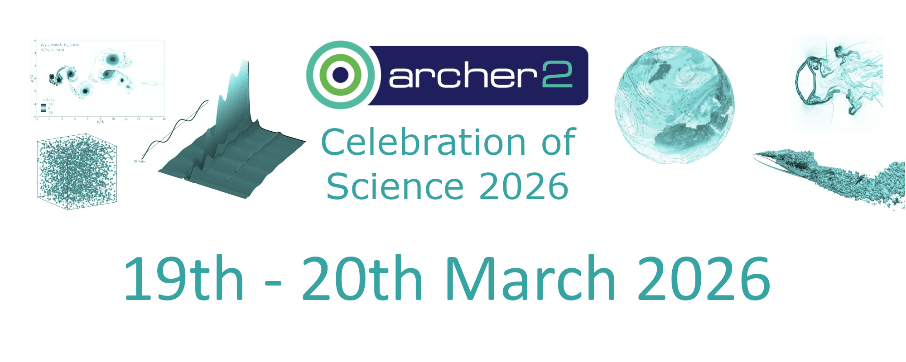

 

## Talk Abstracts

## Alexander Morozov (University of Edinburgh) 

### TBC 

TBC 

 

## Xin Zhou (University of Leeds) 

### TBC 

TBC 

 

## Caitlin McAuley (EPSRC-UKRI) 

### ARCHER2 (TBC) 

TBC 

 

## Marc A. Little (Heriot-Watt University) 

### TBC 

TBC 

 

## Nunzio Palumbo (Rolls Royce) 

### Towards Exascale Multiphysics Simulation of Sustainable Jet Engines Using Archer2 

TBC 

 

## Paul Bartholomew (EPCC) 

### Implementing a portable GPU backend for x3d2 using OpenMP offloading 

TBC 

 

## TBC (University of Manchester) 

### Porting and Optimizing DualSPHysics for Heterogeneous Architectures Using Kokkos and SYCL  

DualSPHysics is a state-of-the-art open-source solver of Smoothed Particle Hydrodynamics (SPH) for free-surface flow applications.  Accelerated on graphics processing units (GPUs), the code is widely used in academia and industry with 160,000+ downloads.  However, the acceleration has been only on a single GPU and tied to a specific vendor.  Future target applications require significantly more particles (e.g. billions), along with the associated memory and compute requirements, than what is currently possible with the latest version of the code. The aim of this project, therefore, is to extend both the availability and capability of DualSPHysics by providing a hardware-agnostic implementation that can run on heterogenous large-scale distributed systems. This talk will present the progress made in porting the code to both Kokkos and SYCL to create a performance-portable high-fidelity fluid-structure simulation software.  

 

## Paddy Roddy (UCL) 

### Porting GLASS to the Python Array API   

GLASS is a Python-based code used in Cosmology to generate full-universe simulations for large galaxy surveys. We are enhancing GLASS by porting it to Python's Array API, replacing its current NumPy and Healpy dependencies to enable execution on GPUs. This involves developing a compatibility layer for spherical harmonic transforms and optimising scientific models for GPU architecture. The resulting GPU-enabled GLASS will offer a significant performance boost, ease integration with other GPU codes, and support advanced techniques like auto-differentiable simulations using JAX, crucial for future cosmological analyses.  

 

## Ian Bush (STFC) 

###  GCRYSTAL - A GPU enabled CRYSTAL 

TBC 

 

## Nick Brown (EPCC, the University of Edinburgh) 

### MONC: Gaining greater insights into clouds and turbulent processes via GPUs   

The Met Office NERC Cloud model (MONC) is a high resolution atmospheric model for simulating clouds and turbulent flows. Used by a range of UK scientists, the demand is always to simulate higher resolution domains at reduced time to solution. Developed over a decade ago as a CPU only code targeting the original ARCHER supercomputer, I will describe our eCSE-GPU project that is modernising the code for both AMD and Nvidia GPUs. With the ultimate objective of making the code ready for future exascale supercomputer(s), the highly modular architecture of MONC in theory makes it easier to port to GPUs but of course the devil is in the detail! In this talk I will share the approach we have been undertaking to result in a GPU vendor agnostic port, highlight some of the challenges and share early performance results on both AMD and Nvidia GPUs. 

 

## James Panton (University of Cologne) - Remote 

### Blobs at the base of the mantle: Using HPC to uncover the evolutionary history of great geophysical structures.    

The large low velocity provinces (LLVPs) are seismically observed structures which sit at the base of Earth's mantle beneath Africa and Pacific Ocean. It is suggested that through the process of subduction, oceanic crust is transported from the surface and incorporated into the LLVPs, but the relative distribution of oceanic crust between the African and Pacific LLVP is an open question. Sadly, we cannot travel to the base of the mantle to directly sample these structures, and the timescales over which they develop is measured in 100's of millions of years, making it impossible to monitor changes to them. 

 

Here we present the coming together of 3-D mantle circulation simulations and 1-billion-year reconstructions of tectonic plate histories, allowing us to simulate the cycling of oceanic crust through the mantle. We find that the African and Pacific LLVPs form naturally as a result of subduction, but that they are compositionally distinct. Their compositional differences are hidden in seismic tomography due to the dominant effect of temperature on seismic velocity over composition. We find the Pacific LLVP has been continually replenished by subducted ocean crust for the last 300 Myr, leading to higher oceanic crust concentrations compared to the African LLVP, which comprises older and better mixed material. The compositional disparity implies a density difference between the two regions, which could explain differences in the observed heights of the structures.  

 

## Gabriele C. Sosso (University of Warwick) 

### First Steps Toward Understanding Ice Formation in Plants   

Understanding how ice forms and spreads in plants is crucial to reducing crop losses amid increasing climate extremes. Unlike in animal tissues, the microscopic determinants of freezing within plant cell walls remain poorly understood. Here, we combine plant biology experiments, mathematical modelling, and ARCHER2-enabled molecular simulations to link the chemistry of homogalacturonan (HG) pectin cross-linking to cell wall porosity and, ultimately, ice propagation. Building on our multidisciplinary framework for quantifying how cross-linking reshapes pore networks in vivo , we use large-scale simulations on ARCHER2 to resolve how HG functionalisation states (deprotonated, protonated, methylesterified) and Ca²⁺-mediated ordering control pore size and connectivity, and to model percolation of an advancing ice front through nanoconfined pectin pores. These results provide a physical basis for freezing tolerance via cell wall remodelling and illustrate how HPC-enabled, multiscale modelling can connect molecular interactions to tissue-scale freezing outcomes, suggesting strategies to concretely improve crop frost resistance by tuning pectin architecture. 

 

## Niamh O’Neill (Max Planck Institute for Polymer Research) 

### From Accurate Quantum Mechanics to Converged Thermodynamics for Ions in Solution with Machine Learning Potentials 

Obtaining accurate predictions of thermodynamic properties, especially free energies that define the state of a system, is a key goal in atomistic simulations. This demands pushing the frontiers of two paradigmatic problems: (1) achieving high electronic structure accuracy and (2) reaching converged sampling of the nuclear motion. Coupling advances across electronic structure theory, machine learning potentials and enhanced sampling, I will discuss approaches to obtain quantitative insight into the properties of ions in solution. 

I will begin by using NaCl in water as a prototypical example, highlighting short-comings with the work-horse method - density functional theory (DFT) - for ion pairing and transport properties, and approaches to go towards accurate correlated wavefunction descriptions [1]. I will then demonstrate a data-efficient approach to perform finite temperature simulations at the ’gold-standard’ CCSD(T) level. This approach has been applied to constant pressure simulations of liquid water, combined with nuclear quantum effects to enable agreement with experiments for structural and transport properties [2]. I further extend this framework to ions in solution, achieving excellent experimental agreement for the ion pair association free energy of CaCO3 in water - a challenging property for both classical force fields and DFT. This framework sets the stage for routine CCSD(T)-quality predictions for complex aqueous systems. 

[1] O’Neill, N.; Shi, B. X.; Fong, K.; Michaelides, A.; Schran, C. To Pair or Not to Pair? Machine-Learned Explicitly-Correlated Electronic Structure for NaCl in Water. J. Phys. Chem. Lett. 2024, 15 (23), 6081–6091. [https://doi.org/10.1021/acs.jpclett.4c01030](https://doi.org/10.1021/acs.jpclett.4c01030). 

[2] O’Neill, N.; Shi, B. X.; Baldwin, W. J.; Witt, W. C.; Csányi, G.; Gale, J. D.; Michaelides, A.; Schran, C. Towards Routine Condensed Phase Simulations with Delta-Learned Coupled Cluster Accuracy: Application to Liquid Water. J. Chem. Theory Comput. 2025, 21 (22), 11710–11720. [https://doi.org/10.1021/acs.jctc.5c01377](https://doi.org/10.1021/acs.jctc.5c01377) 

 

 