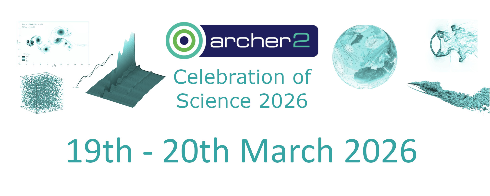

 

<section id="service">

    
	
 		
      

        <a class="ar2_linkbox ar2_linkbox-green" 
          href="https://www.archer2.ac.uk/community/events/celebration-of-science-2026/day0">
          Preceded on Day 0 by  <b>Championing Green Digital Research</b>  workshop      
        </a>
      

 	

</section>

We are pleased to announce ARCHER2 Celebration of Science 2026 will take place on the 19th - 20th March 2026 in Edinburgh at South Hall, The University of Edinburgh.  

There will also be a <a href="https://www.archer2.ac.uk/community/events/celebration-of-science-2026/day0">Day 0 workshop: <b>Championing Green Digital Research</b></a> which will take place at Sydney Smith - Doorway 1, Medical School, Teviot Place, The University of Edinburgh, Edinburgh, EH8 9AG, on Wednesday 18 March 2026, as the Day 0 of the ARCHER2 Celebration of Science 2026.

<section id="service">

    
	
 		
      

        <a class="ar2_linkbox ar2_linkbox-teal" 
          href="https://forms.office.com/e/bYHMcP8KLc?origin=lprLink">
          Please complete the Registration form to attend the  <strong>Championing Green Digital Research event</strong>  and/or <strong>ARCHER2 Celebration of Science 2026</strong>         
        </a>
      

 	

</section>

The event is in-person and there is no registration fee. 

## What to expect at ARCHER2 Celebration of Science 

ARCHER2 Celebration of Science is annual event that brings together the ARCHER2 user community to celebrate their scientific achievements on ARCHER2. You can explore the [highlights of previous events here]({{ base-url }}/community/events/#previous-events) and view the science showcased in the previous years. 

 

The two-day programme of ARCHER2 Celebration of Science 2026 will include: 

-    **Invited talks**: a variety of talks from the invited speakers highlighting their impactful research using ARCHER2. 

-    **Poster programme**: a platform for the ARCHER2 community to present and discuss their successes delivered on ARCHER2 through the lightning talks and the poster session. A Best Poster Prize will be awarded. - [Call for Posters](#call-for-posters) is now open!  

-    **Keynote**: the keynote will be given by Professor Mark Parsons, Director of EPCC. 

-    **Panel Session**: focuses on key topics for the ARCHER2 and UK research community. 

-    **ARCHER2 User Forum**: learn about the latest service updates and engage directly with the ARCHER2 team. 

-    **Diversity Session**: an interactive session to discuss the equality, diversity and inclusion challenges related to the delivery of HPC services. 

 

## Registration 

**Event**: ARCHER2 Celebration of Science 2026

**Date**: 19th – 20th March 2026

**Location**: South Hall, Pollock Halls, The University of Edinburgh, 18 Holyrood Park Road, Edinburgh EH16 5AY 

[AccessAble Guide](https://www.accessable.co.uk/the-university-of-edinburgh/conferences-and-events/access-guides/south-hall )

<iframe src="https://www.google.com/maps/embed?pb=!1m14!1m8!1m3!1d8938.63510169289!2d-3.1696381!3d55.9379531!3m2!1i1024!2i768!4f13.1!3m3!1m2!1s0x4887b880c677627b%3A0x35e0a7189a01b57c!2sSouth%20Hall%20Complex%2C%20Pollock%20Halls%2C%20University%20of%20Edinburgh!5e0!3m2!1sen!2suk!4v1699281768140!5m2!1sen!2suk" width="600" height="450" style="border:0;" allowfullscreen="" loading="lazy" referrerpolicy="no-referrer-when-downgrade"></iframe>

<section id="service">

    
	
 		
      

        <a class="ar2_linkbox ar2_linkbox-teal" 
          href="https://forms.office.com/e/bYHMcP8KLc?origin=lprLink">
          Please complete the Registration form to attend the  <strong>Championing Green Digital Research event</strong>  and/or <strong>ARCHER2 Celebration of Science 2026</strong>         
        </a>
      

 	

</section>

The registration deadline is **26th February 2026.** 

## Call for Posters 

We would like to invite the ARCHER2 community to submit posters for presentation at the ARCHER2 Celebration of Science 2026. The poster session and associated lightning talks have been highlights of previous Celebration of Science events, demonstrating the breadth of high-quality research from ARCHER2. Please complete the [Poster Abstract Submission Form ](ARCHER2_Celebration_of_Science_Poster_2026_Abstract_Submission_Form.docx) and email it to [events@archer2.ac.uk](mailto:events@archer2.ac.uk) extended to **Thursday 12th February 2026.**

 

###   Poster Contents 

Posters should demonstrate your work on ARCHER2, showcasing the science outcomes and impact achieved.  

###    Submission Process and Key Dates 

-    Please complete the [Poster Abstract Submission Form](ARCHER2_Celebration_of_Science_Poster_2026_Abstract_Submission_Form.docx) and send it to [events@archer2.ac.uk](mailto:events@archer2.ac.uk) extended to **Thursday 12th February 2026**.  
-    All submissions received will be reviewed and the abstracts for the accepted posters will be published on the ARCHER2 website.  
-    Notifications of acceptance will be sent out by **Thursday 19th February 2026**.  
-    An electronic version of your poster (PDF file) should be submitted to [events@archer2.ac.uk](mailto:events@archer2.ac.uk) by **Wednesday 18th March 2026**.  
-    Posters will be uploaded to the ARCHER2 repository on [Zenodo ](https://zenodo.org/communities/archer2). DOIs can be arranged as requested in your [Poster Abstract Submission Form ](ARCHER2_Celebration_of_Science_Poster_2026_Abstract_Submission_Form.docx).  

###    Poster Format and Readability 

We recommend you produce a poster of A0 portrait paper size (841 mm x 1189 mm) or A1 landscape paper size (841 mm x 594 mm). Please use accessible and easily readable fonts as well as accessible colour palettes to make it clear and easy to read for everyone.  

###    Attending and Presenting at the ARCHER2 Celebration of Science 2026 

All poster presenters should register to attend the event using the [Registration Form](https://forms.office.com/e/bYHMcP8KLc").

Each poster presenter will need to print your own poster and bring it to the event. Boards and hanging materials will be provided at the event venue. 

All posters will be displayed during the 2-day event. A Lightning Talk session will be scheduled during which each poster presenter will give a brief (~3-5 mins) talk on the content of their poster. There will also be a poster session when the poster presenters will be able to stand beside their posters and discuss their work with other event attendees. 

###    Prize 

A prize of £200 will be awarded to the Best Poster. The winner will be announced on the 20th March 2026.  

##    Contact 

If you have any questions about the ARCHER2 Celebration of Science, and/or for the poster submission, please do not hesitate to contact the Event Organisers by email [events@archer2.ac.uk](mailto:events@archer2.ac.uk). 

 
##  Calendar 

[Add this event to your calendar](myevents.ics).

## Previous events

[Previous events can be found here.](https://www.archer2.ac.uk/community/events/#previous-events).

##  Agenda and event details

To be available soon.

