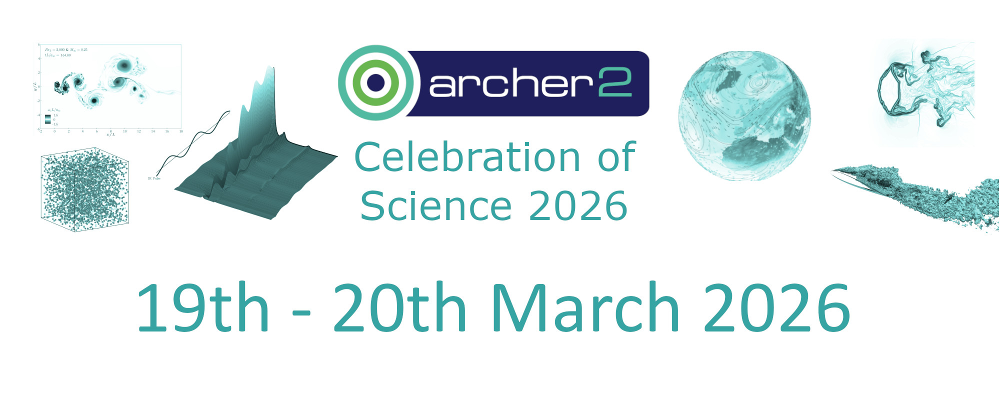

 

<section id="service">

    
	
 		
      

        <a class="ar2_linkbox ar2_linkbox-green" 
          href="./index#registration">
          Map to venue,  and event information     
        </a>
      

 	

</section>

# Agenda

## Day 1: Thursday 19th March 2026

- 09:30 - 10:00 Day 1 Register and Welcome Coffee
- 10:00 - 10:10 Welcome from EPCC
- 10:10 - 11:25 [Talk Session 1](#confirmed-speakers-and-talk-titles) 
    - 10:10 - 10:35 Alexander Morozov (University of Edinburgh)
    - 10:35 - 11:00 Xin Zhou (University of Leeds)
    - 11:00 - 11:25 Caitlin McAuley (EPSRC-UKRI) 
- 11:25 - 11:45 Coffee Break 
- 11:45 - 12:35 [Talk Session 2](#confirmed-speakers-and-talk-titles)
    - 11:45 - 12:10 Marc A. Little (Heriot-Watt University)
    - 12:10 - 12:35 Nunzio Palumbo (Rolls-Royce)
- 12:35 - 13:30 Lunch
- 13:30 - 14:45 Interactive session
- 14:45 - 15:00 Coffee break
- 15:00 - 16:15 [Talk Session 3 (GPU-eCSE talks)](#confirmed-speakers-and-talk-titles)
    - 15:00 - 15:15 Paul Bartholomew (EPCC, University of Edinburgh)
    - 15:15 - 15:30 Benedict D. Rogers (University of Manchester) 
    - 15:30 - 15:45 Paddy Roddy (UCL) 
    - 15:45 - 16:00 Ian Bush (STFC) 
    - 16:00 - 16:15 Nick Brown (EPCC, University of Edinburgh) 
- 16:15 - 16:30 Coffee break
- 16:30 - 18:00 [Lightning Talk Session](#lightning-talks) 
- 18:00 - 19:30 Poster Session / Drink Reception
- 19:30 Day 1 Finish

## Day 2: Friday 20th March 2026

- 08:30 - 09:00 Day 2 Arrival Coffee
- 09:00 - 10:00 [User Forum](https://www.archer2.ac.uk/training/courses/260320-user-forum/)
- 10:00 - 10:10 Mini Break
- 10:10 - 11:25 [Talk Session 4](#confirmed-speakers-and-talk-titles)
    - 10:10 - 10:35 James Panton (University of Cologne) - Remote
    - 10:35 - 11:00 Gabriele C. Sosso (University of Warwick)
    - 11:00 - 11:25 Niamh O’Neill (Max Planck Institute for Polymer Research)
- 11:25 - 11:40 Coffee Break
- 11:40 - 12:10 Prof. Mark Parsons (EPCC, University of Edinburgh) - Keynote
- 12:10 - 13:00 Panel Session
- 13:00 - 14:00 Lunch
- 14:00 - 15:45 Digital Research Landscape - Projects, Skills and Resources Session
- 15:45 - 16:00 ARCHER2 Celebration of Science 2026 wrap-up
- 16:00 Day 2 Finish

## Confirmed speakers and talk titles

| Speaker | [Title (click on title to read abstract)](abstracts#talk-abstracts)  |
| --- | --- |
| Alexander Morozov (University of Edinburgh)| [Narwhals and their blessings on ARCHER2](abstracts#1) |
| Xin Zhou (University of Leeds) | [Quantifying the long-term decay of Hunga stratospheric water vapour using chemistry transport modelling on ARCHER2](abstracts#2) |
| Caitlin McAuley (EPSRC-UKRI) | [ARCHER2](abstracts#3) |
|Marc A. Little (Heriot-Watt University) | [Designing Functional Crystals with Optimal Pore Structures](abstracts#4) |
|Nunzio Palumbo (Rolls-Royce) |  [Towards Exascale Multiphysics Simulation of Sustainable Jet Engines Using Archer2](abstracts#5) |
| Paul Bartholomew (EPCC) | [Implementing a portable GPU backend for x3d2 using OpenMP offloading](abstracts#6) |
|Benedict D. Rogers (University of Manchester) | [Porting and Optimizing DualSPHysics for Heterogeneous Architectures Using Kokkos and SYCL](abstracts#7) |
| Paddy Roddy (UCL)| [Porting GLASS to the Python Array API](abstracts#8) |
|Ian Bush (STFC)| [GCRYSTAL - A GPU enabled CRYSTAL](abstracts#9)|
|Nick Brown (EPCC)| [MONC: Gaining greater insights into clouds and turbulent processes via GPUs](abstracts#10)|
|James Panton (University of Cologne) - Remote|  [Blobs at the base of the mantle: Using HPC to uncover the evolutionary history of great geophysical structures](abstracts#11)|
|Gabriele C. Sosso (University of Warwick)| [First Steps Toward Understanding Ice Formation in Plants](abstracts#12)|
|Niamh O’Neill (Max Planck Institute for Polymer Research)| [From Accurate Quantum Mechanics to Converged Thermodynamics for Ions in Solution with Machine Learning Potentials](abstracts#13)|

## Lightning Talks

| ID | Poster presenter | Poster title 
| 1 |	*withdrawn* | 
| 2 |	David Lewis, University of Liverpool |	[New, high-performance algorithms for the computation of the Hardy Function](#p2) |
| 3 |	Ivan Tolkachev, University of Oxford |	[Irradiation tolerance of nanocrystalline Fe and FeCr: Large scale atomistic simulations and matched experiments](#p3) |
| 4 |	Dylan Green, University of Oxford |	[Wake Dynamics of Floating Offshore Wind Turbines](#p4) |
| 5 |	Timothy Rafferty, University of Oxford |	[Wind farms, understanding the gravity of their atmospheric interactions ](#p5)|
| 6 |	Valeria Mascolo, NCAS, Department of Meteorology, University of Reading |	[Sampling a North Atlantic Tipping Point: Rare-Event Algorithms in UKESM on ARCHER2](#p6) |
| 7 |	James Richings, EPCC, University of Edinburgh |	[Reframe: Test on a postcard ](#p7) |
| 8 |	Amy Davis, Queen’s University Belfast |	[Investigating electron dynamics in the transition from the weak laser-field to the strong laser-field regime](#p8) |
| 9 |	Jundi He, Department of Mechanical and Aerospace Engineering, The University of Manchester |	[Development of a turbulence generator based on improved synthetic eddy method (iSEM) and volumetric source term](#p9) |
| 10 |	Evgenij Belikov, EPCC, University of Edinburgh |	[Understanding weather and climate dynamics using high-resolution global cloud resolving models](#p10) |
| 11 |	Rong Wei, University of Edinburgh |	[The structural dynamics and barocaloric response of organic ionic plastic crystals](#p11) |
| 12 |	Martin Plummer, STFC Scientific Computing |	[Controlling multi-region multi-layered parallelisation for R-matrix with time-dependence, double ionisation](#p12) |
| 13 |	Chi Cheng (Cecilia) Hong, University of Edinburgh |	[Conformational Isomerism Tunes Refrigeration Potential in Metal Organic Frameworks](#p13) |
| 14 |	Laura Moran/Anna Roubickova, EPCC, University of Edinburgh |	[DRI-focussed training for research facilitators and teams (DRIFT)](#p14) |
| 15 |	Benjamin Speake, UKRI Science and Technology Facilities Council |	[Highly coarse-grained polarisable water models for mesoscopic simulations](#p15) |
| 16 |	Diego Renner, Imperial College |	[From Kernels to Solvers: Performance-Portable High-Order PDE Simulation in Nektar++](#p16) |
| 17 |	Evgenij Belikov, EPCC, University of Edinburgh |	[An investigation of Powersched on ARCHER2](#p17) |
| 18 |	Alexei Borrisov, EPCC, University of Edinburgh |	[Hybrid scaling of particle suspension simulations](#p18) |
| 19 |	Holly Lavery, Queen’s University Belfast |	[Computational modelling of Neon High-Harmonic Generation](#p19) |
| 20 |	Amir Miresmaeili, University of Edinburgh |	[Scalable Pipeline for Analysis of Resting-State EEG Spectral Biomarkers in Aging and Neurodegeneration](#p20) |
| 21 |	Ashutosh Shankarrao Londhe, Queen’s University Belfast |	[Re-engineering FLAMENCO, a Low-Mach Fully Compressible Steady Turbulent Flow Solver, with OPS-DSL for Performance Portability across Diverse HPC Architectures](#p21) |
| 22 |	Annette Osprey, NCAS, University of Reading |	[The Atlantic Meridional Overturning Circulation: Exploring sensitivity to model resolution using ARCHER2](#p22) |
| 23 |	*withdrawn* |
| 24 |	David Henty, EPCC, University of Edinburgh |	[The Art of the Exercise: Development of Parallel Programming Exercises for EPCC Courses](#p24) |
| 25 |	Yiyun Raynold Tan, STFC Hartree |	[Cross-platform GPU Implementation of OpenFOAM Using Only ISO C++ standard parallelism](#p25) |
| 26 |	Juan Carlos  Bilbao-Ludena, National Centre for Atmospheric Science |	[Workflow Automation for Reliable Data Transfer and Storage Between ARCHER2 and JASMIN](#p26) |
| 27 | Anirvinya Samanyu Tirumala, UKAEA / University of Oxford | [Modelling the effects of Irradiation Damage on Materials for Fusion](#p27)  | 
| 28 | Ritchie Somerville, EPCC, University of Edinburgh | [The UK AI Factory Antenna (UKAIFA) – supporting Artificial Intelligence adoption across the UK and Europe](#p28) |
| 29 | Lorna Smith, EPCC, University of Edinburgh |  [Environmental Sustainability at the Advanced Computing Facility](#p29) |
| 30 |	Nick Brown, EPCC, University of Edinburgh |	[CAKE: Better connecting and coordinating global Digital Research Infrastructure](#p30) |
| 31 | Francisco Duran del Fierro, University College London  | [Inclusive Futures for the National Federation of Digital Research Infrastructures (DRIs): Power Relations and Epistemic Cultures](#p31) |
| 32 | Kieran Leach, EPCC, University of Edinburgh | [UKRI Research Data Landscape Survey](#p32)

## Lightning Talk Abstracts

  

### 1		

*withdrawn*

### 2		New, high-performance algorithms for the computation of the Hardy Function
David Lewis, University of Liverpool

The Riemann zeta-function &zeta;(<i>s</i>)  for <i>s</i> ∈ &#8450;, is a complex function fundamental to prime number theory. Computation of &zeta;(<i>s</i>) along the critical line <i>s</i>=1⁄2+I<i>t</i>, <i>t</i> ∈ &#8477;, is important for the distribution of primes, since all the zeta-zeros are predicted to lie here (the <i>Riemann Hypothesis</i>). Hardy’s Z-function <i>Z</i>(<i>t</i>)=eI<i>θ</i>(<i>t</i>) &zeta;(1⁄2+I<i>t</i>), <i>θ</i>(<i>t</i>) ∈ &#8477;, defines the amplitude of the zeta-function along the critical line. Such computations also provide a means of <i>Riemann Hypothesis</i> verification, within closed intervals, and estimates on the bounds of &zeta;(1⁄2+I<i>t</i>), central to the <i>Lindelöf Hypothesis</i>.
         
Until recently, the most efficient means of computing <i>Z</i>(<i>t</i>) employed the Riemann-Siegel (RS) formula, an <i>O</i>(√<i>t</i>) operational method. In 2011, this was superseded by an algorithm devised by G. A. Hiary, requiring just <i>O</i>(<i>t</i>1/3){<i>log</i>(<i>t</i>)}κ ) operations. The methodology involved the sub-division of the RS formula into sequences of quadratic Gauss sums of length 𝑁. Such sums are amenable to rapid computation, in 𝑂(𝑙𝑜𝑔(𝑁)) operations, using a recursive scheme. This poster will present an advancement on these ideas. Central to this work is a new asymptotic formula for 𝑍(𝑡), with some interesting analytical properties. Computationally, this new formulation allows one to improve on the quadratic sum expansion and express 𝑍(𝑡) in terms of sub-sequences of <i>mth</i>-order Gauss sums. In the cubic <i>m</i>=3 case, these sums can be computed rapidly, utilising a similar scheme to that used for the quadratics. The result is a more efficient algorithm, requiring only <i>O</i>((<i>t</i> ⁄ ε<i>t</i> )1/4 {<i>log</i>(<i>t</i>)}3 ) operations. Sample computations, using the open-source code developed for this [eCSE Project](https://www.archer2.ac.uk/ecse/reports/eCSE11-07/) and available on GitHub repository, support these findings.

### 3		Irradiation tolerance of nanocrystalline Fe and FeCr: Large scale atomistic simulations and matched experiments
Ivan Tolkachev, University of Oxford

During operation, deuterium-tritium fusion devices generate high-energy neutrons that
penetrate the lattice of reactor components,
triggering collision cascades. The resulting material
defects cause degradation of the thermal and
mechanical properties of the constituent material.
Nanocrystalline materials, characterised by their
small grain size, have been proposed for reactor
applications due to their high grain boundary
density. Grain boundaries are thought to act as
sinks for irradiation defects, increasing the lifespan
of reactor materials. FeCr binary alloys can be
studied as model materials to understand the
behaviour of reduced activation ferritic–martensitic steels likely to be used in the first wall
and breeding blanket of future fusion reactors.
In this poster, we present the results of our
irradiation simulations on ARCHER2 and make
comparisons with experimental data. LAMMPS is
used to run collision cascade simulations,
mimicking irradiation damage in nanocrystalline Fe
and FeCr. For comparison, initially pristine cells are
also irradiated. ARCHER2 was vital for these
simulations as it allowed for large cell sizes that
capture collective physical effects whilst also
enabling large dose simulations to explore longterm evolution. Grain growth is observed for all
nanocrystalline cells, and a lower final dislocation
density for initially nanocrystalline cells when
compared to pristine cells. Chromium does not
appear to alter the grain growth rate. Remarkably
the growth rate from MD simulations, closely
matches that observed in XRD measurements of
ion-irradiated, nanocrystalline Fe and FeCr discs.
These results reveal key mechanisms underlying
nanocrystalline material evolution under
irradiation, providing guidance for developing
next-generation radiation-resistant steels.

### 4		Wake Dynamics of Floating Offshore Wind Turbines
Dylan Green, University of Oxford

The platform motions of floating wind turbines can elicit large-scale unsteady responses in the downstream wake behaviour. This has consequences for farm-scale power production and fatigue loading on turbines. As such, optimal design for future floating offshore wind farms requires an improved understanding of the complex mechanisms that drive these unsteady flows. This challenge is further complicated by the turbulent sheared inflow typical of offshore environments.  
In this study, we investigate the relationship between floating turbine motion-induced wake dynamics and offshore wind conditions using high-fidelity numerical simulations. A precursor simulation is used to develop a representative sheared turbulent flow. Subsequently, the flow is injected into a successor simulation wherein an actuator line model provides a virtual representation of the turbine. This methodology enables a high-resolution view of the unsteady fluid mechanics, such as discrete blade effects and the subsequent wake dynamics, while maintaining computational feasibility. Addressing this multi-scale problem demands significant computational resources and highlights the role of high-performance computing in advancing technologies critical to net-zero energy goals. 
This submission is aimed at ARCHER2 users engaged in large-scale computational fluid dynamics, turbulence modelling, and those interested in and working on renewable energy solutions. The study highlights the use of high-fidelity, computationally intensive simulations to address multi-scale problems, showcasing the capabilities that are relevant across computational science and engineering.

### 5		Wind farms, understanding the gravity of their atmospheric interactions
Timothy Rafferty, University of Oxford

With the growth of offshore wind farm capacity in the North Sea, the challenges that come from the increased interaction with large scale atmospherics must be understood. Notably the newest turbines, which now reach up to hundreds of metres, can trigger Atmospheric Gravity Waves (AGWs). The buoyancy driven AGWs can cause a redistribution of the pressure field in and around a wind farm altering the flow that the turbines interact with. Whilst it has been shown this will alter farm efficiency and power distribution around the farm, it is not known if the AGWs will impact the flow on the turbine scale.

To evaluate the impact of AGWs on turbine wake dynamics and blade loading, Large Eddy Simulations (LES) of turbine rows were carried out using an actuator line method for turbine representation. Through comparisons to cases without AGWs, it was found the waves could change the turbine wake recovery profile. Simulations also showed turbine spacing within a farm is correlated to the wave strength. To accurately model the North Sea conditions for AGWs required simulations with domains spanning 10s of kms and solvers which could capture turbulent shear layer dynamics, thermal profiles, Coriolis forces and unsteady flow dynamics. Therefore, with the findings in this work also demonstrating the need for a more complete understanding of AGW impacts, it also shows the necessity of the ARCHER2 computational resources for reaching the government’s net zero energy goals.

### 6		Sampling a North Atlantic Tipping Point: Rare-Event Algorithms in UKESM on ARCHER2
Valeria Mascolo, NCAS, Department of Meteorology, University of Reading

Greenhouse gas emissions are warming the
climate. A highly uncertain consequence is the
crossing of climate tipping points, where parts of
the Earth system undergo rapid, self-amplifying
changes that are irreversible on societal
timescales. Here we investigate tipping behavior in
the North Atlantic subpolar gyre, a circulation
feature south of Greenland that redistributes heat,
freshwater, and nutrients. A sustained weakening
would alter ocean stratification and deep-water
formation, with impacts for marine ecosystems
and European climate.
A central bottleneck in quantifying tipping
timescales, impacts and uncertainty is data
scarcity: transitions are rare in observations and
under-sampled in conventional climate-model
ensembles. This limits data-hungry AI/ML
approaches, while long high-resolution simulationsneeded to capture processes that trigger
transitions are prohibitively expensive. We
therefore employ rare-event algorithms, which
oversample low-probability transitions by
adaptively reweighting and branching ensemble
members, generating statistically meaningful
samples of rare outcomes at lower cost than direct
simulation.
We are planning a programme of rare-event
sampling experiments in UKESM, designed for
execution on ARCHER2. Because the relevant
transitions are rare, the approach requires many
parallel multi-year coupled simulations with
branching and extensive analysis, making it
exceptionally demanding computationally.
ARCHER2’s national-scale performance and ability
to sustain large ensembles are central to the
project, enabling us to move beyond undersampled ensembles toward meaningful estimates
of SPG transition likelihoods and pathways. We
will describe the proposed simulation plan and
report initial implementation and performance
tests.

### 7		Reframe: Test on a postcard 
James Richings, EPCC, University of Edinburgh 

One of the ways we try to ensure the health of our HPC services is to perform automated testing via Reframe. These tests help us to verify systems perform effectively for users throughout their lifetime through the periodic running of applications and benchmarks.  While we have a good breadth of tests it's difficult to track if these are representative of the user community. The idea of this poster is to get users to write a test that they think is valuable for their work on a postcard so we can see if our test cover the type of work our users run on the system.

### 8		Investigating electron dynamics in the transition from the weak laser-field to the strong laser-field regime
Amy Davis, Queen’s University Belfast

The R-matrix with time-dependence (RMT) code was developed at Queen's and is a leading method for the solution of problems in attosecond science. Laser-driven electron dynamics evolve on the attosecond timescale, where one attosecond is 10^-18s.  We use ARCHER2 to numerically investigate laser-driven electron dynamics. We are interested in how these electron dynamics change when transitioning from the weak laser-field to the strong laser-field regime. To do this we use RMT to investigate how the interaction of a laser-field with helium changes as the laser intensity is increased. We obtain electron spectra which show evidence of new ionization pathways. With RMT we can see how these new pathways are shaped by resonances that are only accessible in strong fields.

### 9		Development of a turbulence generator based on improved synthetic eddy method (iSEM) and volumetric source term
Jundi He, Department of Mechanical and Aerospace Engineering, The University of Manchester

A handy toolkit that generates user-specified turbulent flow in
large eddy simulations (LES) has been developed, which is based
on the improved synthetic eddy method (iSEM) and
implemented via a volumetric source term. It is capable of
generating turbulence within a user-specified box region
anywhere in the flow domain. Via a temporarily and spatially
varying source term, instantaneous turbulent flow is generated
downstream of the box. It is able to generate instantaneous
turbulent flow at a user-specified mean velocity and Reynolds
stress tensor. Compared with the improved synthetic eddy
method which generates turbulence and implemented as
Dirichlet boundary condition on a plane (iSEM-P), the turbulent
flow generated by the volumetric source term approach (iSEMS) has a much shorter developing distance and allows the use of
a larger time step. Moreover, it improves the flexibility and allow
user to generate local turbulence at the region of interest,
making it particularly suitable for detached eddy simulations
(DES). Both methods were tested to generate fully-developed
plane-channel flow at a frictional Reynolds number of 395 and
the streamwise developments of friction coefficient are
compared with periodic LES. The fully-developed turbulent flow
generated by iSEM-P experience a laminarisation initially and
turbulence is then regenerated over a distance of x/D~5. When
the new approach is used, the efficiency is greatly improved and
the laminarisation-regeneration process takes a very short,
negligible distance.

### 10		Understanding weather and climate dynamics using high-resolution global cloud resolving models
Evgenij Belikov, EPCC, University of Edinburgh

We introduce the 'Understanding weather and climate dynamics using high-resolution global cloud resolving models' project that brings together researchers from CICESE (Mexico), DTU (Denmark) and EPCC (UK) at the intersection of atmospheric science and high-performance computing to establish strategic international collaboration in using high-resolution global cloud resolving models. The project aims to advance understanding of atmospheric physics and dynamics at sub-km scale, whilst developing novel model implementations to analyse wind patterns. In alignment with NERC priorities, selected use cases focus on environmental hazards (e.g. resulting from storms) to improve resilience to extreme weather events and on improving wind resource assessment for wind energy systems which contribute to achieving net-zero targets.
We present the results from the physics scheme sensitivity studies at three diverse Mexican locations: La Rumorosa, Merida, and Oaxaca. MPAS-Atmosphere model is used with a publicly available non-uniform mesh configuration with coarsest resolution of 60 km and finest resolution of 3 km over the area of interest. The vertical grid employs 20 m spacing within the first 200 m above ground level, facilitating detailed comparisons of wind speed, temperature, and relative humidity between model output and meteorological station data collected at heights ranging from 20 to 80 m above ground.
This work lays the foundation for further collaboration moving to finer mesh resolutions and investigating performance of GPU-enabled MPAS to leverage next generation computing infrastructure, along with MPAS-LES and 3DPBL schemes for analysing the wake effects and atmospheric interactions of wind farm clusters.

### 11		The structural dynamics and barocaloric response of organic ionic plastic crystals
Rong Wei, University of Edinburgh

Refrigeration systems account for 17% of global electricity consumption. As global temperatures rise, the demand for sustainable cooling technologies grows. Conventional refrigerants are highly efficient but have significant environmental impacts, necessitating greener alternatives. Barocaloric materials, which undergo large entropy and temperature changes under pressure, offer a promising solid-state solution.
Organic ionic plastic crystals (OIPCs) exhibit multiple solid-solid phase transitions that can be driven by pressure, making them attractive barocaloric materials. OIPCs have tunable interionic interactions, and their characteristic phase transitions from highly orientationally disordered to ordered phase allow for large entropy changes. However, the microscopic mechanisms governing their phase behavior remain unclear.
(Cyanomethyl)trimethylammonium hexafluorophosphate ([N111CN][PF6]) undergoes a four-step disorder-order transition with notable thermal hysteresis. Understanding the nature of the disorder in its high-temperature phase is crucial for optimising its barocaloric performance.
This research compares ordered models of the disordered phase to explore its structural flexibility. Ab initio molecular dynamics simulations are employed to explore how the dynamic changes during the phase transition. Phase I is more disordered than other three phases, and the disordered events are likely result from the rotation of the anions [PF]6-. These insights will advance the understanding of OIPCs as next-generation solid-state refrigerants. Furthermore, once a reliable metric has been established to quantify such disorders, large scale parallel simulations will be conducted to generate data to train a machine learning model.

### 12		Controlling multi-region multi-layered parallelisation for R-matrix with time-dependence, double ionisation
Martin Plummer, STFC Scientific Computing

To 'view' electrons in an atom or molecule, we must capture their motion on a time-scale comparable to their interactions. Ultrashort laser pulses can image and control electrons in motion. Free-electron laser facilities operating in VUV, XUV and X-ray regimes have opened up new approaches to investigate ultra-fast dynamics on femtosecond and sub-femtosecond timescales. The complex physics induced by high-energy laser pulses requires close interaction with accurate theory to interpret experimental findings.
 
R-matrix with time-dependence (RMT) is the world’s most sophisticated code for correlated laser-driven multielectron dynamics in atoms and molecules driven by arbitrarily polarised pulses, including relativistic effects in atomic systems. A major extension treats double-ionisation phenomena: two interacting electrons may be ejected from an atom simultaneously. This massively increases complexity and computational workload. Physical space divides into three regions. The first surrounds the nucleus, utilizing a basis expansion for fully correlated multi-electron effects. The single-ionisation and the double-ionisation regions, with respectively one and two electrons far from the nucleus, utilize finite-difference grids. 

Each region adopts numerical schemes requiring distinct multi-layered MPI/OpenMP parallelisation and communication to manage flow of information between regions. Performance issues with the third region restricted efficient operation to near 1500 cores.

A complex additional nested MPI layer in the new region was introduced in an eCSE project to improve performance and match sophistication in the other regions. We present progress on reliable ‘recipes’ for systematic distribution of tasks and threads between regions to achieve (near) optimal load-balancing and performance strategies, crucial for large-scale ARCHER2 calculations.

### 13		Conformational Isomerism Tunes Refrigeration Potential in Metal Organic Frameworks
Chi Cheng (Cecilia) Hong, University of Edinburgh

As the effects of climate change become more apparent in the form of rising global temperatures, the necessity for temperature control become more significant. Current refrigerants are low cost and work extremely efficiently but these materials possess very high global warming potentials. A greener alternative is a solid-state approach via barocaloric materials which exhibit large adiabatic temperature and isothermal entropy changes upon compression and decompression cycles. 
Metal-organic frameworks (MOFs) are porous, crystalline materials that are highly modular due to the many metal and linker combinations possible. Notably, certain MOFs exhibit the breathing effect wherein the adsorption and desorption of guest molecules are accompanied by a large reversible volume change. From this, they have been recognised as potential barocaloric materials. Moreover, we have found orientational disorder in the linkers which result in conformational isomers that can tune the barocaloric performance of the frameworks. 
My research use ab initio molecular dynamics to further understand the effects of the conformational isomerism on the properties of the MIL-53-fum framework series. Grand canonical Monte Carlo simulations allow us to isolate, for the first time, the entropic contributions of guest adsorption from the volumetric or conformational aspects. This reveals the role of breathing MOFs in refrigeration applications and inform the design of functional materials.  

### 14		DRI-focussed training for research facilitators and teams (DRIFT)
Laura Moran/Anna Roubickova, EPCC, University of Edinburgh

Digital Research Infrastructure (DRI) is now ubiquitous in research. It has revolutionised the way that we conduct research, pervading all aspects of the research lifecycle. From the use of large-scale computing for machine-learning and big data, to the management of experiments for record keeping and reproducibility, research is powered by the software and hardware that have become vital for modern researchers. This requires new skills and forms of research collaboration, as research supported by DRI aims at larger scales and interdisciplinary collaboration.
This poster covers our work on our three main objectives: supporting research facilitators working within communities that could benefit from DRI offerings so that they can efficiently assist researchers understand its advantages; training research teams in skills that benefit collaboration, team science, and inter- or multi-disciplinary working; and community engagement with a wider range of research institutions and disciplines focussing on those without existing direct access to institutional HPC services. These objectives are being achieved through development of courses and other content for both research facilitators and research teams, community engagement through DRI awareness roadshows (including small demonstration HPC clusters), and the extension and improvement of the open-source Gutenberg training platform. This will improve the way that the expertise required to efficiently and effectively use DRI is developed within the research community. 

### 15	 Council	Highly coarse-grained polarisable water models for mesoscopic simulations
Benjamin Speake, UKRI Science and Technology Facilities

Modelling micro- and mesoscale thermodynamic and transport properties of soft condensed matter hinges upon its representation.  This is especially relevant for polar solvents such as water, since these require effective representation of their dielectric nature as driven by molecular charge distributions and molecular network structuring.  The dielectric nature of a medium leads to complex phenomena such as local polarisability response and restructuring near interfaces in reaction to changes in local charge distributions.  Inclusion of such phenomena when using larger-than-atomistic techniques such as coarse-grained molecular dynamics (CG-MD) and dissipative particle dynamics (DPD) is still an open question, to which we provide a novel way to consider and justify the necessary and suitable coarse-graining level, enabling us to measure new polar CG models' performance against that of an underlying atomistic model.  We polarise our previous non-polar nDPD water model to prepare it for use in simulations of liquid electrolytes as well as solvated organic membranes and measure its fitness to serve as a dielectric medium by comparing its properties to those of the TIP3P water model, while simultaneously observing changes to properties already represented well by the non-polar model.

### 16		From Kernels to Solvers: Performance-Portable High-Order PDE Simulation in Nektar++
Diego Renner, Imperial College

Nektar++ is an open-source spectral/hp element framework for the numerical solution of partial differential equations (PDEs), widely used for high-order simulations in computational fluid dynamics (CFD) and related fields. To fully exploit the capabilities of modern heterogeneous high-performance computing (HPC) systems, including graphical processing unit (GPU)-accelerated platforms, the framework is undergoing a major redesign aimed at performance portability and long-term maintainability.
The new code enables efficient execution on NVIDIA, AMD, and Intel GPUs, while retaining high-performance CPU implementations single instruction, multiple data (SIMD) vectorisation. This is achieved via a unified backend architecture supporting CUDA, HIP, SYCL, and SIMD operations, enabling device-independent implementation of high-level solver logic while allowing hardware-specific optimisation of performance-critical building blocks such as elemental operators.
Building on results previously presented for elemental kernels, this work reports recent progress on optimised global operators, including linear system solvers, evaluated using industry-standard Center for Efficient Exascale Discretizations (CEED) Bake-off Problems (BPs). We additionally demonstrate emerging multi-GPU capabilities and apply the operator-based design to the solver level by refactoring the unsteady advection and compressible Euler solvers around a unified operator interface within the redesigned framework. The resulting solver architecture cleanly separates numerical formulation from execution backends, enabling a single code path to target serial, vectorised, and GPU platforms. These developments represent an important step towards enabling scalable, portable, and production-ready high-order simulations on current and future heterogeneous HPC systems.

### 17		An investigation of Powersched on ARCHER2
Evgenij Belikov, EPCC, University of Edinburgh

Powersched is a tool developed by HPE which aims to reduce the energy usage on compute nodes by dynamically balancing the energy consumed against application performance. We present some initial investigations of using Powersched, and how it changes application performance and energy usage compared with the standard operational configuration on ARCHER2.

### 18		Hybrid scaling of particle suspension simulations
Alexei Borrisov, EPCC, University of Edinburgh

The aim of this ARCHER2 ESCE project is to provide an effective GPU implementation of the particle suspension functionality of Ludwig, a code for complex fluids. In the context of ARCHER2, the use of an thread abstraction means that hybrid MPI/OpenMP performance is also of interest. We describe the approach and present some recent results.

### 19		Computational modelling of Neon High-Harmonic Generation
Holly Lavery, Queen’s University Belfast

High-Harmonic Generation (HHG) is a process to generate coherent high-frequency XUV light using a visible-light laser. The process starts by removing an electron from its valence shell. Once the electron has escaped the shell, the electric field produced by the pulse causes the electron to accelerate. After acceleration, the electron recombines with the original atom, releasing the kinetic energy it gained during acceleration as a high energy photon. This creates a spectrum of high-order odd harmonics. 
We investigate HHG from Ne+ ions. These ions have been proposed as a source of HHG light seen in experiment, but these experiments have proven hard to replicate.
We make use of the R-Matrix Theory with Time Dependence (RMT) approach to model High-Harmonic Generation of Neon. We make use of separate RMT calculations to model different ionization pathways, and apply our recently developed density matrix approach to accurately model the spin-orbit correlations present between states. These correlations should manifest themselves in a time dependence of the HHG yields.

Full study on HHG requires a detailed description of the atomic structure, making these calculations computationally expensive. We therefore require the use of High-Performance Computing Facilities such as ARCHER2 for this work.

### 20		Scalable Pipeline for Analysis of Resting-State EEG Spectral Biomarkers in Aging and Neurodegeneration
Amir Miresmaeili, University of Edinburgh

Resting-state EEG offers a powerful tool for studying the aging brain and can help identify neurodegenerative changes. The resting-state signal consists of periodic components (alpha-band power) and aperiodic activity (1/f slope). Decomposing these two elements provides features that can act as markers of cortical health. Prior research has shown that healthy older adults typically have a flatter aperiodic slope (a sign of increased neural noise) along with slowing of individual alpha frequencies. Parkinson's Disease patients show similar spectral alterations, although the specific patterns may differ between groups. Moving these laboratory findings into clinical practice requires computational resources capable of processing large datasets with complete reproducibility.
We applied our analysis pipeline to the ds002778 OpenNeuro dataset, which contains 93 EEG sessions from healthy older adults and Parkinson's patients recorded across multiple visits. By using ARCHER2, we developed a standardised workflow that extracts physiologically meaningful biomarkers through Welch Power Spectral Density estimation and SpecParam (FOOOF) parameterisation. Deploying on ARCHER2 established a reproducible, scalable framework ready to extend to large-scale population studies, where parallel processing of thousands of subjects becomes essential.

### 21		Re-engineering FLAMENCO, a Low-Mach Fully Compressible Steady Turbulent Flow Solver, with OPS-DSL for Performance Portability across Diverse HPC Architectures
Ashutosh Shankarrao Londhe, Queen’s University Belfast

FLAMENCO (FLow Analysis and Modeling
ENvironment with COmbustion) is a wellestablished high-fidelity solver used for the
simulation of turbulent reacting flows with detailed
chemistry. The code solves the Navier–Stokes
equations augmented with multi-species quasiconservative advection equations using a
structured finite-volume formulation. FLAMENCO
employs fifth-order accurate spatial discretisation
and a second-order extended stability Runge–Kutta
time-integration scheme, enabling the resolution of
both low- and high-Mach-number flow features,
including shocks and turbulence. Parallelism is
achieved through MPI-based domain
decomposition, and the code has been
demonstrated to scale efficiently to multi-billioncell simulations on tens of thousands of CPU cores
on leadership-class supercomputers.

In this talk, we present ongoing research exploring
the re-engineering of FLAMENCO using the OPS
domain-specific language (DSL) with the aim of
enabling performance portability across modern
multicore CPUs and GPU-accelerated systems. OPS
provides a high-level abstraction for structuredmesh applications, allowing the automatic
generation of parallel code for multiple backends
while significantly reducing the complexity of
architecture-specific performance tuning. This
approach enables domain scientists to target
diverse hardware platforms without requiring
detailed expertise in parallel programming models.
We discuss the design considerations, challenges,
and methodology involved in porting a large,
mature Fortran-based combustion code such as
FLAMENCO to OPS, including data layout, stencil
representation, and preservation of numerical
fidelity. This work lays the foundation for future
performance and scalability studies of OPS-enabled
FLAMENCO on heterogeneous HPC architectures
and aims to facilitate efficient large-scale
simulations of complex combustion phenomena
such as flame–wall interactions, jets, and stratified
reacting flows.

### 22		The Atlantic Meridional Overturning Circulation: Exploring sensitivity to model resolution using ARCHER2
Annette Osprey, NCAS, University of Reading

The Atlantic Meridional Overturning Circulation (AMOC) is an important ocean current that transports warm water poleward, maintaining the temperate climate of the North Atlantic. However, as rising greenhouse gas concentrations warm the climate, the AMOC is projected to weaken. This reduction in heat transport may have profound consequences, including colder winters and disrupted global rainfall patterns.
Despite this, the exact mechanism and magnitude of this weakening remain poorly understood. Additionally, standard climate models have a comparatively coarse spatial resolution that fails to capture the observed structure of  ocean currents of the northern Atlantic. Modelling studies suggest that the AMOC’s sensitivity is highly dependent on how well these features are resolved. To accurately simulate these processes and bridge the gap between models and reality, high-performance computing (HPC) platforms like ARCHER2 are necessary for the high-resolution, long-term simulations required
We present two sets of experiments using both standard and high resolution versions of  the HadGEM3-GC3.1 climate model to explore how the AMOC responds to a changing climate: i)  CO2 Quadrupling simulations to examine the potential for a rapid AMOC collapse and  ii) simulations examining how the atmosphere variability (the North Atlantic Oscillation - NAO) on drives long-term variations in the AMOC.

### 23		
*withdrawn*

### 24		The Art of the Exercise: Development of Parallel Programming Exercises for EPCC Courses
David Henty, EPCC, University of Edinburgh

Many HPC training courses have associated practical examples, either distributed as working source code for students to compile and run or given as exercises for students to practice writing parallel programs. Designing a good exercise can be challenging as it needs to: be straightforward enough to complete in a reasonable time but complicated enough to illustrate real HPC techniques; be simple enough to explain but be relevant to genuine applications in computational science; produce output that is interesting and engaging but which clearly shows any runtime bugs; scalable to a range of problem sizes to illustrate parallel performance characteristics.
Over the years we have used examples from a wide range of areas including cellular automata, image processing, pollution transport via convection-diffusion, predator-prey simulation, percolation of oil through rock, fluid dynamics and sandpile modelling. Despite the wide range of application areas these have all shared the same core characteristic of using a 2D regular grid with nearest-neigbour interactions, e.g. “up, down, left, right minus four times the middle”.
In this poster we will explain why this is such a good core computational pattern to use for training exercises, and give the various pros and cons of each particular example. I will also explain why I think the recently developed sandpile simulation is my best example so far, and show the winner from a recent student competition to develop the best sandpile visualisation.

### 25		Cross-platform GPU Implementation of OpenFOAM Using Only ISO C++ standard parallelism
Yiyun Raynold Tan, STFC Hartree

In this work, we present our port of OpenFOAM to GPUs using the C++ standard parallel execution model (stdpar) introduced in ISO C++17. With a minimally intrusive strategy—primarily replacing serial loops with stdpar constructs—we offload the full computational workload of typical CFD simulations to multicore and manycore architectures. This approach is vendor agnostic, maintains a single unified codebase, and can be integrated easily into the main OpenFOAM release.
We demonstrate performance using the icoFoam and simpleFoam solvers across four test cases: the 3D lid driven cavity, 3D conical diffuser, HPC motorbike, and drivAer automotive geometry. Experiments were conducted on a range of NVIDIA and AMD systems, including CPU only, hybrid CPU–GPU, and unified memory CPU–GPU configurations. Measured speedups relative to a fully populated 32 core CPU socket range from 0.4× to 7.7×, depending on boundary condition complexity, turbulence modelling, and solver type. Details of the porting methodology and performance results are provided.

### 26		Workflow Automation for Reliable Data Transfer and Storage Between ARCHER2 and JASMIN
Juan Carlos Bilbao-Ludena, National Centre for Atmospheric Science

Large-scale simulations executed on ARCHER2
produce substantial data volumes that must be
transferred, archived and managed reliably across
national research facilities. Manual data
movement introduces operational risk, delays
downstream analysis, and increases the likelihood
of storage bottlenecks.
This work presents a production workflow that
automates the end-to-end data movement
pipeline from ARCHER2 to the JASMIN data facility
and onward to long-term Elastic Tape storage.
Implemented using Cylc8, the workflow detects
newly generated datasets via external triggers,
coordinates secure transfers using Globus, verifies
successful archival through the Near-Line Data
Store (NLDS), and performs controlled clean-up of
intermediate storage.

Operational resilience is a primary design
objective. The workflow incorporates configurable
polling intervals, retry mechanisms to tolerate
transient network failures, and structured logging
to support traceability and debugging. A modular
configuration allows the workflow to be reused
across modelling activities and adapted to
differing data management requirements.
Automating cross-facility data handling reduces
time-to-archive, alleviates storage pressure on
ARCHER2, and improves the reliability of scientific
data preservation. This work highlights the role of
workflow automation in supporting sustainable
data management practices for Tier-1
supercomputing environments and provides a
practical approach for handling the increasing data
demands of contemporary simulation workloads.

### 27   Modelling the effects of Irradiation Damage on Materials for Fusion
Anirvinya Samanyu Tirumala, UKAEA / University of Oxford

We are currently facing a dilemma: our energy demands are continually increasing, while the urgency to reduce emissions due to climate concerns is more pressing than ever. Nuclear fusion presents a promising solution to this challenge, with the potential to provide clean electricity and minimal radioactive waste. However, one of the greatest obstacles in developing large-scale nuclear fusion reactors is designing materials capable of withstanding the extreme conditions within the reactor core. 

This study employs high-fidelity molecular dynamics (MD) simulations to model the microstructural evolution of materials under a wide range of irradiation conditions. While MD simulations generate high-dimensional datasets, the macroscopic properties relevant to engineering applications reside in a much lower-dimensional space. Although these simulations can be mapped to engineering-scale properties using characterisation algorithms, understanding how these properties evolve with simulation conditions remains a significant challenge. 

We present both a physics-informed and a data-driven approach to begin addressing this challenge. In the physics-informed framework, we parameterise a simplified model based on physical intuition, focusing on a single parameter: void content. The simplicity of this model facilitates straightforward upscaling to higher-level frameworks, such as finite element models (FEM), enabling practical engineering applications. However, extending this type of physics-based modelling to capture all macroscopic properties of interest is not feasible. Therefore, we adopt a data-driven approach, employing dimensionality reduction techniques and a vector autoregressive (VAR) model to investigate and characterise the evolution of the macroscopic properties. 

### 28		The UK AI Factory Antenna (UKAIFA) – supporting Artificial Intelligence adoption across the UK and Europe
Ritchie Somerville, EPCC, University of Edinburgh

The €10m (£8.6m) UK AI Factory Antenna (UKAIFA) is one of thirteen Antenna projects funded across Europe to expand the development of their national Artificial Intelligence (AI) ecosystems. These projects are designed to complement and enhance the existing European AI Factories, which provide large AI specific supercomputers and associated services across Europe. 
 
Led by the European High Performance Computing Joint Undertaking (EuroHPC JU), EPCC’s UKAIFA is collaborating with the HammerHAI AI Factory, based at and coordinated by the High-Performance Computing Center Stuttgart (HLRS), Germany’s first National Supercomputing Centre, in partnership with a consortium of leading German academic research centres.
 
UKAIFA is funded to support the UK’s growing demand for Artificial Intelligence adoption. The project will expand the use of AI across a wide range of organisations and stakeholders in the UK, focussing on start-ups, SMEs, larger industrial companies and the public sector (with a particular focus on AI for health). HLRS and HammerHAI will aim to work with its local manufacturing, engineering, and research sectors on better harnessing the power of AI. 
 
The Antenna will offer a range of services, including Expertise and support on efficient use of AI-technologies, training and knowledge exchange, resource access and hosting, sharing, and curation of relevant datasets. 

### 29		Environmental Sustainability at the Advanced Computing Facility
Lorna Smith, EPCC, University of Edinburgh

The Advanced Computing Facility is the High Performance Computing data centre of EPCC. It is one of Europe’s largest research computing data centres and is acknowledged by the AI and HPC community as a global leading supercomputing site.
 
EPCC is committed to ensuring that this global leading data centre is also a global leader in environmental sustainability. EPCC is committed to ensuring the ACF reduces it’s carbon footprint and contributes to the University of Edinburgh being zero carbon by 2040. 
 
This poster will present a range of initiatives being carried out at the ACF to improved environment sustainability including cooling infrastructure improvements; energy efficiency of systems; monitoring and biodiversity.  

### 30		CAKE: Better connecting and coordinating global Digital Research Infrastructure
Nick Brown, EPCC, University of Edinburgh

CAKE aims to better connect the UK’s Digital Research Infrastructure (DRI). Based on the observation that there is a lot happening in the UK, but it is not always well coordinated, this network aims to act as a conduit to help ensure that teams can more effectively work together, share results, and showcase their expertise both nationally and globally. 
This poster at the ARCHER2 celebration of science will enable us to share with the ARCHER2 community the existence of CAKE and how we can help them undertake knowledge exchange, highlight some of the wider activities in the UK DRI programme that they could leverage, some of the on-going CAKE initiatives such as the EDI working group, and lastly to share some of our current opportunities for funding including knowledge exchange fellowships and support for undertaking placements.

### 31		Inclusive Futures for the National Federation of Digital Research Infrastructures (DRIs): Power Relations and Epistemic Cultures
Francisco Duran del Fierro, University College London 

The national coordination of Digital Research Infrastructures (DRIs) has become essential for supporting investments in large-scale computing, both at the exascale level and in AI. However, this work is inherently interdisciplinary and cross-sectoral. A critical challenge lies in bridging communities with distinctive epistemic cultures – i.e., diverse ways of knowing, reasoning, and doing.

Drawing on a sociological-cultural and future-thinking approach, this paper presents initial findings on the social and cultural challenges shaping the national federation of DRIs. It first reports results from a national survey that mapped the emergence of competing values in relation to the present and future of the national federation of DRIs. It then presents six tensions along two axes that emerged from interviews with active, inactive, and potential DRI users across academia, industry and public sector. The power axis includes tensions between centralization and decentralization, invisibility and visibility, and privacy and surveillance. The epistemic axis includes tensions between uncertainty and certainty, empowerment and disempowerment, and unity and disunity. Building on these tensions through a futures-thinking methodology, the paper introduces a set of future scenarios that can be used to inform policy discussions and recommendations.

### 32		UKRI Research Data Landscape Survey
Kieran Leach, EPCC, University of Edinburgh

Using desk research, a survey, and follow up interviews, we aim to generate a preliminary UK research data landscape. This includes what data is being generated, how and where this data is stored, who can access that data and the experiences, barriers and challenges faced by the data creators and those that provide services to store and distribute this data. The outputs from this project will go on to inform the National Federated Compute Services (NFCS) to help them develop a road map as to how UKRI funded compute services might be federated, including data sources and sinks, to best benefit the research community.

