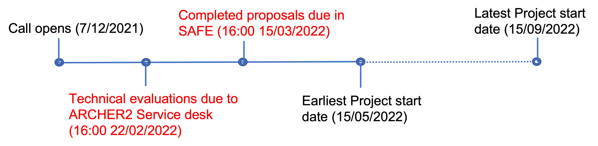

	
A timetable of recent, current and upcoming calls can be found [here](timetable.html).

### The 6th ARCHER2 eCSE call

The 6th ARCHER2 eCSE call (ARCHER2 eCSE06) opened on the 7 December 2021. The deadline for submitting documents for technical evaluations was **16:00 on 22 February 2022**, with the final deadline for proposal submission being **16:00 on 15 March 2022**.

Through a series of regular calls, Embedded CSE (eCSE) support
provides funding to the ARCHER2 user community to develop software in
a sustainable manner, to run on the ARCHER2 system.

Funding will enable the employment of a Research Software Engineer
(RSE) to work specifically on the relevant software to enable new
features or improve the performance of the code. Proposals may request
effort from between 1 and 12 person months (inclusive).

### Application process and guidance for the eCSE call

Applying for an eCSE project under ARCHER2 is via a 2-stage submission
process where technical evaluation documents must be submitted for
evaluation by the first deadline above in advance of the final
submission. Any project members (PI, Co-I and technical staff) must
have been invited by the proposal owner to join a project and have
accepted the invitation in time for the final submission. Proposals
cannot be submitted without technical staff. All technical staff must
provide a CV, and the PI and all Co-Is must each provide descriptions
of their relevant background experience and the contribution that they
will each bring to the project. Please see the guidance document for
further information about this.

We are very keen to encourage software developers at the early stage
of their careers. At this stage, an RSE will be developing
expertise. This will be taken into account when a proposal is assessed
and in such cases, the Panel will be looking at what support is on
offer from PI and any Co-Is so it is important that this information
is made clear in the proposal. Please see the guidance document for
further information about this.

Please follow the links here for [the guidance for submitting a
proposal](ARCHER2_eCSE06_ApplicationGuidance.pdf) to this call, along
with [the technical evaluation
form](ARCHER2_eCSE06_TechnicalEvaluation.docx) and [the project
proposal template](ARCHER2_eCSE06_ProposalTemplate.docx). Each call
has its own guidance document and associated forms. Please ensure that the
correct guidance and forms are used for this call.

If your eCSE proposal is selected for funding, you will be provided
with an award letter and will be asked to agree to the eCSE
Terms. Please view [the Terms here](../Terms/ARCHER2_eCSE_Terms.pdf)
in advance of submitting your eCSE proposal. Please get in touch via
the ARCHER2 service desk if you have any questions about this. 

### Scope of eCSE call

Examples of eCSE work could be

* Implementation of algorithmic improvements within an existing code
  in a portable manner

* Improving the scalability of software on higher core counts in a
  portable manner

* Improving a code to enhance sustainability and maintainability

* Improvements to code that allow new science to be carried out on
  ARCHER2

* Migrating, porting and optimising a code in significant use by an
  EPSRC community to run efficiently on ARCHER2 and next
  generation architectures.

* Adding new functionalities to existing codes

* Code development to take a code from a Tier-2 (Regional) or local
  university cluster to ARCHER2

Funding will be prioritised for projects which can evidence how they
complement, support and enable research in the existing EPSRC
portfolio and the strategic aims of the councils.

Note that projects to develop software on the GPU hardware component
of ARCHER2 are not within the remit of this call.

### Funding and eligibility

Funding is provided for software which results in research which is
within the remit of EPSRC. Funding can be requested for staff located
at the institution of the PI, third parties, or can include staff from
the centralised CSE support team or a mixture of the above. Funding
can be requested for between 1 and 12 person months in total. Staff
employed on an eCSE project are expected to play a full part in
ARCHER2 related activities.

Reasonable travel will be funded for travel within the UK to meetings
with other project partners.

When submitting your proposal, all costs must be included in your
submission. Please ensure your budget is accurate and inclusive of all
costs before submission and that you provide a costing
breakdown. Please see the guidance document for details of allowable
costs and associated documents.

### Computing Resources

Successful projects will be given an allocation of 800 CU of ARCHER2
resources per 6 months of eCSE person month awarded.

### Training

Regular training will be provided via the CSE team. Details of
upcoming training course can be found [here](../../training/).

### Application and Review Process

Information and guidelines on how to apply for eCSE funding can be
found [here](ARCHER2_eCSE06_ApplicationGuidance.pdf). Proposals
undergo a two-stage process. A technical evaluation is performed first
with completed forms being passed back to applicants in time for
including in the final submission. After final submission, all
proposal documents, including the completed technical evaluation
forms, will then be passed to the review panel who will make decisions
on ranking and any award of funding.

The eCSE technical evaluation form can be found
[here](ARCHER2_eCSE06_TechnicalEvaluation.docx) and should be
submitted to the ARCHER service desk
[support@archer2.ac.uk](mailto:support@archer2.ac.uk). The proposal
template can be found [here](ARCHER2_eCSE06_ProposalTemplate.docx) and
should be submitted via the [ARCHER2
SAFE](https://safe.epcc.ed.ac.uk/) together with the completed
Technical Evaluation document.

The eCSE team recently presented a webinar giving an overview of the eCSE scheme and application 
process, including a walk-through of completing the application form. Full details 
and video of this presentation are 
available [here](https://www.archer2.ac.uk/training/courses/200527-archer2-ecse-call/).

### Reports and eCSE staff requirements

A detailed technical report is required at the end of the project. A
template is provided for the report will be made available on the
ARCHER2 website. Upon conclusion of the project, in addition to the
detailed technical section, a section aimed at the non-specialist is
required explaining the aims and successes of the project together
with the scientific and any other impacts of the work. PIs and/or
project technical staff are expected to give a least one webinar of
the work achieved.

### Intellectual Property

IPR will belong to the project, although the expectation is that any
EPSRC-funded code development will be made available to the wider
community via a new release of the software.

### Acknowledging ARCHER2

You should use the following phrase to acknowledge ARCHER2 in all
research outputs that have used the facility and the eCSE Programme:

This work was funded under the embedded CSE programme of the ARCHER2
UK National Supercomputing Service (http://www.archer2.ac.uk).

You should also tag outputs with the keyword ARCHER2 whenever
possible.

### Contact

The ARCHER2 CSE team can be contacted via the ARCHER2 service desk [support@archer2.ac.uk](mailto:support@archer2.ac.uk).

### Links and documents

* [Application Guidance](ARCHER2_eCSE06_ApplicationGuidance.pdf)

* [Technical evaluation form](ARCHER2_eCSE06_TechnicalEvaluation.docx)

* [Project Proposal template](ARCHER2_eCSE06_ProposalTemplate.docx)

* [eCSE projects funded](../panels/)

* [eCSE Terms](../Terms/ARCHER2_eCSE_Terms.pdf)
