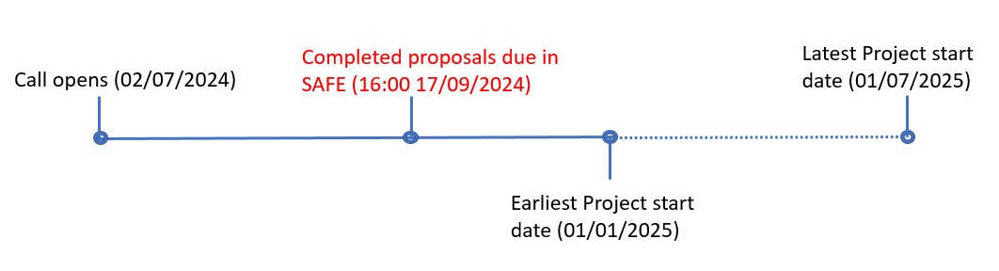

	
### The 2nd GPU eCSE call  

GPU eCSE support provides funding to the UKRI research community to develop software in a sustainable manner to run on GPU-based architectures. We invite proposals to develop software that facilitates research targeted at UKRI’s digital research infrastructure e.g. future Exascale supercomputing services, UK national AI services, national Tier-2 HPC services. The call is open to research across all of UKRI’s remit. 

The 2nd GPU eCSE call (GPU-eCSE02) opened on the **2 July 2024**. The final deadline for proposal submission is **16:00 on 17 September 2024** via the ARCHER2 SAFE. Please note that for this call there is no separate technical evaluation stage or separate technical evaluation form.  

### GPU eCSE call

Funding will enable the employment of an RSE (a Research Software Engineer, PDRA or equivalent) to work specifically on the relevant software to enable new features or improve the performance of the software to be run on GPU-based architectures. Funding can be requested for up to 24 person months of effort per project for a duration of up to 2 calendar years. There is flexibility in the way the effort is requested. For example, a project may have more than one person working on it or the effort could be spread over a greater number of calendar months, i.e. a staff member could work on the project at less than 100% alongside other commitments or it could be worked on by a staff member who doesn’t work full time. Please just get in contact with the [ARCHER2 Service Desk](mailto:support@archer2.ac.uk) if you wish to discuss possible scenarios. Projects are expected to start between 1 January and 1 July 2025 and be completed by 31 March 2027.

The GPU eCSE programme is administered by EPCC through ARCHER2, the UK National HPC Service. However, applications are not limited to projects targeting the GPU component of ARCHER2. Projects may utilise other GPU resources within the UK digital research infrastructure. 

The text below gives an overview of the call but all applicants should read [the guidance for submitting a
proposal](GPU_eCSE02_ApplicationGuidance.pdf) to this call in full. 

### Application process and guidance for the GPU eCSE call

Applications for a GPU eCSE project must be completed and submitted via the ARCHER2 SAFE. Any project members (PI, Co-I and technical staff) must have been invited by the proposal owner to join a project and have accepted the invitation in time for the final submission. Proposals cannot be submitted without technical staff. All technical staff must provide a CV, and the PI and all Co-Is must each provide descriptions of their relevant background experience and the contribution that they will each bring to the project. Please see the guidance document for further information about this. 

We are very keen to encourage software developers at the early stage of their careers. At this stage, an RSE will be developing expertise. This will be taken into account when a proposal is assessed and in such cases the Panel will be looking at what support is on offer from PI and any Co-Is so it is important that this information is made clear in the proposal. Please see the guidance document for further information about this. 

Please follow the links here for [the guidance for submitting a proposal](GPU_eCSE02_ApplicationGuidance.pdf) to this call, along with [the project proposal template](GPU_eCSE02_ProposalTemplate.docx). Each call has its own guidance document and associated forms. Please ensure that the correct guidance and forms are used for this call. Please note submission will not be accepted if the correct version of template is not used for your application. 

If your eCSE proposal is selected for funding, you will be provided with an award letter and will be asked to agree to the [eCSE Terms](../Terms/ARCHER2_GPU_eCSE_Terms.pdf) in advance of submitting your eCSE proposal. Please get in touch via the ARCHER2 service desk if you have any questions about this. 

### Scope of eCSE call

Examples of GPU eCSE work could be:

- Transforming existing software that targets CPU architectures into software that can exploit GPU-based architectures (in part or in full)

- Implementation of algorithmic improvements within existing GPU software

- Improving the portability of GPU software (e.g. converting CUDA-based software to run on a wider range of architectures)

- Improving the performance of software running on GPU-based architectures

- Improving the scalability of software to enable effective use of an increased number of GPUs

  -E.g. making software that can run on a single GPU able to exploit multiple GPUs in parallel or making single-node, multi-GPU software scale better across multiple nodes with GPUs

- Improving GPU-based software to enhance sustainability and maintainability

- Improvements to GPU-based software to allow new research to be carried out

- Adding new functionalities to existing GPU-based software or enhancing existing GPU software for use in new research areas/workflows

Note the above are just examples and not a comprehensive list. Please get in touch if you have any questions.

Funding will be prioritised for projects which can demonstrate how they
complement, support and enable research in the existing UKRI
portfolio and the strategic aims of the research council.

Projects may utilise the GPU component of ARCHER2 or other suitable GPU resources to complete the technical work. If the proposal plans to use the GPU component of ARCHER2, successful projects will be given access to these resources. If projects plan to utilise other systems, you should ensure you have suitable resources available to complete the project successfully. Please contact and arrange this access with the relevant service provider before submission.

### Funding and eligibility

Funding can be requested for staff located at the institution of the PI, third parties, or can include staff from the centralised CSE support team or a mixture of the above. Funding can be requested for between 1 and 24 person months in total. 

Reasonable travel will be funded for travel within the UK to meetings with other project partners. In addition to this, travel funds may be requested to send each technical member of staff to one national or international conference or workshop to help disseminate their work on the project. We recognise that carrying out this travel can cause challenges for individuals with caring responsibilities. Funds may be requested to help towards increased caring costs resulting from this travel. Please see the guidance document for further details.  

When submitting your proposal, all costs must be included in your submission. Please ensure your budget is accurate and inclusive of all costs before submission and that you provide a costing breakdown. Please see [the guidance document](GPU_eCSE02_ApplicationGuidance.pdf) for details of allowable costs and associated documents. 

### Application and Review Process

Information and guidelines on how to apply for eCSE funding can be found [in our Application Guidance document](GPU_eCSE02_ApplicationGuidance.pdf). After final submission, all proposal documents will then be passed to the review panel who will make decisions on ranking and any award of funding.

The [proposal template](GPU_eCSE02_ProposalTemplate.docx) should be submitted via the [ARCHER2 SAFE](https://safe.epcc.ed.ac.uk/).

### Reports and eCSE staff requirements

A detailed technical report is required at the end of the project. A
template is provided for the report will be provided to successful candidates.

### Intellectual Property

IPR will belong to the project, e.g. converting CUDA-based software to run on a wider range of architectures.

### Links and documents

- [The guidance for submitting a proposal](GPU_eCSE02_ApplicationGuidance.pdf)

- The [proposal template](GPU_eCSE02_ProposalTemplate.docx) (Please note submission will not be accepted if the correct version of template is not used for your application.)

- The [Terms document](../Terms/ARCHER2_GPU_eCSE_Terms.pdf)
