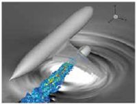

The case studies below highlight some of the research carried out on ARCHER and ARCHER2 by the scientific community.  We would be delighted if you would like to create and send in a case study highlighting the research you have carried out on ARCHER or ARCHER2.  If you would help to create a case study please [get in touch](mailto:support@archer2.ac.uk), we will help review the text and design the case study for you.

	

		
	

	

		<h3>
			<a href="volcanoes/Archer2_volcanoes_AW_LO.pdf">Forecasting the dispersion of volcanic ash and gas.</a>
		</h3>

		

          The National Centre for Atmospheric Science (NCAS), the British Geological Survey
(BGS), the UK Met Office (UKMO) and the Icelandic Met Office (IMO) work under a
Memorandum of Understanding on collaborative projects aimed at improving response
to volcanic events. A dispersion modelling exercise led by the UKMO was conducted in
June 2019 to improve the partners’ awareness of the volcanic ash dispersion modelling
capabilities at each institution and test the ability of each institution to run its dispersion
models.
		 
				<a href="volcanoes/Archer2_volcanoes_AW_LO.pdf">Read more...</a>
		

	

	

		
	

	

		<h3>
			<a href="jetnoise/Archer2_jet_noise_AW_LO.pdf">Predicting aircraft jet noise.</a>
		</h3>

		

     The world’s civil aircraft fleet almost doubles in size every 20 years, and the noise
generated by these aircraft is having an unprecedented impact on communities. Plans
to expand major airports will further exacerbate this problem if noise emissions are not
significantly tackled. To meet the FlightPath 2050 targets set out by ACARE (Advisory
Council for Aviation Research and innovation in Europe)1, the perceived noise emission
from flying aircraft in 2050 needs to be reduced by 65% relative to the capabilities of
typical new aircraft in 2000.
		 
				<a href="jetnoise/Archer2_jet_noise_AW_LO.pdf">Read more...</a>
		

	

	

		
	

	

		<h3>
			<a href="clouds/Archer2_clouds_AW_LO.pdf">Improving cloud modelling for better weather and climate predicution.</a>
		</h3>

		

     Current weather and climate models struggle to resolve the complex details of the interactions between clouds and their environment. 

     A team of researchers from the University of St Andrews and University of Leeds had previously developed a new numerical model, MPIC (Moist Parcel-In-Cell), which deals with the dynamics of clouds. These researchers have now incorporated this code into a community code used by atmospheric scientists around the UK, the MONC (Met Office NERC Cloud) framework.
				<a href="clouds/Archer2_clouds_AW_LO.pdf">Read more...</a>
		

	

