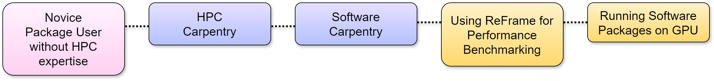
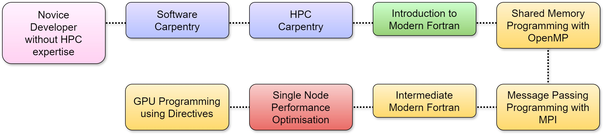

Please see the [Course Descriptions page](./) for more information about the courses.

## Novice package user without HPC expertise

Virat is a PhD student working in materials science research. He has been told by his supervisor that he will be using CASTEP on ARCHER2 for the research project. He has played around with using the command line before but has no experience of accessing remote HPC resources, using batch submission systems or running parallel software. He feels unsure about where to start with accessing and using ARCHER2 and is concerned that he will waste the project’s ARCHER2 resources by getting things wrong when he uses the system.

{: style="width: 100%; float:center"}

----------

## Experienced package user without HPC expertise

Naomi is an early-career researcher with significant experience running LAMMPS on her local system. She has experience using the command line and knows how to compile and run parallel programs on her local system. She is now wanting to run larger simulations for longer simulation times for which she will benefit from using ARCHER2. She has experience with connecting to remote systems but has little to no experience with using batch submission systems or with using modules to load packages. Furthermore, she is aware that it would be an inefficient use of her resources to run simulations on the largest number of nodes possible and would like to learn how to get the most from her grant. 

{: style="width: 100%; float:center"}

----------

## Experienced package user with HPC expertise

Matt works as a post-doctoral researcher with a background in materials chemistry. He used CP2K to do high-throughput DFT on ARCHER. He would like to be able to get a head start on using ARCHER2 upon its release. 

{: style="width: 100%; float:center"}

----------

## Data Scientist

Aeronwen is an AI researcher, not at all a computational biologist but rather applied machine learning scientist. She used HPC before but self-taught. Her goal in attending ARCHER2 training courses is to gain more confidence and learn more about HPC. 

{: style="width: 100%; float:center"}

----------

## Novice Developer without HPC expertise

Anika is a MSc student with experience developing simple serial programs as an undergraduate. Now that she is a master's student, she wants to learn how she can start writing and designing programs more efficiently. Anika has experience in using the command line to navigate through her files, compile and run her programs but has never accessed remote HPC resources, written or executed programs in parallel. First, she wants to learn computing skills to maximise productivity as a researcher before learning how HPC resources and parallelisation of programs can benefit her. She’s not sure she’s ready for systems as large as ARCHER2 but is ready to practice and learn the foundation skills for the future. 

{: style="width: 100%; float:center"}

----------

## Novice Developer with HPC expertise

Dan is a climate and ocean modeller. He would like to compile the Unstructured Grid Finite Volume Community Ocean Model (FVCOM), both hydrostatic and non-hydrostatic models, and the Weather Research and Forecasting model, and maybe MITgcm. These will be used to develop coastal forecasting systems.

{: style="width: 100%; float:center"}

----------

## Experienced Developer with HPC expertise

Dan is a climate and ocean modeller. He would like to compile the Unstructured Grid Finite Volume Community Ocean Model (FVCOM), both hydrostatic and non-hydrostatic models, and the Weather Research and Forecasting model, and maybe MITgcm. These will be used to develop coastal forecasting systems.

{: style="width: 100%; float:center"}

----------