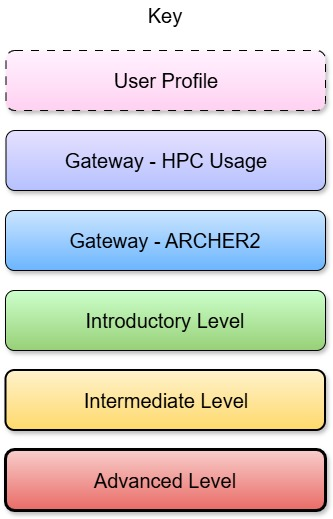

<svg xmlns="http://www.w3.org/2000/svg" xmlns:xlink="http://www.w3.org/1999/xlink" version="1.1" width="1563px" height="1214px" viewBox="-0.5 -0.5 1563 1214" content="&lt;mxfile modified=&quot;2023-03-13T12:14:05.889Z&quot; host=&quot;Electron&quot; agent=&quot;5.0 (Windows NT 10.0; Win64; x64) AppleWebKit/537.36 (KHTML, like Gecko) draw.io/20.8.10 Chrome/106.0.5249.199 Electron/21.3.5 Safari/537.36&quot; etag=&quot;YQeLUjfBx2PIAC5t9yV0&quot; version=&quot;20.8.10&quot; type=&quot;device&quot; pages=&quot;3&quot;&gt;&lt;diagram id=&quot;HM_GZg5QxDpaKEgj5FE8&quot; name=&quot;Page-1&quot;&gt;7Z1rV6M6F4B/jR/p4tIC/ai11TnnOPa1M3NmPs2KkLYotwmptufXvwm3QkiRWkBQXbNGCSQB8uydvXcunCkTZ3uFgL++8Uxon8miuT1TLs9k8iOq5BdN2UUpGj2iCStkmVGStE9YWP/BOFGMUzeWCYPchdjzbGz5+UTDc11o4FwaQMh7zl+29Ox8rT5YwULCwgB2MfVfy8TrOFVSx/sT19BareOqdVmLTjgguTh+kmANTO85k6RMz5QJ8jwc/eVsJ9CmLy95L1G+2YGz6Y0h6OIqGZY/1972tyT9WTyc2/8oT6ur+0tBjh8jwLvkiaFJXkB86CG89laeC+zpPvUCeRvXhLRYkRztr/nH83ySKJHEB4jxLm5NsMEeSVpjx47Pwq2Ff9Lsg1F89Ctz5nIblxwe7OKDpefiuEBZJ8cmCNbhPdBsAUbeY9pACs3rmue0+cmh67kwSplZth0XR7PPAcYQuWEZshiWk7RReC8uRrvoNsdymvArTBA1OUnY3254tMsezSGyHEgqiROLbZYwDdAK4rKGisWGtk4mZ9zUV9Aj1aAduQBBG2DrKY8viKVglV6XZp17FrkXWYwlVhrK6mCc+RlFJcTiK6vigF6jj7Twfz1ffuBtkAHjIrMsFmvRcuVK0kjMFxW9kUJR5I/M4+6TQtiPAV/vC/gZDLUxi6GuvAbD9mWpB+DLoj4YNg5+eS2aXFrLAZkgjQN2mct8ekFQ/qiM9OkjRsiiMusVOa2HIqcO1bzI0XfXb5GLWC1pKEnrmGyO9Rb6pPJKWpJMURRz1eqaWH7TY73s+oYEWe2hII9yYvyCCHdIWjsjhJoqNy+E5ZW0I4SaqrC940lC9T2A6Pb+gXqnsmiDe2hH5UaV2Jb7mBwr5D4gcqBpAQwFGz5BW5AFg7y7AAbR5YlgPsyD0Teoo//9uRj9tR5emwDthGHmoWJBzsjo89rCcOGDUPc/E3c9L18s8/R44tkeCnMrYvjDYruX6rSIuEJ6/AQRtogvfW5bK0o+pqJ+AZAR10NlZ0nEJFPNbDZTp5ckfYWAacHcLcz0qXQ5KxMWWiHclkpBfFYf5xWtmije572Xr6px2jrj4I8UxlHJSk7OS9kTQA4zELQMhdIzKCTx7ahIW7yEijSg0wAVFfvfYQ/7X1nUjumB+29EDzvWfytS3lSsqcdmi31dH12baTrqoWgoQz0nGp9hnfqoHylaE9Szxb4x9UoPqRdVjaFeVHtOfbZTgN+lrfJ14/759mft3KC7+8WtJEjym4nHASOkABj3vpPg/BOwN3FVdzCAxGhbQxQU4HvJqMwbd4YBR8sl37gTRY3YfvlWVpJWP8kQPd1YFKS8sTis6EFo+tGtdMhb+Oo9WeQlU4tUtUnxF/eI/LWif82B8UjHNmWRZs6ez7SU+mdDhx/DVyME4es9JxeQF7Pdn0xKfLaIitjQO7ieT4oVwq1PLfsAsi7MYECeJvJXBB/gNeFFccMbJ4fhTQobcotCXL6w9g2BKawczmwzHe/hFDwNOQSO52nMLqUZ6xXVAGPpyGAFHpM4BQdAWeQAKMmNurBT2nbk1RnkYQ9jqQKHtoR7H9Bfb80ogyfcP8LRjPK9gQ+O6H4+SE5lfiIbIdsor0fDKn/CGvbnijYYdRLXS4BBEZYJQH5oIbOwrDGms6XOac3y7Pn5eRAZbvIAGIPNI0nDCFiu5a7SjjoIr1VMUpFg5MstRWdUIzpTdSoeQudiNJFYu7A6OiwseZRqQEfV8noutfleAkdrMYyoFWz6iCtxYYSq5IOa9WwMmCfzvBBwjWY9X77DZiEqHL/QGYRCG+QvLgVB/9T3PKFtW9tXk9pxQWrvFtMgdAGJxhYv6fiQ539cr5wd2OuWV542T4ecndgXN5Nbe72TI559KhJyZix208tJuGwcykaIPB7HT6c7Oiv10evuHJRZH/tUMj897OisMuwmmQtviZ/Jkx3hZJO3GMS5jvKYpdPm5xxwmRtwi8u88Ca0VMs+8yEUcuMo5H/PfYVCCjURo5PO7ybX0zuZw1Emgid4rhAHa6qwVB5+ybdnfe6AenExej11NbAzZNTIUK+oRvRG0WHDKa9j5whw9p6/cSw56sckh/X5u0JOZF84MJxz0jg2+9qOpKY8cvRuqSn0VZ/YHIXNuEZsXmXovIK1JszdjmDDadvqc875I4inud5vsxKhbG75ofnoNVDBTiPqykqEHxbCG0Bb7tsGe8gCdsAB5Sm56mUmanZ6owZogJUyDliOHMs0w9mUe5RkpRku0mVIWTCkETeW3SgYNzAIIo9oDoIgHDUW58gjr81xoqM43HIz/8IhxomyC36UWfD3WaNoiuNbeZw049/F9di+AUgFP9C1vdpdbmtUMTX5x5ywzGRyKCxjjlWjoU5FVSp2KuNmQyhr8lQmpQA6XnjDXEZufejezDmYBGF+wQlzFyHxSD7Hr8LJaWrn/XDC2qx8TqS2OflOXg0KMHDNWJOk8RbOTCyIlh5yQDo5IUfMJltSOg3KZ/OU01LbarnXRllfQUcLE/U0OZ0L9bZq5dx8AtGAgbiJ4nHLIif/nN/czBccRECcOwqtLQWbqBQ/qMLFaRObaudiqRvQMPhcQKDeq2o7XCT7DbxIhTpqtLOJZrssLaPQzxTpiHue+Q6vqYtc7HnSwordjp/JVA5MeUCtdWAMY7k8BMxYM0VNqwcQduy7I71MRm3wrdJUM1SzPpX2+4mjrIpK+qEJ61OrOoLXrELIWQqsArj1seVYAcBWPkQWnaVp4vkNKUWczn9NOKxkTApih+7LCqNgjilAf2dUYaj9PqUfDI2rhsWa1RnTJekCrCiWurc1RLzmIHU9n5JTk2ijkelPzuTNDaHG8Bx/Q1cuFpmCSWWJaUKqEdY+FAxSpgC3QrALMHSqYHXadM73gxXr8HQEq0xXdND5TXujym6uUh5T/7itzu+QOAZIsx3SHSS2pLkxrHubapJIE4S9Rhhihe6ThTyXjqUEReWxiaNsE/LGgeWmk3tzzKBMDUKufCFbuhAWRi7IF1UK1/C0iZ3994pTL1gfaDw3mIOTJDWqRb64OGztyIYRsceZqjSX/+ZwYmVyCtgTDF9+zDOwkt2/h1t1+/D18Ufw9a/ni4v54sRFYf3zZ46NpjarPio099Xd7c35hBf1YFt8hTwHGEGFRu9YNKwtJ5aNcvQHgu+utbQiNzfaiv1FGDZRDsHZX1+KRG17zPULCXaKWUeQqBQOnZCm/b0AeINcXtycDYoa9PIge3kpEB89MloaCW3dzoznHJ4Ts2+HLYNjTGbnwhdYCGcQgiRzOru9AgYfNN7JTiDsiF6g2h/RToJkugj/iUsP8VRD3g9J15jyPAwnLFQwBFIU42EETL5SVLTWUenkiCwbKq8cOtXTsbiG4Zl5CCPAGyOJUVhmLyht844Hpd6qzfVR5XHVZhVGNtg5BwjYdvghny+3nMbfxyr9+ErB8iow8Bmi4oeoOgNBpuFzAyiRORFYQWhmRrEo+o0kEBiAw0dKRXagBMRFxPGnIJe9FJsTlxW/H27YcZIjuGk2pN2Xeeflhse7Xa7AdjotTzsv7GvBl/JkD80+7WHa149KvLx7ddzyL25Umnwrpu1PwEg5omv7BMx4oOhi+qPmKpHEkTwY1rWzbweWHp/msr+bzbpY9diRhcfczQrKGKC7EBzT/KdFct9t8ytVe8c292pLviaQ2fapnYXptdlHFcJxb2UfscM9TdpHFY2h4tv/NIbezhiqagsN27GFGvuShzbQpL31Iw4Z82fI4F7fVw1KN8vvj86ro3/jBiAn45nOCVpOp/rJa5O7o/P6+BGL96DzSjbVzyu9Uilt/Pu8rJWuMiBW/gSvKA6Go72WY79ELSrjgZrxNJt2+I6z88OPKZQb+9xmkjs+AFPJgahBz/XSuQsb3SIvbzsIG+V4X6+RTcb65+uxln5HaOjoHmPcz0mWL7tv3l4qDbAfCMp33D56p6TINZLSo9GWNqMJ73ABAheljs0xfKtV+Wyokr+iqf3FCL1mq2MTF9+KLXYiY1fYmtsexhEhwDU5e4JkV/sfu9TfjwsXSNHVFvvvvvwWRiRdWyrClfowcwPz14lf9+rz3FfmA0md2SYkNw06mrhUpCPiKfdRrx9WsAH2wbXhlltG037yNJ3nRJF6yhYnWG51pMqNp3eMVH5gvzNTnCqsvTm46wy75Ia36wwXgg+6/Kr44bUj9Eo9MyRJEvI8nLn8irzgdbSoSpn+Hw==&lt;/diagram&gt;&lt;diagram id=&quot;DPv2Cp5MP9YpbfnbOz4b&quot; name=&quot;Page-2&quot;&gt;xZffd6I4FMf/Gh/ZE2Cw+igodbvt1G2PM9u+7IkQIRUJhqDYv36TkMiPasd6tp0+WO7NvTck95OvsWd76/Kawiy+IyFKehYIy5497lmW+c0e8H/Cs688Q9OsHBHFoQqqHY/4FSknUN4ChyhvBTJCEoaztjMgaYoC1vJBSsmuHbYkSXvWDEbojeMxgMlb708csrjyDhxQ+6cIR7Ge2QRqZA11sHLkMQzJruGyJz3bo4Sw6mldeigRm6f3ZXP778DPwNVfc4dcMTSdp/jZqIr5H0k5LIGilF1c+uk6nKyN7Cf4QfPQ2qyM4s+xLp2zvd4vFPLtUyahLCYRSWEyqb0uJUUaIlEVcKuOuSUk406TO18QY3vFAiwY4a6YrRM1ikrM/hHpfzjKemqMjEtVWRp7baSM7htJwnxqjtVp0tJ5h6aJ8iHMY/ni2phBxhBNpccCwrskKVMvbg1EPqNkdSDHlvVDHyfJYbZwJCjlZkpSsT1nNkvvPClooFEtBqti5dyUk9cZRiWZebdj1VTAII0Qe6eTKk60rwG+QuEakTXi28IDKEogw9v26YDqkEWHuEPqjGC+DgsoQTicBiUHtrZ1iWpBKqvGkT80XqN2SUilOc8RvV+8CA2wQAIXKKkKTmc8sp/wtbsLyp8i8eRBmslGV5MnOF1V0T3LjrPACNrj+gzspvPv5gvaPePhzXC/nC0ebgYGaKxWnZnGedjFmKHHDMom7bhGtllu8gKU7ZGEUJltA/nX5VAmqSlA60TJUU5Xo8SkPwE+30U3ojDEqFXedTxTjn0Mui2iDJXvYqJHO+12tKzvai21tGLGDR29AqfJajFRA8DNBgPHRey9I7KFSaGa9p1sMW+YePkuOTMYrMRXhgXEZM3xRtf7m0KoumyUkcv2jngA3+GyHtQVd5grYCGoPYoqKjO+3ThHb6T2V2i1OfB93zrFge+PTf9iHDv4deD8KrTs/plomV3JOYOtU+LSooF/kvQCIiQKHShGD9508mAdkaesmtIocmSQ1IA0iBG12jplevko+jG+f97cjwkebd178+4XOtVu4meo1hHu+q7rSCY7rAYBcpbLL4Snf64uDf4XXTqF05y3gOYMpiFOIz5U43VEiBBdErqGaYCOUFI0Kxmamaybo4EZ/t2Prhd37uuNA72lmxWbZ/obvtje/SITAuZ5pwQsHPaD36g+V9aZAA0/FaBHsmQ7vtiP3XhylXXq2nP6wngxHRfcUT7hqvRVdAy+fem1h7vqn5XVzbn+cW5P/gM=&lt;/diagram&gt;&lt;diagram id=&quot;n3jFyLq0yUNhVzph1EIy&quot; name=&quot;Page-3&quot;&gt;xZfbctowEIafhks6sswpl2Bw0pkemDCZpr1T7MVWMJIjyxz69JVkGdsEaKAhzQXx/tpdWdpPi2i53nJzK0gaf+UhJC2Mwk3LHbcwdjruQP3TyrZQbhynECJBQ+tUCTP6G6yIrJrTELKGo+Q8kTRtigFnDALZ0IgQfN10m/OkOWtKInglzAKSvFZ/0FDGhTrookq/AxrF5cwOsiNLUjpbIYtJyNc1yZ20XE9wLoun5caDRG9euS8j/PmRvSz80XDYGU+n9NdAjttFMv+ckN0SBDD5vqmxXZrclvsFodo+a3IhYx5xRpJJpY4Ez1kIOitSVuXzhfNUiY4Sn0HKrWWB5JIrKZbLxI7ChspH/fwJoa61f+p0n1xc2uONzW+MbWkwKbaPdaOI65ZmFWasMm5XOj19SLLYvH5pTImUIJhRMNLqnDNpXx8PdLwUfLHjxzX5Q58myW62cKhZVSbjDOxrT0HQJajU1uuNZbTlznguAjjh17GniYgITuXrF366sLUjYSG5Ba5eUWyVg4CESLpqnhtij1+089uFTjlV68DItordObGNwi3tMkWxIBtVgaoeaq9RSQZfYz5kIL4/PevugFFCniApEt5NlWcvUWsfPQn1FOknj4jUFL+YPKFsUXi3sBunQTtojp88HW5ttfY01U7KOqYSZikxRVqr7tmkvM4QsrbHEy5MtIvM3z6bJshOgRpnzYwq4mopJr0J8tUujiJBQgqN9KOu55ix86BbgZCwOYlJWe5Bs9ylua6aLC5baVxrsH10HKwGElX9lVlD4IzuZk/IiiS5rdk3vqKqXhrNfXCmJFjo7xKM9GT18VrRey+5bvemTu3MVHeoHNQGb6rBMuOaqtaYa2gPkgqbVO02zeBVD/4bWU0MfN/HxzDw/bHjX0zjHn17bF6LrM5lYDn7/eYNZB3rLA0W1CdnF/BgQNhDYnjv3U3u8YHelBZTtvMM2py1iQhiEPgNTap7skk1S3iNlnWAut5o1DVE7pEaBNCdz6+IThdfxs7gXZrSMZoeVAVEJgkLKYvUUEXXgS4EYs7FkrAADkCS1zO1S2TS/ZiTvPQ+/Evt5JeY7l6ed6x7hTe94ANbT793GT83V+VnxudyrdZ63mUns1Fn3Xj6/wTHBdeTK9ySrgWHg9D/vPIoqfqtWVyaq1/s7uQP&lt;/diagram&gt;&lt;/mxfile&gt;" style="background-color: rgb(255, 255, 255);"><defs><linearGradient x1="0%" y1="0%" x2="0%" y2="100%" id="mx-gradient-fff6ed-1-f8e1df-1-s-0"><stop offset="0%" style="stop-color: rgb(255, 246, 237); stop-opacity: 1;"/><stop offset="100%" style="stop-color: rgb(248, 225, 223); stop-opacity: 1;"/></linearGradient><linearGradient x1="0%" y1="0%" x2="0%" y2="100%" id="mx-gradient-cce5ff-1-007fff-1-s-0"><stop offset="0%" style="stop-color: rgb(204, 229, 255); stop-opacity: 1;"/><stop offset="100%" style="stop-color: rgb(0, 127, 255); stop-opacity: 1;"/></linearGradient><linearGradient x1="0%" y1="0%" x2="0%" y2="100%" id="mx-gradient-fff2ff-1-ffd1f1-1-s-0"><stop offset="0%" style="stop-color: rgb(255, 242, 255); stop-opacity: 1;"/><stop offset="100%" style="stop-color: rgb(255, 209, 241); stop-opacity: 1;"/></linearGradient><linearGradient x1="0%" y1="0%" x2="0%" y2="100%" id="mx-gradient-e6e0ff-1-b5c1ff-1-s-0"><stop offset="0%" style="stop-color: rgb(230, 224, 255); stop-opacity: 1;"/><stop offset="100%" style="stop-color: rgb(181, 193, 255); stop-opacity: 1;"/></linearGradient><linearGradient x1="0%" y1="0%" x2="0%" y2="100%" id="mx-gradient-cce5ff-1-6bb5ff-1-s-0"><stop offset="0%" style="stop-color: rgb(204, 229, 255); stop-opacity: 1;"/><stop offset="100%" style="stop-color: rgb(107, 181, 255); stop-opacity: 1;"/></linearGradient><linearGradient x1="0%" y1="0%" x2="0%" y2="100%" id="mx-gradient-fff2cc-1-ffd96c-1-s-0"><stop offset="0%" style="stop-color: rgb(255, 242, 204); stop-opacity: 1;"/><stop offset="100%" style="stop-color: rgb(255, 217, 108); stop-opacity: 1;"/></linearGradient><linearGradient x1="0%" y1="0%" x2="0%" y2="100%" id="mx-gradient-f8cecc-1-ea6b66-1-s-0"><stop offset="0%" style="stop-color: rgb(248, 206, 204); stop-opacity: 1;"/><stop offset="100%" style="stop-color: rgb(234, 107, 102); stop-opacity: 1;"/></linearGradient><linearGradient x1="0%" y1="0%" x2="0%" y2="100%" id="mx-gradient-ccffcc-1-97d077-1-s-0"><stop offset="0%" style="stop-color: rgb(204, 255, 204); stop-opacity: 1;"/><stop offset="100%" style="stop-color: rgb(151, 208, 119); stop-opacity: 1;"/></linearGradient><linearGradient x1="0%" y1="0%" x2="0%" y2="100%" id="mx-gradient-fee8ff-1-ffc9f8-1-s-0"><stop offset="0%" style="stop-color: rgb(254, 232, 255); stop-opacity: 1;"/><stop offset="100%" style="stop-color: rgb(255, 201, 248); stop-opacity: 1;"/></linearGradient></defs><g><path d="M 1437 220.21 L 1437 680.1 L 1436.76 1145.04" fill="none" stroke="#000000" stroke-width="3" stroke-miterlimit="10" stroke-dasharray="3 3" pointer-events="stroke" transform="translate(2,3)" opacity="0.25"/><path d="M 1437 220.21 L 1437 680.1 L 1436.76 1145.04" fill="none" stroke="rgb(0, 0, 0)" stroke-width="3" stroke-miterlimit="10" stroke-dasharray="3 3" pointer-events="stroke"/><path d="M 1218.5 220.21 L 1218.5 1145.8 L 1233.96 1145.81" fill="none" stroke="#000000" stroke-width="3" stroke-miterlimit="10" stroke-dasharray="3 3" pointer-events="stroke" transform="translate(2,3)" opacity="0.25"/><path d="M 1218.5 220.21 L 1218.5 1145.8 L 1233.96 1145.81" fill="none" stroke="rgb(0, 0, 0)" stroke-width="3" stroke-miterlimit="10" stroke-dasharray="3 3" pointer-events="stroke"/><path d="M 1010 520 L 1010 830 L 1007.8 830 L 1007.76 1154.56" fill="none" stroke="#000000" stroke-width="3" stroke-miterlimit="10" stroke-dasharray="3 3" pointer-events="stroke" transform="translate(2,3)" opacity="0.25"/><path d="M 1010 520 L 1010 830 L 1007.8 830 L 1007.76 1154.56" fill="none" stroke="rgb(0, 0, 0)" stroke-width="3" stroke-miterlimit="10" stroke-dasharray="3 3" pointer-events="stroke"/><path d="M 773 220.21 L 773 1140 L 780 1140" fill="none" stroke="#000000" stroke-width="3" stroke-miterlimit="10" stroke-dasharray="3 3" pointer-events="stroke" transform="translate(2,3)" opacity="0.25"/><path d="M 773 220.21 L 773 1140 L 780 1140" fill="none" stroke="rgb(0, 0, 0)" stroke-width="3" stroke-miterlimit="10" stroke-dasharray="3 3" pointer-events="stroke"/><a xlink:href="#intermediate-level-2-courses"><rect x="900" y="560" width="660" height="530" rx="15.9" ry="15.9" fill="#000000" stroke="#000000" pointer-events="all" transform="translate(2,3)" opacity="0.25"/><rect x="900" y="560" width="660" height="530" rx="15.9" ry="15.9" fill="url(#mx-gradient-fff6ed-1-f8e1df-1-s-0)" stroke="rgb(0, 0, 0)" pointer-events="all"/></a><a xlink:href="#intermediate-level-2-courses"><rect x="670" y="560" width="220" height="530" rx="22" ry="22" fill="#000000" stroke="#000000" pointer-events="all" transform="translate(2,3)" opacity="0.25"/><rect x="670" y="560" width="220" height="530" rx="22" ry="22" fill="url(#mx-gradient-fff6ed-1-f8e1df-1-s-0)" stroke="rgb(0, 0, 0)" pointer-events="all"/></a><path d="M 330 520 L 330 830 L 322.9 830 L 322.92 1140" fill="none" stroke="#000000" stroke-width="3" stroke-miterlimit="10" stroke-dasharray="3 3" pointer-events="stroke" transform="translate(2,3)" opacity="0.25"/><path d="M 330 520 L 330 830 L 322.9 830 L 322.92 1140" fill="none" stroke="rgb(0, 0, 0)" stroke-width="3" stroke-miterlimit="10" stroke-dasharray="3 3" pointer-events="stroke"/><path d="M 547 220.21 L 547 680.1 L 542.9 680.1 L 542.88 1145.81" fill="none" stroke="#000000" stroke-width="3" stroke-miterlimit="10" stroke-dasharray="3 3" pointer-events="stroke" transform="translate(2,3)" opacity="0.25"/><path d="M 547 220.21 L 547 680.1 L 542.9 680.1 L 542.88 1145.81" fill="none" stroke="rgb(0, 0, 0)" stroke-width="3" stroke-miterlimit="10" stroke-dasharray="3 3" pointer-events="stroke"/><path d="M 110 520 L 110 830 L 104.5 830 L 104.52 1140.42" fill="none" stroke="#000000" stroke-width="3" stroke-miterlimit="10" stroke-dasharray="3 3" pointer-events="stroke" transform="translate(2,3)" opacity="0.25"/><path d="M 110 520 L 110 830 L 104.5 830 L 104.52 1140.42" fill="none" stroke="rgb(0, 0, 0)" stroke-width="3" stroke-miterlimit="10" stroke-dasharray="3 3" pointer-events="stroke"/><rect x="0" y="0" width="660" height="78" rx="11.7" ry="11.7" fill="#000000" stroke="#000000" pointer-events="all" transform="translate(2,3)" opacity="0.25"/><rect x="0" y="0" width="660" height="78" rx="11.7" ry="11.7" fill="url(#mx-gradient-cce5ff-1-007fff-1-s-0)" stroke="rgb(0, 0, 0)" pointer-events="all"/><g transform="translate(-0.5 -0.5)"><switch><foreignObject pointer-events="none" width="100%" height="100%" requiredFeatures="http://www.w3.org/TR/SVG11/feature#Extensibility" style="overflow: visible; text-align: left;">

Researchers

</foreignObject><text x="330" y="48" fill="#000000" font-family="Helvetica" font-size="30px" text-anchor="middle" font-weight="bold">Researchers</text></switch></g><a xlink:href="../course-paths#novice-package-user-without-hpc-expertise"><rect x="10" y="100" width="200" height="120" rx="18" ry="18" fill="#000000" stroke="#000000" pointer-events="all" transform="translate(2,3)" opacity="0.25"/><rect x="10" y="100" width="200" height="120" rx="18" ry="18" fill="url(#mx-gradient-fff2ff-1-ffd1f1-1-s-0)" stroke="rgb(0, 0, 0)" pointer-events="all"/><g transform="translate(-0.5 -0.5)"><switch><foreignObject pointer-events="none" width="100%" height="100%" requiredFeatures="http://www.w3.org/TR/SVG11/feature#Extensibility" style="overflow: visible; text-align: left;">

Novice  Package User without HPC expertise

</foreignObject><text x="110" y="166" fill="#000000" font-family="Helvetica" font-size="20px" text-anchor="middle">Novice...</text></switch></g></a><a xlink:href="course-paths#experienced-package-user-without-hpc-expertise"><rect x="230" y="100" width="200" height="120" rx="18" ry="18" fill="#000000" stroke="#000000" pointer-events="all" transform="translate(2,3)" opacity="0.25"/><rect x="230" y="100" width="200" height="120" rx="18" ry="18" fill="url(#mx-gradient-fff2ff-1-ffd1f1-1-s-0)" stroke="rgb(0, 0, 0)" pointer-events="all"/><g transform="translate(-0.5 -0.5)"><switch><foreignObject pointer-events="none" width="100%" height="100%" requiredFeatures="http://www.w3.org/TR/SVG11/feature#Extensibility" style="overflow: visible; text-align: left;">

Experienced Package User without HPC expertise

</foreignObject><text x="330" y="166" fill="#000000" font-family="Helvetica" font-size="20px" text-anchor="middle">Experienced...</text></switch></g></a><a xlink:href="course-paths#experienced-package-user-with-hpc-expertise"><rect x="447.5" y="100" width="200" height="120" rx="18" ry="18" fill="#000000" stroke="#000000" pointer-events="all" transform="translate(2,3)" opacity="0.25"/><rect x="447.5" y="100" width="200" height="120" rx="18" ry="18" fill="url(#mx-gradient-fff2ff-1-ffd1f1-1-s-0)" stroke="rgb(0, 0, 0)" pointer-events="all"/><g transform="translate(-0.5 -0.5)"><switch><foreignObject pointer-events="none" width="100%" height="100%" requiredFeatures="http://www.w3.org/TR/SVG11/feature#Extensibility" style="overflow: visible; text-align: left;">

Experienced Package User with HPC expertise

</foreignObject><text x="548" y="166" fill="#000000" font-family="Helvetica" font-size="20px" text-anchor="middle">Experienced...</text></switch></g></a><a xlink:href="https://www.archer2.ac.uk/training/courses/#data-carpentry"><rect x="680" y="238" width="200" height="70" rx="10.5" ry="10.5" fill="#000000" stroke="#000000" pointer-events="all" transform="translate(2,3)" opacity="0.25"/><rect x="680" y="238" width="200" height="70" rx="10.5" ry="10.5" fill="url(#mx-gradient-e6e0ff-1-b5c1ff-1-s-0)" stroke="rgb(0, 0, 0)" pointer-events="all"/><g transform="translate(-0.5 -0.5)"><switch><foreignObject pointer-events="none" width="100%" height="100%" requiredFeatures="http://www.w3.org/TR/SVG11/feature#Extensibility" style="overflow: visible; text-align: left;">

Data Carpentry

</foreignObject><text x="780" y="279" fill="#000000" font-family="Helvetica" font-size="20px" text-anchor="middle">Data...</text></switch></g></a><rect x="670" y="0" width="220" height="78" rx="11.7" ry="11.7" fill="#000000" stroke="#000000" pointer-events="all" transform="translate(2,3)" opacity="0.25"/><rect x="670" y="0" width="220" height="78" rx="11.7" ry="11.7" fill="url(#mx-gradient-cce5ff-1-007fff-1-s-0)" stroke="rgb(0, 0, 0)" pointer-events="all"/><g transform="translate(-0.5 -0.5)"><switch><foreignObject pointer-events="none" width="100%" height="100%" requiredFeatures="http://www.w3.org/TR/SVG11/feature#Extensibility" style="overflow: visible; text-align: left;">

Data Science

</foreignObject><text x="780" y="48" fill="#000000" font-family="Helvetica" font-size="30px" text-anchor="middle" font-weight="bold">Data Science</text></switch></g><a xlink:href="course-paths#data-scientist"><rect x="680" y="100" width="200" height="120" rx="18" ry="18" fill="#000000" stroke="#000000" pointer-events="all" transform="translate(2,3)" opacity="0.25"/><rect x="680" y="100" width="200" height="120" rx="18" ry="18" fill="url(#mx-gradient-fff2ff-1-ffd1f1-1-s-0)" stroke="rgb(0, 0, 0)" pointer-events="all"/><g transform="translate(-0.5 -0.5)"><switch><foreignObject pointer-events="none" width="100%" height="100%" requiredFeatures="http://www.w3.org/TR/SVG11/feature#Extensibility" style="overflow: visible; text-align: left;">

Data Scientist

</foreignObject><text x="780" y="166" fill="#000000" font-family="Helvetica" font-size="20px" text-anchor="middle">Data...</text></switch></g></a><rect x="900" y="0" width="660" height="78" rx="11.7" ry="11.7" fill="#000000" stroke="#000000" pointer-events="all" transform="translate(2,3)" opacity="0.25"/><rect x="900" y="0" width="660" height="78" rx="11.7" ry="11.7" fill="url(#mx-gradient-cce5ff-1-007fff-1-s-0)" stroke="rgb(0, 0, 0)" pointer-events="all"/><g transform="translate(-0.5 -0.5)"><switch><foreignObject pointer-events="none" width="100%" height="100%" requiredFeatures="http://www.w3.org/TR/SVG11/feature#Extensibility" style="overflow: visible; text-align: left;">

RSEs / Developers

</foreignObject><text x="1230" y="48" fill="#000000" font-family="Helvetica" font-size="30px" text-anchor="middle" font-weight="bold">RSEs / Developers</text></switch></g><a xlink:href="course-paths#novice-developer-without-hpc-expertise"><rect x="910" y="100" width="200" height="120" rx="18" ry="18" fill="#000000" stroke="#000000" pointer-events="all" transform="translate(2,3)" opacity="0.25"/><rect x="910" y="100" width="200" height="120" rx="18" ry="18" fill="url(#mx-gradient-fff2ff-1-ffd1f1-1-s-0)" stroke="rgb(0, 0, 0)" pointer-events="all"/><g transform="translate(-0.5 -0.5)"><switch><foreignObject pointer-events="none" width="100%" height="100%" requiredFeatures="http://www.w3.org/TR/SVG11/feature#Extensibility" style="overflow: visible; text-align: left;">

Novice  Developer without HPC expertise

</foreignObject><text x="1010" y="166" fill="#000000" font-family="Helvetica" font-size="20px" text-anchor="middle">Novice...</text></switch></g></a><a xlink:href="course-paths#novice-developer-with-hpc-expertise"><rect x="1130" y="100" width="200" height="120" rx="18" ry="18" fill="#000000" stroke="#000000" pointer-events="all" transform="translate(2,3)" opacity="0.25"/><rect x="1130" y="100" width="200" height="120" rx="18" ry="18" fill="url(#mx-gradient-fff2ff-1-ffd1f1-1-s-0)" stroke="rgb(0, 0, 0)" pointer-events="all"/><g transform="translate(-0.5 -0.5)"><switch><foreignObject pointer-events="none" width="100%" height="100%" requiredFeatures="http://www.w3.org/TR/SVG11/feature#Extensibility" style="overflow: visible; text-align: left;">

Novice Developer with HPC expertise

</foreignObject><text x="1230" y="166" fill="#000000" font-family="Helvetica" font-size="20px" text-anchor="middle">Novice...</text></switch></g></a><a xlink:href="course-paths#experienced-developer-with-hpc-expertise"><rect x="1350" y="100" width="200" height="120" rx="18" ry="18" fill="#000000" stroke="#000000" pointer-events="all" transform="translate(2,3)" opacity="0.25"/><rect x="1350" y="100" width="200" height="120" rx="18" ry="18" fill="url(#mx-gradient-fff2ff-1-ffd1f1-1-s-0)" stroke="rgb(0, 0, 0)" pointer-events="all"/><g transform="translate(-0.5 -0.5)"><switch><foreignObject pointer-events="none" width="100%" height="100%" requiredFeatures="http://www.w3.org/TR/SVG11/feature#Extensibility" style="overflow: visible; text-align: left;">

Experienced Developer with HPC expertise

</foreignObject><text x="1450" y="166" fill="#000000" font-family="Helvetica" font-size="20px" text-anchor="middle">Experienced...</text></switch></g></a><a xlink:href="#software-carpentry"><rect x="1130" y="238" width="200" height="70" rx="10.5" ry="10.5" fill="#000000" stroke="#000000" pointer-events="all" transform="translate(2,3)" opacity="0.25"/><rect x="1130" y="238" width="200" height="70" rx="10.5" ry="10.5" fill="url(#mx-gradient-e6e0ff-1-b5c1ff-1-s-0)" stroke="rgb(0, 0, 0)" pointer-events="all"/><g transform="translate(-0.5 -0.5)"><switch><foreignObject pointer-events="none" width="100%" height="100%" requiredFeatures="http://www.w3.org/TR/SVG11/feature#Extensibility" style="overflow: visible; text-align: left;">

Software Carpentry

</foreignObject><text x="1230" y="279" fill="#000000" font-family="Helvetica" font-size="20px" text-anchor="middle">Software...</text></switch></g></a><a xlink:href="#package-use-on-archer2"><rect x="450" y="440" width="200" height="80" rx="12" ry="12" fill="#000000" stroke="#000000" pointer-events="all" transform="translate(2,3)" opacity="0.25"/><rect x="450" y="440" width="200" height="80" rx="12" ry="12" fill="url(#mx-gradient-cce5ff-1-6bb5ff-1-s-0)" stroke="rgb(0, 0, 0)" pointer-events="all"/><g transform="translate(-0.5 -0.5)"><switch><foreignObject pointer-events="none" width="100%" height="100%" requiredFeatures="http://www.w3.org/TR/SVG11/feature#Extensibility" style="overflow: visible; text-align: left;">

Package Use on ARCHER2

</foreignObject><text x="550" y="486" fill="#000000" font-family="Helvetica" font-size="20px" text-anchor="middle">Package Use on...</text></switch></g></a><a xlink:href="#data-science-on-archer2"><rect x="680" y="440" width="200" height="80" rx="12" ry="12" fill="#000000" stroke="#000000" pointer-events="all" transform="translate(2,3)" opacity="0.25"/><rect x="680" y="440" width="200" height="80" rx="12" ry="12" fill="url(#mx-gradient-cce5ff-1-6bb5ff-1-s-0)" stroke="rgb(0, 0, 0)" pointer-events="all"/><g transform="translate(-0.5 -0.5)"><switch><foreignObject pointer-events="none" width="100%" height="100%" requiredFeatures="http://www.w3.org/TR/SVG11/feature#Extensibility" style="overflow: visible; text-align: left;">

Data Science on ARCHER2

</foreignObject><text x="780" y="486" fill="#000000" font-family="Helvetica" font-size="20px" text-anchor="middle">Data Science on...</text></switch></g></a><a xlink:href="#development-on-archer2"><rect x="1130" y="440" width="200" height="80" rx="12" ry="12" fill="#000000" stroke="#000000" pointer-events="all" transform="translate(2,3)" opacity="0.25"/><rect x="1130" y="440" width="200" height="80" rx="12" ry="12" fill="url(#mx-gradient-cce5ff-1-6bb5ff-1-s-0)" stroke="rgb(0, 0, 0)" pointer-events="all"/><g transform="translate(-0.5 -0.5)"><switch><foreignObject pointer-events="none" width="100%" height="100%" requiredFeatures="http://www.w3.org/TR/SVG11/feature#Extensibility" style="overflow: visible; text-align: left;">

Development on ARCHER2

</foreignObject><text x="1230" y="486" fill="#000000" font-family="Helvetica" font-size="20px" text-anchor="middle">Development on...</text></switch></g></a><a xlink:href="#development-on-archer2"><rect x="1350" y="440" width="200" height="80" rx="12" ry="12" fill="#000000" stroke="#000000" pointer-events="all" transform="translate(2,3)" opacity="0.25"/><rect x="1350" y="440" width="200" height="80" rx="12" ry="12" fill="url(#mx-gradient-cce5ff-1-6bb5ff-1-s-0)" stroke="rgb(0, 0, 0)" pointer-events="all"/><g transform="translate(-0.5 -0.5)"><switch><foreignObject pointer-events="none" width="100%" height="100%" requiredFeatures="http://www.w3.org/TR/SVG11/feature#Extensibility" style="overflow: visible; text-align: left;">

Development on ARCHER2

</foreignObject><text x="1450" y="486" fill="#000000" font-family="Helvetica" font-size="20px" text-anchor="middle">Development on...</text></switch></g></a><a xlink:href="#intermediate-level-2-courses"><rect x="0" y="560" width="660" height="530" rx="15.9" ry="15.9" fill="#000000" stroke="#000000" pointer-events="all" transform="translate(2,3)" opacity="0.25"/><rect x="0" y="560" width="660" height="530" rx="15.9" ry="15.9" fill="url(#mx-gradient-fff6ed-1-f8e1df-1-s-0)" stroke="rgb(0, 0, 0)" pointer-events="all"/></a><a xlink:href="#virtual"><rect x="0" y="1140" width="1560" height="70" rx="16.1" ry="16.1" fill="#000000" stroke="#000000" pointer-events="all" transform="translate(2,3)" opacity="0.25"/><rect x="0" y="1140" width="1560" height="70" rx="16.1" ry="16.1" fill="url(#mx-gradient-fff6ed-1-f8e1df-1-s-0)" stroke="rgb(0, 0, 0)" pointer-events="all"/><g transform="translate(-0.5 -0.5)"><switch><foreignObject pointer-events="none" width="100%" height="100%" requiredFeatures="http://www.w3.org/TR/SVG11/feature#Extensibility" style="overflow: visible; text-align: left;">

Virtual Tutorials

</foreignObject><text x="780" y="1183" fill="#000000" font-family="Helvetica" font-size="28px" text-anchor="middle" font-weight="bold">Virtual Tutorials</text></switch></g></a><a xlink:href="#message-passing-programming-with-mpi"><rect x="1350" y="590" width="200" height="90" rx="13.5" ry="13.5" fill="#000000" stroke="#000000" pointer-events="all" transform="translate(2,3)" opacity="0.25"/><rect x="1350" y="590" width="200" height="90" rx="13.5" ry="13.5" fill="url(#mx-gradient-fff2cc-1-ffd96c-1-s-0)" stroke="rgb(0, 0, 0)" pointer-events="all"/><g transform="translate(-0.5 -0.5)"><switch><foreignObject pointer-events="none" width="100%" height="100%" requiredFeatures="http://www.w3.org/TR/SVG11/feature#Extensibility" style="overflow: visible; text-align: left;">

Message Passing Programming with MPI

</foreignObject><text x="1450" y="641" fill="#000000" font-family="Helvetica" font-size="20px" text-anchor="middle">Message Passing Prog...</text></switch></g></a><a xlink:href="#shared-memory-programming-with-openmp"><rect x="1130" y="590" width="201" height="90" rx="13.5" ry="13.5" fill="#000000" stroke="#000000" pointer-events="all" transform="translate(2,3)" opacity="0.25"/><rect x="1130" y="590" width="201" height="90" rx="13.5" ry="13.5" fill="url(#mx-gradient-fff2cc-1-ffd96c-1-s-0)" stroke="rgb(0, 0, 0)" pointer-events="all"/><g transform="translate(-0.5 -0.5)"><switch><foreignObject pointer-events="none" width="100%" height="100%" requiredFeatures="http://www.w3.org/TR/SVG11/feature#Extensibility" style="overflow: visible; text-align: left;">

Shared Memory Programming with OpenMP

</foreignObject><text x="1231" y="641" fill="#000000" font-family="Helvetica" font-size="20px" text-anchor="middle">Shared Memory Progra...</text></switch></g></a><a xlink:href="#understanding-package-performance"><rect x="230" y="687.5" width="200" height="90" rx="13.5" ry="13.5" fill="#000000" stroke="#000000" pointer-events="all" transform="translate(2,3)" opacity="0.25"/><rect x="230" y="687.5" width="200" height="90" rx="13.5" ry="13.5" fill="url(#mx-gradient-fff2cc-1-ffd96c-1-s-0)" stroke="rgb(0, 0, 0)" pointer-events="all"/><g transform="translate(-0.5 -0.5)"><switch><foreignObject pointer-events="none" width="100%" height="100%" requiredFeatures="http://www.w3.org/TR/SVG11/feature#Extensibility" style="overflow: visible; text-align: left;">

Understanding Package  Performance

</foreignObject><text x="330" y="739" fill="#000000" font-family="Helvetica" font-size="20px" text-anchor="middle">Understanding Packag...</text></switch></g></a><a xlink:href="#advanced-use-of-lammps"><rect x="230" y="830" width="200" height="65" rx="9.75" ry="9.75" fill="#000000" stroke="#000000" pointer-events="all" transform="translate(2,3)" opacity="0.25"/><rect x="230" y="830" width="200" height="65" rx="9.75" ry="9.75" fill="url(#mx-gradient-f8cecc-1-ea6b66-1-s-0)" stroke="rgb(0, 0, 0)" pointer-events="all"/><g transform="translate(-0.5 -0.5)"><switch><foreignObject pointer-events="none" width="100%" height="100%" requiredFeatures="http://www.w3.org/TR/SVG11/feature#Extensibility" style="overflow: visible; text-align: left;">

Advanced use of LAMMPS

</foreignObject><text x="330" y="869" fill="#000000" font-family="Helvetica" font-size="20px" text-anchor="middle">Advanced use of...</text></switch></g></a><a xlink:href="#scientific-programming-with-python"><rect x="910" y="590" width="201" height="90" rx="13.5" ry="13.5" fill="#000000" stroke="#000000" pointer-events="all" transform="translate(2,3)" opacity="0.25"/><rect x="910" y="590" width="201" height="90" rx="13.5" ry="13.5" fill="url(#mx-gradient-ccffcc-1-97d077-1-s-0)" stroke="rgb(0, 0, 0)" pointer-events="all"/><g transform="translate(-0.5 -0.5)"><switch><foreignObject pointer-events="none" width="100%" height="100%" requiredFeatures="http://www.w3.org/TR/SVG11/feature#Extensibility" style="overflow: visible; text-align: left;">

Scientific Programming  with Python

</foreignObject><text x="1011" y="641" fill="#000000" font-family="Helvetica" font-size="20px" text-anchor="middle">Scientific Programmi...</text></switch></g></a><a xlink:href="#advanced-mpi"><rect x="1350" y="700" width="200" height="65" rx="9.75" ry="9.75" fill="#000000" stroke="#000000" pointer-events="all" transform="translate(2,3)" opacity="0.25"/><rect x="1350" y="700" width="200" height="65" rx="9.75" ry="9.75" fill="url(#mx-gradient-f8cecc-1-ea6b66-1-s-0)" stroke="rgb(0, 0, 0)" pointer-events="all"/><g transform="translate(-0.5 -0.5)"><switch><foreignObject pointer-events="none" width="100%" height="100%" requiredFeatures="http://www.w3.org/TR/SVG11/feature#Extensibility" style="overflow: visible; text-align: left;">

Advanced MPI

</foreignObject><text x="1450" y="739" fill="#000000" font-family="Helvetica" font-size="20px" text-anchor="middle">Advanced MPI</text></switch></g></a><a xlink:href="#performance-optimisation-on-amd-epyc"><rect x="1350" y="940" width="200" height="90" rx="13.5" ry="13.5" fill="#000000" stroke="#000000" pointer-events="all" transform="translate(2,3)" opacity="0.25"/><rect x="1350" y="940" width="200" height="90" rx="13.5" ry="13.5" fill="url(#mx-gradient-f8cecc-1-ea6b66-1-s-0)" stroke="rgb(0, 0, 0)" pointer-events="all"/><g transform="translate(-0.5 -0.5)"><switch><foreignObject pointer-events="none" width="100%" height="100%" requiredFeatures="http://www.w3.org/TR/SVG11/feature#Extensibility" style="overflow: visible; text-align: left;">

Performance Optimisation on AMD EPYC

</foreignObject><text x="1450" y="991" fill="#000000" font-family="Helvetica" font-size="20px" text-anchor="middle">Performance...</text></switch></g></a><a xlink:href="#efficient-use-of-the-hpe-cray-ex-system"><rect x="1130" y="940" width="200" height="90" rx="13.5" ry="13.5" fill="#000000" stroke="#000000" pointer-events="all" transform="translate(2,3)" opacity="0.25"/><rect x="1130" y="940" width="200" height="90" rx="13.5" ry="13.5" fill="url(#mx-gradient-f8cecc-1-ea6b66-1-s-0)" stroke="rgb(0, 0, 0)" pointer-events="all"/><g transform="translate(-0.5 -0.5)"><switch><foreignObject pointer-events="none" width="100%" height="100%" requiredFeatures="http://www.w3.org/TR/SVG11/feature#Extensibility" style="overflow: visible; text-align: left;">

Efficient use of the HPE Cray EX Supercomputer

</foreignObject><text x="1230" y="991" fill="#000000" font-family="Helvetica" font-size="20px" text-anchor="middle">Efficient use of the...</text></switch></g></a><a xlink:href="#advanced-openmp"><rect x="1130" y="700" width="201" height="65" rx="9.75" ry="9.75" fill="#000000" stroke="#000000" pointer-events="all" transform="translate(2,3)" opacity="0.25"/><rect x="1130" y="700" width="201" height="65" rx="9.75" ry="9.75" fill="url(#mx-gradient-f8cecc-1-ea6b66-1-s-0)" stroke="rgb(0, 0, 0)" pointer-events="all"/><g transform="translate(-0.5 -0.5)"><switch><foreignObject pointer-events="none" width="100%" height="100%" requiredFeatures="http://www.w3.org/TR/SVG11/feature#Extensibility" style="overflow: visible; text-align: left;">

Advanced OpenMP

</foreignObject><text x="1231" y="739" fill="#000000" font-family="Helvetica" font-size="20px" text-anchor="middle">Advanced OpenMP</text></switch></g></a><a xlink:href="#reproducible-computational-environments-using-containers"><rect x="10" y="688.75" width="201" height="110" rx="16.5" ry="16.5" fill="#000000" stroke="#000000" pointer-events="all" transform="translate(2,3)" opacity="0.25"/><rect x="10" y="688.75" width="201" height="110" rx="16.5" ry="16.5" fill="url(#mx-gradient-fff2cc-1-ffd96c-1-s-0)" stroke="rgb(0, 0, 0)" pointer-events="all"/><g transform="translate(-0.5 -0.5)"><switch><foreignObject pointer-events="none" width="100%" height="100%" requiredFeatures="http://www.w3.org/TR/SVG11/feature#Extensibility" style="overflow: visible; text-align: left;">

Reproducible computational environments using Containers

</foreignObject><text x="111" y="750" fill="#000000" font-family="Helvetica" font-size="20px" text-anchor="middle">Reproducible computa...</text></switch></g></a><a xlink:href="#introduction-to-cp2k"><rect x="10" y="590" width="200" height="65" rx="9.75" ry="9.75" fill="#000000" stroke="#000000" pointer-events="all" transform="translate(2,3)" opacity="0.25"/><rect x="10" y="590" width="200" height="65" rx="9.75" ry="9.75" fill="url(#mx-gradient-ccffcc-1-97d077-1-s-0)" stroke="rgb(0, 0, 0)" pointer-events="all"/><g transform="translate(-0.5 -0.5)"><switch><foreignObject pointer-events="none" width="100%" height="100%" requiredFeatures="http://www.w3.org/TR/SVG11/feature#Extensibility" style="overflow: visible; text-align: left;">

Introduction to CP2K

</foreignObject><text x="110" y="629" fill="#000000" font-family="Helvetica" font-size="20px" text-anchor="middle">Introduction to...</text></switch></g></a><a xlink:href="#introduction-to-gromacs"><rect x="230" y="590" width="200" height="65" rx="9.75" ry="9.75" fill="#000000" stroke="#000000" pointer-events="all" transform="translate(2,3)" opacity="0.25"/><rect x="230" y="590" width="200" height="65" rx="9.75" ry="9.75" fill="url(#mx-gradient-ccffcc-1-97d077-1-s-0)" stroke="rgb(0, 0, 0)" pointer-events="all"/><g transform="translate(-0.5 -0.5)"><switch><foreignObject pointer-events="none" width="100%" height="100%" requiredFeatures="http://www.w3.org/TR/SVG11/feature#Extensibility" style="overflow: visible; text-align: left;">

Introduction to GROMACS

</foreignObject><text x="330" y="629" fill="#000000" font-family="Helvetica" font-size="20px" text-anchor="middle">Introduction to...</text></switch></g></a><a xlink:href="#introduction-to-unified-model"><rect x="450" y="590" width="200" height="65" rx="9.75" ry="9.75" fill="#000000" stroke="#000000" pointer-events="all" transform="translate(2,3)" opacity="0.25"/><rect x="450" y="590" width="200" height="65" rx="9.75" ry="9.75" fill="url(#mx-gradient-ccffcc-1-97d077-1-s-0)" stroke="rgb(0, 0, 0)" pointer-events="all"/><g transform="translate(-0.5 -0.5)"><switch><foreignObject pointer-events="none" width="100%" height="100%" requiredFeatures="http://www.w3.org/TR/SVG11/feature#Extensibility" style="overflow: visible; text-align: left;">

Introduction to Unified Model

</foreignObject><text x="550" y="629" fill="#000000" font-family="Helvetica" font-size="20px" text-anchor="middle">Introduction to...</text></switch></g></a><a xlink:href="#advanced-use-of-code_saturne"><rect x="10" y="830" width="201" height="65" rx="9.75" ry="9.75" fill="#000000" stroke="#000000" pointer-events="all" transform="translate(2,3)" opacity="0.25"/><rect x="10" y="830" width="201" height="65" rx="9.75" ry="9.75" fill="url(#mx-gradient-f8cecc-1-ea6b66-1-s-0)" stroke="rgb(0, 0, 0)" pointer-events="all"/><g transform="translate(-0.5 -0.5)"><switch><foreignObject pointer-events="none" width="100%" height="100%" requiredFeatures="http://www.w3.org/TR/SVG11/feature#Extensibility" style="overflow: visible; text-align: left;">

Advanced use of Code_Saturne

</foreignObject><text x="111" y="869" fill="#000000" font-family="Helvetica" font-size="20px" text-anchor="middle">Advanced use of...</text></switch></g></a><a xlink:href="#data-analytics-with-hpc"><rect x="680" y="590" width="200" height="65" rx="9.75" ry="9.75" fill="#000000" stroke="#000000" pointer-events="all" transform="translate(2,3)" opacity="0.25"/><rect x="680" y="590" width="200" height="65" rx="9.75" ry="9.75" fill="url(#mx-gradient-ccffcc-1-97d077-1-s-0)" stroke="rgb(0, 0, 0)" pointer-events="all"/><g transform="translate(-0.5 -0.5)"><switch><foreignObject pointer-events="none" width="100%" height="100%" requiredFeatures="http://www.w3.org/TR/SVG11/feature#Extensibility" style="overflow: visible; text-align: left;">

Data Analytics with HPC

</foreignObject><text x="780" y="629" fill="#000000" font-family="Helvetica" font-size="20px" text-anchor="middle">Data Analytics...</text></switch></g></a><a xlink:href="#modern-c-for-computational-scientists"><rect x="910" y="700" width="200" height="87.5" rx="13.13" ry="13.13" fill="#000000" stroke="#000000" pointer-events="all" transform="translate(2,3)" opacity="0.25"/><rect x="910" y="700" width="200" height="87.5" rx="13.13" ry="13.13" fill="url(#mx-gradient-fff2cc-1-ffd96c-1-s-0)" stroke="rgb(0, 0, 0)" pointer-events="all"/><g transform="translate(-0.5 -0.5)"><switch><foreignObject pointer-events="none" width="100%" height="100%" requiredFeatures="http://www.w3.org/TR/SVG11/feature#Extensibility" style="overflow: visible; text-align: left;">

Modern C++ for Computational Scientists

</foreignObject><text x="1010" y="750" fill="#000000" font-family="Helvetica" font-size="20px" text-anchor="middle">Modern C++ for...</text></switch></g></a><a xlink:href="#modern-fortran"><rect x="910" y="817.5" width="200" height="65" rx="9.75" ry="9.75" fill="#000000" stroke="#000000" pointer-events="all" transform="translate(2,3)" opacity="0.25"/><rect x="910" y="817.5" width="200" height="65" rx="9.75" ry="9.75" fill="url(#mx-gradient-fff2cc-1-ffd96c-1-s-0)" stroke="rgb(0, 0, 0)" pointer-events="all"/><g transform="translate(-0.5 -0.5)"><switch><foreignObject pointer-events="none" width="100%" height="100%" requiredFeatures="http://www.w3.org/TR/SVG11/feature#Extensibility" style="overflow: visible; text-align: left;">

Modern Fortran

</foreignObject><text x="1010" y="856" fill="#000000" font-family="Helvetica" font-size="20px" text-anchor="middle">Modern Fortran</text></switch></g></a><a xlink:href="#efficient-parallel-io"><rect x="1130" y="817.5" width="200" height="65" rx="9.75" ry="9.75" fill="#000000" stroke="#000000" pointer-events="all" transform="translate(2,3)" opacity="0.25"/><rect x="1130" y="817.5" width="200" height="65" rx="9.75" ry="9.75" fill="url(#mx-gradient-f8cecc-1-ea6b66-1-s-0)" stroke="rgb(0, 0, 0)" pointer-events="all"/><g transform="translate(-0.5 -0.5)"><switch><foreignObject pointer-events="none" width="100%" height="100%" requiredFeatures="http://www.w3.org/TR/SVG11/feature#Extensibility" style="overflow: visible; text-align: left;">

Efficient Parallel IO

</foreignObject><text x="1230" y="856" fill="#000000" font-family="Helvetica" font-size="20px" text-anchor="middle">Efficient Parallel IO</text></switch></g></a><a xlink:href="#parallel-performance-analysis-using-scalasca"><rect x="1350" y="817.5" width="200" height="90" rx="13.5" ry="13.5" fill="#000000" stroke="#000000" pointer-events="all" transform="translate(2,3)" opacity="0.25"/><rect x="1350" y="817.5" width="200" height="90" rx="13.5" ry="13.5" fill="url(#mx-gradient-f8cecc-1-ea6b66-1-s-0)" stroke="rgb(0, 0, 0)" pointer-events="all"/><g transform="translate(-0.5 -0.5)"><switch><foreignObject pointer-events="none" width="100%" height="100%" requiredFeatures="http://www.w3.org/TR/SVG11/feature#Extensibility" style="overflow: visible; text-align: left;">

Parallel Performance Analysis using Scalasca

</foreignObject><text x="1450" y="869" fill="#000000" font-family="Helvetica" font-size="20px" text-anchor="middle">Parallel Performance...</text></switch></g></a><a xlink:href="#development-on-archer2"><rect x="910" y="440" width="200" height="80" rx="12" ry="12" fill="#000000" stroke="#000000" pointer-events="all" transform="translate(2,3)" opacity="0.25"/><rect x="910" y="440" width="200" height="80" rx="12" ry="12" fill="url(#mx-gradient-cce5ff-1-6bb5ff-1-s-0)" stroke="rgb(0, 0, 0)" pointer-events="all"/><g transform="translate(-0.5 -0.5)"><switch><foreignObject pointer-events="none" width="100%" height="100%" requiredFeatures="http://www.w3.org/TR/SVG11/feature#Extensibility" style="overflow: visible; text-align: left;">

Development on ARCHER2

</foreignObject><text x="1010" y="486" fill="#000000" font-family="Helvetica" font-size="20px" text-anchor="middle">Development on...</text></switch></g></a><path d="M 1010 220 L 1010 440" fill="none" stroke="#000000" stroke-width="3" stroke-miterlimit="10" stroke-dasharray="3 3" pointer-events="stroke" transform="translate(2,3)" opacity="0.25"/><path d="M 1010 220 L 1010 440" fill="none" stroke="rgb(0, 0, 0)" stroke-width="3" stroke-miterlimit="10" stroke-dasharray="3 3" pointer-events="stroke"/><a xlink:href="#software-carpentry"><rect x="910" y="238" width="200" height="70" rx="10.5" ry="10.5" fill="#000000" stroke="#000000" pointer-events="all" transform="translate(2,3)" opacity="0.25"/><rect x="910" y="238" width="200" height="70" rx="10.5" ry="10.5" fill="url(#mx-gradient-e6e0ff-1-b5c1ff-1-s-0)" stroke="rgb(0, 0, 0)" pointer-events="all"/><g transform="translate(-0.5 -0.5)"><switch><foreignObject pointer-events="none" width="100%" height="100%" requiredFeatures="http://www.w3.org/TR/SVG11/feature#Extensibility" style="overflow: visible; text-align: left;">

Software Carpentry

</foreignObject><text x="1010" y="279" fill="#000000" font-family="Helvetica" font-size="20px" text-anchor="middle">Software...</text></switch></g></a><a xlink:href="#hpc-carpentry"><rect x="910" y="340" width="200" height="70" rx="10.5" ry="10.5" fill="#000000" stroke="#000000" pointer-events="all" transform="translate(2,3)" opacity="0.25"/><rect x="910" y="340" width="200" height="70" rx="10.5" ry="10.5" fill="url(#mx-gradient-e6e0ff-1-b5c1ff-1-s-0)" stroke="rgb(0, 0, 0)" pointer-events="all"/><g transform="translate(-0.5 -0.5)"><switch><foreignObject pointer-events="none" width="100%" height="100%" requiredFeatures="http://www.w3.org/TR/SVG11/feature#Extensibility" style="overflow: visible; text-align: left;">

HPC Carpentry

</foreignObject><text x="1010" y="381" fill="#000000" font-family="Helvetica" font-size="20px" text-anchor="middle">HPC...</text></switch></g></a><rect x="230" y="440" width="200" height="80" rx="12" ry="12" fill="#000000" stroke="#000000" pointer-events="all" transform="translate(2,3)" opacity="0.25"/><rect x="230" y="440" width="200" height="80" rx="12" ry="12" fill="url(#mx-gradient-ccffcc-1-97d077-1-s-0)" stroke="rgb(0, 0, 0)" pointer-events="all"/><g transform="translate(-0.5 -0.5)"><switch><foreignObject pointer-events="none" width="100%" height="100%" requiredFeatures="http://www.w3.org/TR/SVG11/feature#Extensibility" style="overflow: visible; text-align: left;">

Package Use on ARCHER2

</foreignObject><text x="330" y="486" fill="#000000" font-family="Helvetica" font-size="20px" text-anchor="middle">Package Use on...</text></switch></g><path d="M 330 220 L 330 440" fill="none" stroke="#000000" stroke-width="3" stroke-miterlimit="10" stroke-dasharray="3 3" pointer-events="stroke" transform="translate(2,3)" opacity="0.25"/><path d="M 330 220 L 330 440" fill="none" stroke="rgb(0, 0, 0)" stroke-width="3" stroke-miterlimit="10" stroke-dasharray="3 3" pointer-events="stroke"/><rect x="10" y="440" width="200" height="80" rx="12" ry="12" fill="#000000" stroke="#000000" pointer-events="all" transform="translate(2,3)" opacity="0.25"/><rect x="10" y="440" width="200" height="80" rx="12" ry="12" fill="url(#mx-gradient-fee8ff-1-ffc9f8-1-s-0)" stroke="rgb(0, 0, 0)" pointer-events="all"/><g transform="translate(-0.5 -0.5)"><switch><foreignObject pointer-events="none" width="100%" height="100%" requiredFeatures="http://www.w3.org/TR/SVG11/feature#Extensibility" style="overflow: visible; text-align: left;">

Package Use on ARCHER2

</foreignObject><text x="110" y="486" fill="#000000" font-family="Helvetica" font-size="20px" text-anchor="middle">Package Use on...</text></switch></g><path d="M 110 220 L 110 440" fill="none" stroke="#000000" stroke-width="3" stroke-miterlimit="10" stroke-dasharray="3 3" pointer-events="stroke" transform="translate(2,3)" opacity="0.25"/><path d="M 110 220 L 110 440" fill="none" stroke="rgb(0, 0, 0)" stroke-width="3" stroke-miterlimit="10" stroke-dasharray="3 3" pointer-events="stroke"/><a xlink:href="../#hpc-carpentry"><rect x="10" y="238" width="200" height="70" rx="10.5" ry="10.5" fill="#000000" stroke="#000000" pointer-events="all" transform="translate(2,3)" opacity="0.25"/><rect x="10" y="238" width="200" height="70" rx="10.5" ry="10.5" fill="url(#mx-gradient-e6e0ff-1-b5c1ff-1-s-0)" stroke="rgb(0, 0, 0)" pointer-events="all"/><g transform="translate(-0.5 -0.5)"><switch><foreignObject pointer-events="none" width="100%" height="100%" requiredFeatures="http://www.w3.org/TR/SVG11/feature#Extensibility" style="overflow: visible; text-align: left;">

HPC Carpentry

</foreignObject><text x="110" y="279" fill="#000000" font-family="Helvetica" font-size="20px" text-anchor="middle">HPC...</text></switch></g></a><a xlink:href="../index.html#hpc-carpentry"><rect x="230" y="238" width="200" height="70" rx="10.5" ry="10.5" fill="#000000" stroke="#000000" pointer-events="all" transform="translate(2,3)" opacity="0.25"/><rect x="230" y="238" width="200" height="70" rx="10.5" ry="10.5" fill="url(#mx-gradient-e6e0ff-1-b5c1ff-1-s-0)" stroke="rgb(0, 0, 0)" pointer-events="all"/><g transform="translate(-0.5 -0.5)"><switch><foreignObject pointer-events="none" width="100%" height="100%" requiredFeatures="http://www.w3.org/TR/SVG11/feature#Extensibility" style="overflow: visible; text-align: left;">

HPC Carpentry

</foreignObject><text x="330" y="279" fill="#000000" font-family="Helvetica" font-size="20px" text-anchor="middle">HPC...</text></switch></g></a><a xlink:href="#package-use-on-archer2"><rect x="10" y="440" width="200" height="80" rx="12" ry="12" fill="#000000" stroke="#000000" pointer-events="all" transform="translate(2,3)" opacity="0.25"/><rect x="10" y="440" width="200" height="80" rx="12" ry="12" fill="url(#mx-gradient-cce5ff-1-6bb5ff-1-s-0)" stroke="rgb(0, 0, 0)" pointer-events="all"/><g transform="translate(-0.5 -0.5)"><switch><foreignObject pointer-events="none" width="100%" height="100%" requiredFeatures="http://www.w3.org/TR/SVG11/feature#Extensibility" style="overflow: visible; text-align: left;">

Package Use on ARCHER2

</foreignObject><text x="110" y="486" fill="#000000" font-family="Helvetica" font-size="20px" text-anchor="middle">Package Use on...</text></switch></g></a><a xlink:href="#package-use-on-archer2"><rect x="230" y="440" width="200" height="80" rx="12" ry="12" fill="#000000" stroke="#000000" pointer-events="all" transform="translate(2,3)" opacity="0.25"/><rect x="230" y="440" width="200" height="80" rx="12" ry="12" fill="url(#mx-gradient-cce5ff-1-6bb5ff-1-s-0)" stroke="rgb(0, 0, 0)" pointer-events="all"/><g transform="translate(-0.5 -0.5)"><switch><foreignObject pointer-events="none" width="100%" height="100%" requiredFeatures="http://www.w3.org/TR/SVG11/feature#Extensibility" style="overflow: visible; text-align: left;">

Package Use on ARCHER2

</foreignObject><text x="330" y="486" fill="#000000" font-family="Helvetica" font-size="20px" text-anchor="middle">Package Use on...</text></switch></g></a><a xlink:href="#reproducible-computational-environments-using-containers"><rect x="910" y="940" width="201" height="110" rx="16.5" ry="16.5" fill="#000000" stroke="#000000" pointer-events="all" transform="translate(2,3)" opacity="0.25"/><rect x="910" y="940" width="201" height="110" rx="16.5" ry="16.5" fill="url(#mx-gradient-fff2cc-1-ffd96c-1-s-0)" stroke="rgb(0, 0, 0)" pointer-events="all"/><g transform="translate(-0.5 -0.5)"><switch><foreignObject pointer-events="none" width="100%" height="100%" requiredFeatures="http://www.w3.org/TR/SVG11/feature#Extensibility" style="overflow: visible; text-align: left;">

Reproducible computational environments using Containers

</foreignObject><text x="1011" y="1001" fill="#000000" font-family="Helvetica" font-size="20px" text-anchor="middle">Reproducible computa...</text></switch></g></a><a xlink:href="#reproducible-computational-environments-using-containers"><rect x="680" y="940" width="201" height="110" rx="16.5" ry="16.5" fill="#000000" stroke="#000000" pointer-events="all" transform="translate(2,3)" opacity="0.25"/><rect x="680" y="940" width="201" height="110" rx="16.5" ry="16.5" fill="url(#mx-gradient-fff2cc-1-ffd96c-1-s-0)" stroke="rgb(0, 0, 0)" pointer-events="all"/><g transform="translate(-0.5 -0.5)"><switch><foreignObject pointer-events="none" width="100%" height="100%" requiredFeatures="http://www.w3.org/TR/SVG11/feature#Extensibility" style="overflow: visible; text-align: left;">

Reproducible computational environments using Containers

</foreignObject><text x="781" y="1001" fill="#000000" font-family="Helvetica" font-size="20px" text-anchor="middle">Reproducible computa...</text></switch></g></a><a xlink:href="#plotting-and-programming-with-python"><rect x="680.5" y="687.5" width="200" height="90" rx="13.5" ry="13.5" fill="#000000" stroke="#000000" pointer-events="all" transform="translate(2,3)" opacity="0.25"/><rect x="680.5" y="687.5" width="200" height="90" rx="13.5" ry="13.5" fill="url(#mx-gradient-ccffcc-1-97d077-1-s-0)" stroke="rgb(0, 0, 0)" pointer-events="all"/><g transform="translate(-0.5 -0.5)"><switch><foreignObject pointer-events="none" width="100%" height="100%" requiredFeatures="http://www.w3.org/TR/SVG11/feature#Extensibility" style="overflow: visible; text-align: left;">

Plotting and Programming with Python

</foreignObject><text x="781" y="739" fill="#000000" font-family="Helvetica" font-size="20px" text-anchor="middle">Plotting and...</text></switch></g></a><a xlink:href="#data-analysis-and-visualisation-in-python"><rect x="681" y="817.5" width="200" height="90" rx="13.5" ry="13.5" fill="#000000" stroke="#000000" pointer-events="all" transform="translate(2,3)" opacity="0.25"/><rect x="681" y="817.5" width="200" height="90" rx="13.5" ry="13.5" fill="url(#mx-gradient-ccffcc-1-97d077-1-s-0)" stroke="rgb(0, 0, 0)" pointer-events="all"/><g transform="translate(-0.5 -0.5)"><switch><foreignObject pointer-events="none" width="100%" height="100%" requiredFeatures="http://www.w3.org/TR/SVG11/feature#Extensibility" style="overflow: visible; text-align: left;">

Data Analytsis  and Visualisation in Python

</foreignObject><text x="781" y="869" fill="#000000" font-family="Helvetica" font-size="20px" text-anchor="middle">Data Analytsis...</text></switch></g></a><a xlink:href="#introduction-to-lammps"><rect x="447.5" y="687.5" width="200" height="65" rx="9.75" ry="9.75" fill="#000000" stroke="#000000" pointer-events="all" transform="translate(2,3)" opacity="0.25"/><rect x="447.5" y="687.5" width="200" height="65" rx="9.75" ry="9.75" fill="url(#mx-gradient-ccffcc-1-97d077-1-s-0)" stroke="rgb(0, 0, 0)" pointer-events="all"/><g transform="translate(-0.5 -0.5)"><switch><foreignObject pointer-events="none" width="100%" height="100%" requiredFeatures="http://www.w3.org/TR/SVG11/feature#Extensibility" style="overflow: visible; text-align: left;">

Introduction to LAMMPS

</foreignObject><text x="548" y="726" fill="#000000" font-family="Helvetica" font-size="20px" text-anchor="middle">Introduction to...</text></switch></g></a></g><switch><g requiredFeatures="http://www.w3.org/TR/SVG11/feature#Extensibility"/><a transform="translate(0,-5)" xlink:href="https://www.diagrams.net/doc/faq/svg-export-text-problems" target="_blank"><text text-anchor="middle" font-size="10px" x="50%" y="100%">Text is not SVG - cannot display</text></a></switch></svg>
{: style="width: 100%; float:center"}

{: style="width: 200px; float:right"}

[Some example scenarios and suggested training paths](course-paths).

&nbsp;

##  Outline Course Descriptions

#### [Introductory (level 1) courses](#introductory_courses)

* [Data Carpentry](#data-carpentry)
* [HPC Carpentry](#hpc-carpentry)
* [Software Carpentry](#software-carpentry)

* [Package Use on ARCHER2](#package-use-on-archer2)
* [Introduction to CP2K](#introduction-to-cp2k)
* [Introduction to LAMMPS](#introduction-to-lammps)
* [Introduction to GROMACS](#introduction-to-gromacs)
* [Introduction to Unified Model](#introduction-to-unified-model)

* [Data Science on ARCHER2](#data-science-on-archer2)
* [Data Analytics with HPC](#data-analytics-with-hpc)
* [Data Analysis and Visualisation in Python](#data-analysis-and-visualisation-in-python)

* [Development on ARCHER2](#development-on-archer2)
* [Modern Fortran](#modern-fortran) 
* [Scientific Programming with Python](#scientific-programming-with-python)

#### [Intermediate (level 2) courses](#intermediate_courses)

<!-- * [Data Analysis using Python](#data-analysis-using-python) -->

* [Message Passing Programming with MPI](#message-passing-programming-with-mpi)
* [Shared Memory Programming with OpenMP](#shared-memory-programming-with-openmp)
* [Modern C++ for Computational Scientists](#modern-c-for-computational-scientists) 
* [Reproducible computational environments using containers](#reproducible-computational-environments-using-containers)
* [Understanding Package Performance](#understanding-package-performance)

#### [Advanced (level 3) courses](#advanced_courses)

* [Advanced MPI](#advanced-mpi) 
* [Advanced OpenMP](#advanced-openmp)
* [Advanced use of Code_Saturne](#advanced-use-of-code_saturne) 
* [Advanced use of LAMMPS](#advanced-use-of-lammps) 
* [Efficient Parallel IO](#efficient-parallel-io)
* [Efficient use of the HPE Cray EX System](#efficient-use-of-the-hpe-cray-ex-system)
* [Parallel Performance Analysis using Scalasca](#parallel-performance-analysis-using-scalasca) 
* [Performance Optimisation on AMD EPYC](#performance-optimisation-on-amd-epyc)
<!-- * [Performance Analysis Workshop](#performance-analysis-workshop) -->

<a name="introductory_courses">&nbsp;</a>

### Introductory (level 1) courses

#### Data Carpentry

*Course length: 2 days. Course level: introductory.*

In many domains of research, the rapid generation of large amounts of data is fundamentally changing how research is done. The deluge of data presents great opportunities, but also many challenges in managing, analysing, and sharing data. Data Carpentry aims to teach the skills that will enable researchers to be more effective and productive. This two-day introductory workshop is designed for learners with little to no prior knowledge of programming, shell scripting, or command line tools.

#### HPC Carpentry

*Course length: 2 days. Course level: introductory.*

This course provides an introduction to High Performance Computing (HPC). After completing this course, participants will:

*    Understand motivations for using HPC in research
*    Understand how HPC systems are put together to achieve performance and how they differ from desktops/laptops
*    Know how to connect to remote HPC systems and transfer data
*    Know how to use a scheduler to work on a shared system
*    Be able to use the Bash command line on remote systems
*    Be able to use software modules to access different HPC software
*    Be able to work effectively on a remote shared resource

#### Software Carpentry

*Course length: 2 days. Course level: introductory.*

Software Carpentry’s goal is to help scientists and engineers become more productive by teaching them basic computing skills like program design, version control, testing, and task automation. In this two-day introductory workshop, short tutorials will alternate with hands-on practical exercises. Participants will be encouraged both to help one another, and to apply what they have learned to their own research problems during and between sessions.

#### Package Use on ARCHER2

*Course length: 1 day. Course level: introductory.*

This one-day introductory course will cover efficient use of pre-installed research software packages on ARCHER2. This will include the essentials of the ARCHER2 service and explain how pre-installed software packages can be used. We will run this both online and face-to-face and both of these will have practical exercises to complete.

####  Introduction to CP2K

*Course length: 1 day. Course level: introductory.*

This introductory course aims to give a practical introduction to using CP2K on HPC systems. CP2K is a quantum chemistry and solid state physics software package that can perform atomistic simulations of solid state, liquid, molecular, periodic, material, crystal, and biological systems. 

Lectures introducing the theory implemented in CP2K will be interspersed by tutored practical sessions, with access to ARCHER2.

#### Introduction to LAMMPS

*Course length: 1 day. Course level: introductory.*

LAMMPS (Large-scale Atomic/Molecular Massively Parallel Simulator) is a widely-used classical molecular dynamics (MD) code. This C++ code is easy to use, incredibly versatile, and parallelised to run efficiently on both small-scale personal computers and CPU/GPU/CPU&GPU HPC clusters. As of 2023, LAMMPS has been used, to some degree, in over 40,000 publications in fields as varied as chemistry, physics, material science, granular and lubricated-granular flow.

The course will be divided into two parts:

 *   The first part will be an introduction to setting up and running an MD simulation using LAMMPS. We will begin by running a simulation of a Lennard-Jones fluid before delving deeper into how simulations can be set up and run in LAMMPS.
 *   The second part will go over advanced input commands, property calculations, outputs, and ancillary for input generation, data post-processing, and trajectory visualization.

####  Introduction to GROMACS

*Course length: 1 day. Course level: introductory.*

This introductory course aims to give a practical introduction to using GROMACS on HPC systems. GROMACS is a molecular dynamics package mainly designed for simulations of proteins, lipids, and nucleic acids. Lectures introducing the theory implemented in GROMACS will be interspersed by tutored practical sessions, with access to ARCHER2.

####  Introduction to Unified Model 

*Course length: 1 day. Course level: introductory.*

The Met Office Unified Model is used for weather and climate prediction by forecasting centres worldwide. The Introduction to Unified Model course provides practical support for setting up and running experiments on this model, through a series of short lectures and hands-on workshops. This course is delivered in conjunction with NERC, with support from the ARCHER2 CSE team.

#### Data Science on ARCHER2

*Course length: 1 day. Course level: introductory.*

This one-day introductory course will cover the essentials of ARCHER2, the basic use of core data science packages (e.g., R, Pandas), and data handling best practice.

#### Data Analytics with HPC

*Course length: 2 days. Course level: introductory.*

Data Analytics, Data Science and Big Data are a just a few of the many terms used in business and academic research, all referring to the manipulation, processing, and analysis of data. Fundamentally, these are all concerned with the extraction of knowledge from data that can be used for competitive advantage or to provide scientific insight. In recent years, this area has undergone a revolution in which HPC has been a key driver. This two-day intermediate course provides an overview of data science and the analytical techniques that form its basis as well as exploring how HPC provides the power that has driven their adoption. The course will cover key data analytical techniques such as, classification, optimisation, and unsupervised learning; key parallel patterns, such as Map Reduce, for implementing analytical techniques; relevant HPC and data infrastructures; case studies from academia and business.

#### Data Analysis and Visualisation in Python

*Course length: 2 days. Course level: introductory.*

Python is a general purpose programming language that is useful for writing scripts to work effectively and reproducibly with data.

This is an introduction to Python designed for participants with no programming experience. This course covers:

- Some basic information about Python syntax.
- The Jupyter notebook interface.
- How to import CSV files.
- Using the Pandas package to work with data frames.
- How to calculate summary information from a data frame.
- Brief introduction to plotting.
- How to work with databases directly from Python.

#### Development on ARCHER2

*Course length: 2 days. Course level: introductory.*

This two-day introductory course will cover the ARCHER2 application development environment, core parallel and scientific software libraries, available debugging, and profiling tools. This will be available both online and face-to-face course to suit the needs of attendees.

#### Modern Fortran 

*Course length: 2 days. Course level: introductory.*

Fortran (a contraction of Formula Translation) was the first programming langauge to have a standard (in 1954), but has changed significantly over the years. More recent standards (the latest being Fortran 2018) come under the umbrella term “Modern Fortran”. Fortran retains very great significance in many areas of scientific and numerical computing, particularly for applications such as quantum chemistry, plasmas, and in numerical weather prediction and climate models.

This course provides an introduction to the basics of writing Fortran. It will cover basic syntax, variables, expressions and assignments, flow of control, and introductions to i/o and user-defined types. Common Fortran idioms are introduced and contrasted with those available in C-like languages; the course will try to focus on real usage rather than formal descriptions.

At the end of the course you should be able to understand many Fortran programs and be confident to start to write well-structured and portable Fortran. Fortran is a rather “large” language, so it is not possible to cover all its features in a two day course. Further elements of Fortran are discussed in the “Intermediate Modern Fortran” course.

#### Plotting and Programming with Python

*Course length: 1 day. Course level: introductory.*

This lesson is an introduction to programming in Python for people with little or no previous programming experience. It uses plotting as its motivating example. Please note that this lesson uses Python 3.

This one-day course aims to answer the following questions:

How do I…

-    …read tabular data?
-    …plot a single vector of values?
-    …create a time series plot?
-    …create one plot for each of several data sets?
-    …get extra data from a single data set for plotting?
-    …write programs I can read and re-use in future?

#### Scientific Programming with Python

*Course length: 2 days. Course level: introductory.*

This course is aimed at programmers with little or no Python knowledge seeking to learn how to use Python for scientific computing. We will introduce Python's fundamental scientific libraries numpy, scipy, and matplotlib. We will also introduce how to interface Python with Fortran and C codes, along with parallel programming methods including MPI via mpi4py.

<a name="intermediate_courses">&nbsp;</a>

### Intermediate (level 2) courses

<!--
#### Data Analysis using Python

*Course length: 1 day. Course level: intermediate.*

Data Analytics, Data Science and Big Data are a just a few of the many terms used in business and academic research, all referring to the manipulation, processing and analysis of data. Fundamentally, these are all concerned with the extraction of knowledge from data that can be used for competitive advantage or to provide scientific insight. In recent years, this area has undergone a revolution in which HPC has been a key driver. This course provides an overview of data science and the analytical techniques that form its basis as well as exploring how HPC provides the power that has driven their adoption. The course will cover: key data analytical techniques such as, classification, optimisation, and unsupervised learning; key parallel patterns, such as Map Reduce, for implementing analytical techniques; relevant HPC and data infrastructures; case studies from academia and business.
-->

#### Message Passing Programming with MPI

*Course length: 2 days. Course level: intermediate.*

The world's largest supercomputers are used almost exclusively to run applications which are parallelised using Message Passing. This two-day intermediate course covers all the basic knowledge required to write parallel programs using this programming model and is directly applicable to almost every parallel computer architecture.

Parallel programming by definition involves co-operation between processors to solve a common problem. The programmer has to define the tasks that will be executed by the processors, and also how these tasks are to synchronise and exchange data with one another. In the message-passing model the tasks are separate processes that communicate and synchronise by explicitly sending each other messages. All these parallel operations are performed via calls to some message-passing interface that is entirely responsible for interfacing with the physical communication network linking the actual processors together. This course uses the de facto standard for message passing, the Message Passing Interface (MPI). It covers point-to-point communication, non-blocking operations, derived datatypes, virtual topologies, collective communication, and general design issues.

The course is taught using a variety of methods including formal lectures, practical exercises, programming examples and informal tutorial discussions. This enables lecture material to be supported by the tutored practical sessions in order to reinforce the key concepts.

#### Shared Memory Programming with OpenMP

*Course length: 2 days. Course level: intermediate.*

Almost all modern computers now have a shared-memory architecture with multiple CPUs connected to the same physical memory, for example multicore laptops or large multi-processor compute servers. This two-day intermediate course covers OpenMP, the industry standard for shared-memory programming, which enables serial programs to be parallelised easily using compiler directives. Users of desktop machines can use OpenMP on its own to improve program performance by running on multiple cores; users of parallel supercomputers can use OpenMP in conjunction with MPI to better exploit the shared-memory capabilities of the compute nodes.

This course will cover an introduction to the fundamental concepts of the shared variables model, followed by the syntax and semantics of OpenMP and how it can be used to parallelise real programs. Hands-on practical programming exercises make up a significant, and integral, part of this course.

#### Modern C++ for Computational Scientists 

*Course length: 2 days. Course level: intermediate.*

With the recent revisions to the C++ language and standard library, the ways it is now being used are quite different. Used well, these features enable the programmer to write elegant, reusable, and portable code that runs efficiently on a variety of architectures.

However, it is still a very large and complex tool. This course will cover a minimal set of features to allow an experienced non-C++ programmer to get to grips with language. These include overloading, templates, containers, iterators, lambdas, and standard algorithms. We will also briefly cover several important libraries for numerical computing.

The course is meant to appeal to programmers with experience in another language (e.g., C, Fortran, Java, Python), it is not an introduction to programming.

#### Reproducible computational environments using containers

*Course length: 2 days. Course level: intermediate.*

This course aims to introduce the use of containers with the goal of using them to effect reproducible computational environments. Such environments are useful for ensuring reproducible research outputs and for simplifying the setup of complex software dependencies across different systems. We will primarily use Docker to illustrate the use of containers but will also briefly introduce Singularity which is designed for use on multi-user systems (such as HPC resources). This course is aimed at researchers who have no (or very little) previous experience of using containers. Attendees are expected to have basic familiarity with using a command line interface such as bash or Powershell.

#### Understanding Package Performance

*Course length: 1 day. Course level: intermediate.*

As parallel packages for computational science become more sophisticated, it becomes more difficult for a researcher to understand the most important factors that determine end-to-end productivity from initial input data to final result. Aspects such as file IO and data transfer can be just as important in practice as the performance and parallel scalability of the application itself. This one-day intermediate course will take a holistic approach and cover tools and techniques to help researchers to improve their overall scientific productivity on large-scale HPC systems.

<a name="advanced_courses">&nbsp;</a>

### Advanced (level 3) courses

#### Advanced MPI

*Course length: 2 days. Course level: advanced.*

This course is aimed at programmers seeking to deepen their understanding of MPI and explore some of its more recent and advanced features. We cover topics including communicator management, non-blocking, and neighbourhood collectives, single-sided MPI and the new MPI memory model. We also look at performance aspects such as which MPI routines to use for scalability, overlapping communication and calculation and MPI internal implementation issues.

 
#### Advanced OpenMP 

*Course length: 2 days. Course level: advanced.*

OpenMP is the industry standard for shared-memory programming, which enables serial programs to be parallelised using compiler directives. This course is aimed at programmers seeking to deepen their understanding of OpenMP and explore some of its more recent and advanced features.

This two-day advanced course will cover topics including nested parallelism, OpenMP tasks, the OpenMP memory model, performance tuning, hybrid OpenMP + MPI, OpenMP implementations, and new features in OpenMP 5. Hands-on practical programming exercises make up a significant, and integral, part of this course.

####  Advanced use of Code_Saturne 

*Course length: 1 day. Course level: advanced.*

Code_Saturne is the free, open-source software developed and released by EDF to solve computational fluid dynamics (CFD) applications. This course will focus on the use of CFD for the prediction of fluid flow and heat transfer, including turbulence modelling, near wall modelling and conjugate heat transfer.

####  Advanced use of LAMMPS 

*Course length: 1 day. Course level: advanced.*

LAMMPS (Large-scale Atomic/Molecular Massively Parallel Simulator) is a widely-used classical molecular dynamics (MD) code. This C++ code is easy to use, incredibly versatile, and parallelised to run efficiently on both small-scale personal computers and HPC clusters. As of 2018, LAMMPS has been used, to some degree, in over 14,000 publications in fields as varied as chemistry, physics, material science, granular and lubricated-granular flow, etc. This course will contain an in-depth discussion of the various packages LAMMPS offers and how to use them efficiently.

#### Efficient Parallel IO

*Course length: 2 days. Course level: advanced.*

One of the greatest challenges to running parallel applications on large numbers of processors is how to handle file IO. Standard Unix IO routines are not designed with parallelism in mind, and IO overheads can grow to dominate the overall runtime. Parallel file systems are optimised for large volumes of data, but performance can be far from optimal if every process opens its own file or if all IO is funnelled through a single controller process.

This hands-on course explores a range of issues related to parallel IO. It uses ARCHER2 and its parallel Lustre file system as a platform for the exercises; however, almost all the IO concepts and performance considerations are applicable to any parallel system.

We will give a general overview of the Lustre filesystem and how parallel IO is implemented in MPI-IO since these are the routines ultimately used by many higher-level libraries such as HDF5 and NetCDF. A good understanding of the performance characteristics of MPI-IO is therefore very useful in optimising the IO performance of most parallel applications.

The course does not teach the detailed syntax of the various parallel IO libraries, but the Fortran source code provided for the benchmarking application used in the practical sessions should be useful reference material.

Prerequisites: The course assumes an understanding of basic MPI programming in C, C++ or Fortran. Knowledge of MPI derived datatypes would be useful but not essential.

#### Efficient use of the HPE Cray EX System

*Course length: 3 days. Course level: advanced.*

HPE Cray’s supercomputer platforms are an advanced pairing of software and hardware that provide HPC application developers and users the opportunity of excellent scaling and high productivity. This workshop, provided by ARCHER2 staff from HPE Cray and EPCC, offers instruction and insight into using the advanced tools available for analysing and optimising applications on the new Cray EX architecture. All practical exercises will be done on the ARCHER2 system.

#### Parallel Performance Analysis using Scalasca 

*Course length: 2 days. Course level: advanced.*

Current and future supercomputing architectures face a dramatic growth of parallelism and heterogeneity on multiple levels. As a result, it is almost impossible for code developers to predict which parts of their code will perform well, which development decisions impact scalability, which choice of data structures are reasonable for a specific architecture, etc. Most decisions are based upon experience, intuition, and a limited understanding of the code's performance.

To get a better understanding of code performance and to guide performance engineering, it is essential for computational scientists and engineers to conduct measurements in order to study code performance in detail. Performance analysis tools, a generalisation of the classic profiler, are the best tools to obtain this insight. However, they themselves require a certain level of understanding, experience, and expertise to be used productively which adds to the complexity of the underlying problem. This two-day advanced workshop introduces the Scalasca tool and provides hands-on training on how to use it in practice on large-scale HPC applications.

#### Performance Optimisation on AMD EPYC

*Course length: 2 days. Course level: advanced.*

This two-day advanced course covers the system-specific features of the ARCHER2 processing units. It includes a detailed overview of the AMD EPYC processors and Cray-provided systems software and performance tools. It is ideal for users both familiar with existing Cray supercomputers and those porting from alternative platforms.

<!--
#### Performance Analysis Workshop

*Course length: 3 days. Course level: advanced.*

Current and future supercomputing architectures face a dramatic growth of parallelism and heterogeneity on multiple levels. As a result, it is almost impossible for code developers to predict which parts of their code will perform well, which development decisions impact scalability, which choice of data structures are reasonable for a specific architecture, etc. Most decisions are based upon experience, intuition and a limited understanding of the code's performance.

To get a better understanding of code performance and to guide performance engineering, it is essential for computational scientists and engineers to conduct measurements in order to study code performance in detail. Performance analysis tools, a generalisation of the classic profiler, are the best tools to obtain this insight. However, they themselves require a certain level of understanding, experience and expertise to be used productively which adds to the complexity of the underlying problem. This workshop introduces several performance analysis tools and provides hands-on training on how to use them in practice on large-scale HPC applications.
-->

<a name="virtual">&nbsp;</a>

### Virtual Tutorials and Webinars

The ARCHER2 virtual tutorials and webinars cover a wide range of topics and levels; from talks on research using ARCHER2 and HPC in general, through technical talks of interest to users to more general talks on areas such as diversity and inclusion. We also actively seek feedback from the community on potential topics and presenters for virtual tutorials so if you have any ideas for topics or presenters, please let us know at: [support@archer2.ac.uk](mailto:support@archer2.ac.uk).

Most sessions last around an hour, with 40 minutes of presentation followed by 20 minutes of questions and discussion.

* [Upcoming virtual tutorials and webinars](../#upcoming-training)
* [Past virtual tutorials and webinars](../materials/) 
* [ARCHER2 YouTube channel](https://www.youtube.com/playlist?list=PLB4tvLCynFjTtNn-wG8qHVDqge6aNrt2r)
