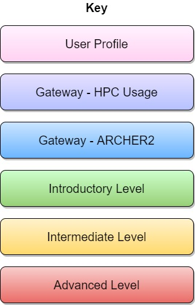

<div class="mxgraph" style="max-width:100%;border:1px solid transparent;" data-mxgraph="{&quot;lightbox&quot;:false,&quot;nav&quot;:true,&quot;resize&quot;:true,&quot;toolbar&quot;:&quot;zoom tags&quot;,&quot;edit&quot;:&quot;_blank&quot;,&quot;xml&quot;:&quot;&lt;mxfile modified=\&quot;2024-04-25T10:53:49.413Z\&quot; host=\&quot;Electron\&quot; agent=\&quot;Mozilla/5.0 (Windows NT 10.0; Win64; x64) AppleWebKit/537.36 (KHTML, like Gecko) draw.io/24.2.5 Chrome/120.0.6099.109 Electron/28.1.0 Safari/537.36\&quot; etag=\&quot;uWGvkU0x0por8EqEIt_Q\&quot; version=\&quot;24.2.5\&quot; type=\&quot;device\&quot;&gt;\n  &lt;diagram id=\&quot;HM_GZg5QxDpaKEgj5FE8\&quot; name=\&quot;Page-1\&quot;&gt;\n    &lt;mxGraphModel dx=\&quot;2897\&quot; dy=\&quot;1203\&quot; grid=\&quot;1\&quot; gridSize=\&quot;10\&quot; guides=\&quot;1\&quot; tooltips=\&quot;1\&quot; connect=\&quot;1\&quot; arrows=\&quot;1\&quot; fold=\&quot;1\&quot; page=\&quot;1\&quot; pageScale=\&quot;1\&quot; pageWidth=\&quot;1169\&quot; pageHeight=\&quot;827\&quot; math=\&quot;0\&quot; shadow=\&quot;0\&quot;&gt;\n      &lt;root&gt;\n        &lt;mxCell id=\&quot;0\&quot; /&gt;\n        &lt;mxCell id=\&quot;1\&quot; parent=\&quot;0\&quot; /&gt;\n        &lt;mxCell id=\&quot;fXhox_11qSjAlL3vgGbD-29\&quot; style=\&quot;edgeStyle=orthogonalEdgeStyle;rounded=0;orthogonalLoop=1;jettySize=auto;html=1;exitX=0.5;exitY=1;exitDx=0;exitDy=0;fontSize=28;dashed=1;strokeWidth=3;endArrow=none;endFill=0;dashPattern=1 1;shadow=1;entryX=0.921;entryY=0.072;entryDx=0;entryDy=0;entryPerimeter=0;\&quot; parent=\&quot;1\&quot; target=\&quot;fXhox_11qSjAlL3vgGbD-22\&quot; edge=\&quot;1\&quot;&gt;\n          &lt;mxGeometry relative=\&quot;1\&quot; as=\&quot;geometry\&quot;&gt;\n            &lt;mxPoint x=\&quot;1426.9999999999995\&quot; y=\&quot;260.2142857142858\&quot; as=\&quot;sourcePoint\&quot; /&gt;\n            &lt;mxPoint x=\&quot;1427\&quot; y=\&quot;1150\&quot; as=\&quot;targetPoint\&quot; /&gt;\n          &lt;/mxGeometry&gt;\n        &lt;/mxCell&gt;\n        &lt;mxCell id=\&quot;fXhox_11qSjAlL3vgGbD-28\&quot; style=\&quot;edgeStyle=orthogonalEdgeStyle;rounded=0;orthogonalLoop=1;jettySize=auto;html=1;exitX=0.5;exitY=1;exitDx=0;exitDy=0;entryX=0.791;entryY=0.083;entryDx=0;entryDy=0;entryPerimeter=0;fontSize=28;dashed=1;strokeWidth=3;endArrow=none;endFill=0;dashPattern=1 1;shadow=1;\&quot; parent=\&quot;1\&quot; target=\&quot;fXhox_11qSjAlL3vgGbD-22\&quot; edge=\&quot;1\&quot;&gt;\n          &lt;mxGeometry relative=\&quot;1\&quot; as=\&quot;geometry\&quot;&gt;\n            &lt;mxPoint x=\&quot;1208.4999999999995\&quot; y=\&quot;260.2142857142858\&quot; as=\&quot;sourcePoint\&quot; /&gt;\n            &lt;mxPoint x=\&quot;1208.4999999999995\&quot; y=\&quot;720.2142857142858\&quot; as=\&quot;targetPoint\&quot; /&gt;\n            &lt;Array as=\&quot;points\&quot;&gt;\n              &lt;mxPoint x=\&quot;1208\&quot; y=\&quot;1185\&quot; /&gt;\n            &lt;/Array&gt;\n          &lt;/mxGeometry&gt;\n        &lt;/mxCell&gt;\n        &lt;mxCell id=\&quot;fXhox_11qSjAlL3vgGbD-27\&quot; style=\&quot;edgeStyle=orthogonalEdgeStyle;rounded=0;orthogonalLoop=1;jettySize=auto;html=1;exitX=0.5;exitY=1;exitDx=0;exitDy=0;entryX=0.646;entryY=0.208;entryDx=0;entryDy=0;entryPerimeter=0;fontSize=28;dashed=1;strokeWidth=3;endArrow=none;endFill=0;dashPattern=1 1;shadow=1;\&quot; parent=\&quot;1\&quot; source=\&quot;fXhox_11qSjAlL3vgGbD-17\&quot; target=\&quot;fXhox_11qSjAlL3vgGbD-22\&quot; edge=\&quot;1\&quot;&gt;\n          &lt;mxGeometry relative=\&quot;1\&quot; as=\&quot;geometry\&quot;&gt;\n            &lt;mxPoint x=\&quot;986.9999999999995\&quot; y=\&quot;260.2142857142858\&quot; as=\&quot;sourcePoint\&quot; /&gt;\n            &lt;mxPoint x=\&quot;986.9999999999995\&quot; y=\&quot;720.2142857142858\&quot; as=\&quot;targetPoint\&quot; /&gt;\n            &lt;Array as=\&quot;points\&quot;&gt;\n              &lt;mxPoint x=\&quot;1000\&quot; y=\&quot;870\&quot; /&gt;\n              &lt;mxPoint x=\&quot;998\&quot; y=\&quot;870\&quot; /&gt;\n            &lt;/Array&gt;\n          &lt;/mxGeometry&gt;\n        &lt;/mxCell&gt;\n        &lt;mxCell id=\&quot;fXhox_11qSjAlL3vgGbD-26\&quot; style=\&quot;edgeStyle=orthogonalEdgeStyle;rounded=0;orthogonalLoop=1;jettySize=auto;html=1;exitX=0.5;exitY=1;exitDx=0;exitDy=0;entryX=0.5;entryY=0;entryDx=0;entryDy=0;fontSize=28;dashed=1;strokeWidth=3;endArrow=none;endFill=0;dashPattern=1 1;shadow=1;\&quot; parent=\&quot;1\&quot; target=\&quot;fXhox_11qSjAlL3vgGbD-22\&quot; edge=\&quot;1\&quot;&gt;\n          &lt;mxGeometry relative=\&quot;1\&quot; as=\&quot;geometry\&quot;&gt;\n            &lt;mxPoint x=\&quot;762.9999999999995\&quot; y=\&quot;260.2142857142858\&quot; as=\&quot;sourcePoint\&quot; /&gt;\n            &lt;mxPoint x=\&quot;762.9999999999995\&quot; y=\&quot;720.2142857142858\&quot; as=\&quot;targetPoint\&quot; /&gt;\n            &lt;Array as=\&quot;points\&quot;&gt;\n              &lt;mxPoint x=\&quot;763\&quot; y=\&quot;1180\&quot; /&gt;\n            &lt;/Array&gt;\n          &lt;/mxGeometry&gt;\n        &lt;/mxCell&gt;\n        &lt;UserObject label=\&quot;\&quot; link=\&quot;#intermediate-level-2-courses\&quot; id=\&quot;jPs5Te8rQqB5Jh4Hdary-4\&quot;&gt;\n          &lt;mxCell style=\&quot;whiteSpace=wrap;html=1;fontSize=28;fontColor=#000000;shadow=1;rounded=1;fontStyle=1;verticalAlign=top;arcSize=3;fillColor=#FFF6ED;gradientColor=#F8E1DF;\&quot; parent=\&quot;1\&quot; vertex=\&quot;1\&quot;&gt;\n            &lt;mxGeometry x=\&quot;890\&quot; y=\&quot;600\&quot; width=\&quot;660\&quot; height=\&quot;530\&quot; as=\&quot;geometry\&quot; /&gt;\n          &lt;/mxCell&gt;\n        &lt;/UserObject&gt;\n        &lt;UserObject label=\&quot;\&quot; link=\&quot;#intermediate-level-2-courses\&quot; id=\&quot;jPs5Te8rQqB5Jh4Hdary-3\&quot;&gt;\n          &lt;mxCell style=\&quot;whiteSpace=wrap;html=1;fontSize=28;fontColor=#000000;shadow=1;rounded=1;fontStyle=1;verticalAlign=top;arcSize=10;fillColor=#FFF6ED;gradientColor=#F8E1DF;\&quot; parent=\&quot;1\&quot; vertex=\&quot;1\&quot;&gt;\n            &lt;mxGeometry x=\&quot;660\&quot; y=\&quot;600\&quot; width=\&quot;220\&quot; height=\&quot;530\&quot; as=\&quot;geometry\&quot; /&gt;\n          &lt;/mxCell&gt;\n        &lt;/UserObject&gt;\n        &lt;mxCell id=\&quot;fXhox_11qSjAlL3vgGbD-24\&quot; style=\&quot;edgeStyle=orthogonalEdgeStyle;rounded=0;orthogonalLoop=1;jettySize=auto;html=1;exitX=0.5;exitY=1;exitDx=0;exitDy=0;entryX=0.207;entryY=0;entryDx=0;entryDy=0;entryPerimeter=0;fontSize=28;dashed=1;strokeWidth=3;endArrow=none;endFill=0;dashPattern=1 1;shadow=1;\&quot; parent=\&quot;1\&quot; source=\&quot;fXhox_11qSjAlL3vgGbD-14\&quot; target=\&quot;fXhox_11qSjAlL3vgGbD-22\&quot; edge=\&quot;1\&quot;&gt;\n          &lt;mxGeometry relative=\&quot;1\&quot; as=\&quot;geometry\&quot;&gt;\n            &lt;mxPoint x=\&quot;318\&quot; y=\&quot;260.2142857142858\&quot; as=\&quot;sourcePoint\&quot; /&gt;\n            &lt;mxPoint x=\&quot;318\&quot; y=\&quot;720.2142857142858\&quot; as=\&quot;targetPoint\&quot; /&gt;\n          &lt;/mxGeometry&gt;\n        &lt;/mxCell&gt;\n        &lt;mxCell id=\&quot;fXhox_11qSjAlL3vgGbD-25\&quot; style=\&quot;edgeStyle=orthogonalEdgeStyle;rounded=0;orthogonalLoop=1;jettySize=auto;html=1;exitX=0.5;exitY=1;exitDx=0;exitDy=0;entryX=0.348;entryY=0.083;entryDx=0;entryDy=0;entryPerimeter=0;fontSize=28;dashed=1;strokeWidth=3;endArrow=none;endFill=0;dashPattern=1 1;shadow=1;\&quot; parent=\&quot;1\&quot; target=\&quot;fXhox_11qSjAlL3vgGbD-22\&quot; edge=\&quot;1\&quot;&gt;\n          &lt;mxGeometry relative=\&quot;1\&quot; as=\&quot;geometry\&quot;&gt;\n            &lt;mxPoint x=\&quot;537\&quot; y=\&quot;260.2142857142858\&quot; as=\&quot;sourcePoint\&quot; /&gt;\n            &lt;mxPoint x=\&quot;537\&quot; y=\&quot;720.2142857142858\&quot; as=\&quot;targetPoint\&quot; /&gt;\n          &lt;/mxGeometry&gt;\n        &lt;/mxCell&gt;\n        &lt;mxCell id=\&quot;fXhox_11qSjAlL3vgGbD-23\&quot; style=\&quot;edgeStyle=orthogonalEdgeStyle;rounded=0;orthogonalLoop=1;jettySize=auto;html=1;exitX=0.5;exitY=1;exitDx=0;exitDy=0;entryX=0.067;entryY=0.006;entryDx=0;entryDy=0;entryPerimeter=0;fontSize=28;dashed=1;strokeWidth=3;endArrow=none;endFill=0;dashPattern=1 1;shadow=1;\&quot; parent=\&quot;1\&quot; source=\&quot;eU1x3NunqTqhmMrRbSO1-12\&quot; target=\&quot;fXhox_11qSjAlL3vgGbD-22\&quot; edge=\&quot;1\&quot;&gt;\n          &lt;mxGeometry relative=\&quot;1\&quot; as=\&quot;geometry\&quot; /&gt;\n        &lt;/mxCell&gt;\n        &lt;mxCell id=\&quot;eU1x3NunqTqhmMrRbSO1-50\&quot; value=\&quot;Researchers\&quot; style=\&quot;whiteSpace=wrap;html=1;fillColor=#cce5ff;gradientColor=#007FFF;fontSize=30;fontColor=#000000;shadow=1;rounded=1;fontStyle=1\&quot; parent=\&quot;1\&quot; vertex=\&quot;1\&quot;&gt;\n          &lt;mxGeometry x=\&quot;-10\&quot; y=\&quot;40\&quot; width=\&quot;660\&quot; height=\&quot;78\&quot; as=\&quot;geometry\&quot; /&gt;\n        &lt;/mxCell&gt;\n        &lt;UserObject label=\&quot;Novice &amp;lt;br&amp;gt;Package User&amp;lt;br style=&amp;quot;font-size: 20px&amp;quot;&amp;gt;without HPC&amp;lt;br&amp;gt;expertise\&quot; link=\&quot;../course-paths#novice-package-user-without-hpc-expertise\&quot; id=\&quot;eU1x3NunqTqhmMrRbSO1-51\&quot;&gt;\n          &lt;mxCell style=\&quot;whiteSpace=wrap;html=1;fillColor=#FFF2FF;gradientColor=#FFD1F1;fontSize=20;fontColor=#000000;shadow=1;rounded=1;fontStyle=0;\&quot; parent=\&quot;1\&quot; vertex=\&quot;1\&quot;&gt;\n            &lt;mxGeometry y=\&quot;140\&quot; width=\&quot;200\&quot; height=\&quot;120\&quot; as=\&quot;geometry\&quot; /&gt;\n          &lt;/mxCell&gt;\n        &lt;/UserObject&gt;\n        &lt;UserObject label=\&quot;Experienced&amp;lt;br&amp;gt;Package&amp;amp;nbsp;User&amp;lt;br style=&amp;quot;font-size: 20px&amp;quot;&amp;gt;without HPC&amp;lt;br&amp;gt;expertise\&quot; link=\&quot;course-paths#experienced-package-user-without-hpc-expertise\&quot; id=\&quot;fXhox_11qSjAlL3vgGbD-1\&quot;&gt;\n          &lt;mxCell style=\&quot;whiteSpace=wrap;html=1;fillColor=#FFF2FF;gradientColor=#FFD1F1;fontSize=20;fontColor=#000000;shadow=1;rounded=1;fontStyle=0;\&quot; parent=\&quot;1\&quot; vertex=\&quot;1\&quot;&gt;\n            &lt;mxGeometry x=\&quot;220\&quot; y=\&quot;140\&quot; width=\&quot;200\&quot; height=\&quot;120\&quot; as=\&quot;geometry\&quot; /&gt;\n          &lt;/mxCell&gt;\n        &lt;/UserObject&gt;\n        &lt;UserObject label=\&quot;Experienced&amp;lt;br&amp;gt;Package&amp;amp;nbsp;User&amp;lt;br style=&amp;quot;font-size: 20px&amp;quot;&amp;gt;with HPC&amp;lt;br&amp;gt;expertise\&quot; link=\&quot;course-paths#experienced-package-user-with-hpc-expertise\&quot; id=\&quot;fXhox_11qSjAlL3vgGbD-2\&quot;&gt;\n          &lt;mxCell style=\&quot;whiteSpace=wrap;html=1;fillColor=#FFF2FF;gradientColor=#FFD1F1;fontSize=20;fontColor=#000000;shadow=1;rounded=1;fontStyle=0;\&quot; parent=\&quot;1\&quot; vertex=\&quot;1\&quot;&gt;\n            &lt;mxGeometry x=\&quot;437.5\&quot; y=\&quot;140\&quot; width=\&quot;200\&quot; height=\&quot;120\&quot; as=\&quot;geometry\&quot; /&gt;\n          &lt;/mxCell&gt;\n        &lt;/UserObject&gt;\n        &lt;UserObject label=\&quot;Data&amp;lt;br&amp;gt;Carpentry\&quot; link=\&quot;https://www.archer2.ac.uk/training/courses/#data-carpentry\&quot; id=\&quot;fXhox_11qSjAlL3vgGbD-5\&quot;&gt;\n          &lt;mxCell style=\&quot;whiteSpace=wrap;html=1;fillColor=#E6E0FF;gradientColor=#B5C1FF;fontSize=20;fontColor=#000000;shadow=1;fontStyle=0;rounded=1;\&quot; parent=\&quot;1\&quot; vertex=\&quot;1\&quot;&gt;\n            &lt;mxGeometry x=\&quot;670\&quot; y=\&quot;278\&quot; width=\&quot;200\&quot; height=\&quot;70\&quot; as=\&quot;geometry\&quot; /&gt;\n          &lt;/mxCell&gt;\n        &lt;/UserObject&gt;\n        &lt;mxCell id=\&quot;fXhox_11qSjAlL3vgGbD-7\&quot; value=\&quot;Data Science\&quot; style=\&quot;whiteSpace=wrap;html=1;fillColor=#cce5ff;gradientColor=#007FFF;fontSize=30;fontColor=#000000;shadow=1;rounded=1;fontStyle=1\&quot; parent=\&quot;1\&quot; vertex=\&quot;1\&quot;&gt;\n          &lt;mxGeometry x=\&quot;660\&quot; y=\&quot;40\&quot; width=\&quot;220\&quot; height=\&quot;78\&quot; as=\&quot;geometry\&quot; /&gt;\n        &lt;/mxCell&gt;\n        &lt;UserObject label=\&quot;Data&amp;lt;br&amp;gt;Scientist\&quot; link=\&quot;course-paths#data-scientist\&quot; id=\&quot;fXhox_11qSjAlL3vgGbD-8\&quot;&gt;\n          &lt;mxCell style=\&quot;whiteSpace=wrap;html=1;fillColor=#FFF2FF;gradientColor=#FFD1F1;fontSize=20;fontColor=#000000;shadow=1;rounded=1;fontStyle=0;\&quot; parent=\&quot;1\&quot; vertex=\&quot;1\&quot;&gt;\n            &lt;mxGeometry x=\&quot;670\&quot; y=\&quot;140\&quot; width=\&quot;200\&quot; height=\&quot;120\&quot; as=\&quot;geometry\&quot; /&gt;\n          &lt;/mxCell&gt;\n        &lt;/UserObject&gt;\n        &lt;mxCell id=\&quot;fXhox_11qSjAlL3vgGbD-9\&quot; value=\&quot;RSEs / Developers\&quot; style=\&quot;whiteSpace=wrap;html=1;fillColor=#cce5ff;gradientColor=#007FFF;fontSize=30;fontColor=#000000;shadow=1;rounded=1;fontStyle=1\&quot; parent=\&quot;1\&quot; vertex=\&quot;1\&quot;&gt;\n          &lt;mxGeometry x=\&quot;890\&quot; y=\&quot;40\&quot; width=\&quot;660\&quot; height=\&quot;78\&quot; as=\&quot;geometry\&quot; /&gt;\n        &lt;/mxCell&gt;\n        &lt;UserObject label=\&quot;Novice &amp;lt;br&amp;gt;Developer&amp;lt;br style=&amp;quot;font-size: 20px&amp;quot;&amp;gt;without HPC&amp;lt;br&amp;gt;expertise\&quot; link=\&quot;course-paths#novice-developer-without-hpc-expertise\&quot; id=\&quot;fXhox_11qSjAlL3vgGbD-10\&quot;&gt;\n          &lt;mxCell style=\&quot;whiteSpace=wrap;html=1;fillColor=#FFF2FF;gradientColor=#FFD1F1;fontSize=20;fontColor=#000000;shadow=1;rounded=1;fontStyle=0;\&quot; parent=\&quot;1\&quot; vertex=\&quot;1\&quot;&gt;\n            &lt;mxGeometry x=\&quot;900\&quot; y=\&quot;140\&quot; width=\&quot;200\&quot; height=\&quot;120\&quot; as=\&quot;geometry\&quot; /&gt;\n          &lt;/mxCell&gt;\n        &lt;/UserObject&gt;\n        &lt;UserObject label=\&quot;Novice&amp;lt;br&amp;gt;Developer&amp;lt;br style=&amp;quot;font-size: 20px&amp;quot;&amp;gt;with HPC&amp;lt;br&amp;gt;expertise\&quot; link=\&quot;course-paths#novice-developer-with-hpc-expertise\&quot; id=\&quot;fXhox_11qSjAlL3vgGbD-11\&quot;&gt;\n          &lt;mxCell style=\&quot;whiteSpace=wrap;html=1;fillColor=#FFF2FF;gradientColor=#FFD1F1;fontSize=20;fontColor=#000000;shadow=1;rounded=1;fontStyle=0;\&quot; parent=\&quot;1\&quot; vertex=\&quot;1\&quot;&gt;\n            &lt;mxGeometry x=\&quot;1120\&quot; y=\&quot;140\&quot; width=\&quot;200\&quot; height=\&quot;120\&quot; as=\&quot;geometry\&quot; /&gt;\n          &lt;/mxCell&gt;\n        &lt;/UserObject&gt;\n        &lt;UserObject label=\&quot;Experienced&amp;lt;br&amp;gt;Developer&amp;lt;br style=&amp;quot;font-size: 20px&amp;quot;&amp;gt;with HPC&amp;lt;br&amp;gt;expertise\&quot; link=\&quot;course-paths#experienced-developer-with-hpc-expertise\&quot; id=\&quot;fXhox_11qSjAlL3vgGbD-12\&quot;&gt;\n          &lt;mxCell style=\&quot;whiteSpace=wrap;html=1;fillColor=#FFF2FF;gradientColor=#FFD1F1;fontSize=20;fontColor=#000000;shadow=1;rounded=1;fontStyle=0;\&quot; parent=\&quot;1\&quot; vertex=\&quot;1\&quot;&gt;\n            &lt;mxGeometry x=\&quot;1340\&quot; y=\&quot;140\&quot; width=\&quot;200\&quot; height=\&quot;120\&quot; as=\&quot;geometry\&quot; /&gt;\n          &lt;/mxCell&gt;\n        &lt;/UserObject&gt;\n        &lt;UserObject label=\&quot;Software&amp;lt;br&amp;gt;Carpentry\&quot; link=\&quot;#software-carpentry\&quot; id=\&quot;fXhox_11qSjAlL3vgGbD-13\&quot;&gt;\n          &lt;mxCell style=\&quot;whiteSpace=wrap;html=1;fillColor=#E6E0FF;fontSize=20;fontColor=#000000;shadow=1;fontStyle=0;rounded=1;gradientColor=#B5C1FF;\&quot; parent=\&quot;1\&quot; vertex=\&quot;1\&quot;&gt;\n            &lt;mxGeometry x=\&quot;1120\&quot; y=\&quot;278\&quot; width=\&quot;200\&quot; height=\&quot;70\&quot; as=\&quot;geometry\&quot; /&gt;\n          &lt;/mxCell&gt;\n        &lt;/UserObject&gt;\n        &lt;UserObject label=\&quot;Package Use on&amp;lt;br style=&amp;quot;font-size: 20px;&amp;quot;&amp;gt;ARCHER2\&quot; link=\&quot;#package-use-on-archer2\&quot; id=\&quot;fXhox_11qSjAlL3vgGbD-15\&quot;&gt;\n          &lt;mxCell style=\&quot;rounded=1;whiteSpace=wrap;html=1;fillColor=#cce5ff;gradientColor=#6BB5FF;fontSize=20;fontColor=#000000;shadow=1;\&quot; parent=\&quot;1\&quot; vertex=\&quot;1\&quot;&gt;\n            &lt;mxGeometry x=\&quot;440\&quot; y=\&quot;480\&quot; width=\&quot;200\&quot; height=\&quot;80\&quot; as=\&quot;geometry\&quot; /&gt;\n          &lt;/mxCell&gt;\n        &lt;/UserObject&gt;\n        &lt;UserObject label=\&quot;Data Science on&amp;lt;br style=&amp;quot;font-size: 20px&amp;quot;&amp;gt;ARCHER2\&quot; link=\&quot;#data-science-on-archer2\&quot; id=\&quot;fXhox_11qSjAlL3vgGbD-16\&quot;&gt;\n          &lt;mxCell style=\&quot;rounded=1;whiteSpace=wrap;html=1;fillColor=#cce5ff;gradientColor=#6BB5FF;fontSize=20;fontColor=#000000;shadow=1;\&quot; parent=\&quot;1\&quot; vertex=\&quot;1\&quot;&gt;\n            &lt;mxGeometry x=\&quot;670\&quot; y=\&quot;480\&quot; width=\&quot;200\&quot; height=\&quot;80\&quot; as=\&quot;geometry\&quot; /&gt;\n          &lt;/mxCell&gt;\n        &lt;/UserObject&gt;\n        &lt;UserObject label=\&quot;Development on&amp;lt;br style=&amp;quot;font-size: 20px&amp;quot;&amp;gt;ARCHER2\&quot; link=\&quot;#development-on-archer2\&quot; id=\&quot;fXhox_11qSjAlL3vgGbD-18\&quot;&gt;\n          &lt;mxCell style=\&quot;rounded=1;whiteSpace=wrap;html=1;fillColor=#cce5ff;gradientColor=#6BB5FF;fontSize=20;fontColor=#000000;shadow=1;\&quot; parent=\&quot;1\&quot; vertex=\&quot;1\&quot;&gt;\n            &lt;mxGeometry x=\&quot;1120\&quot; y=\&quot;480\&quot; width=\&quot;200\&quot; height=\&quot;80\&quot; as=\&quot;geometry\&quot; /&gt;\n          &lt;/mxCell&gt;\n        &lt;/UserObject&gt;\n        &lt;UserObject label=\&quot;Development on&amp;lt;br style=&amp;quot;font-size: 20px&amp;quot;&amp;gt;ARCHER2\&quot; link=\&quot;#development-on-archer2\&quot; id=\&quot;fXhox_11qSjAlL3vgGbD-19\&quot;&gt;\n          &lt;mxCell style=\&quot;rounded=1;whiteSpace=wrap;html=1;fontSize=20;fontColor=#000000;shadow=1;fillColor=#cce5ff;gradientColor=#6BB5FF;\&quot; parent=\&quot;1\&quot; vertex=\&quot;1\&quot;&gt;\n            &lt;mxGeometry x=\&quot;1340\&quot; y=\&quot;480\&quot; width=\&quot;200\&quot; height=\&quot;80\&quot; as=\&quot;geometry\&quot; /&gt;\n          &lt;/mxCell&gt;\n        &lt;/UserObject&gt;\n        &lt;UserObject label=\&quot;\&quot; link=\&quot;#intermediate-level-2-courses\&quot; id=\&quot;fXhox_11qSjAlL3vgGbD-21\&quot;&gt;\n          &lt;mxCell style=\&quot;whiteSpace=wrap;html=1;fontSize=28;fontColor=#000000;shadow=1;rounded=1;fontStyle=1;verticalAlign=top;arcSize=3;gradientColor=#F8E1DF;fillColor=#FFF6ED;\&quot; parent=\&quot;1\&quot; vertex=\&quot;1\&quot;&gt;\n            &lt;mxGeometry x=\&quot;-10\&quot; y=\&quot;600\&quot; width=\&quot;660\&quot; height=\&quot;530\&quot; as=\&quot;geometry\&quot; /&gt;\n          &lt;/mxCell&gt;\n        &lt;/UserObject&gt;\n        &lt;UserObject label=\&quot;Virtual Tutorials\&quot; link=\&quot;#virtual\&quot; id=\&quot;fXhox_11qSjAlL3vgGbD-22\&quot;&gt;\n          &lt;mxCell style=\&quot;whiteSpace=wrap;html=1;fillColor=#FFF6ED;fontSize=28;fontColor=#000000;shadow=1;rounded=1;fontStyle=1;gradientColor=#F8E1DF;verticalAlign=middle;arcSize=23;\&quot; parent=\&quot;1\&quot; vertex=\&quot;1\&quot;&gt;\n            &lt;mxGeometry x=\&quot;-10\&quot; y=\&quot;1180\&quot; width=\&quot;1560\&quot; height=\&quot;70\&quot; as=\&quot;geometry\&quot; /&gt;\n          &lt;/mxCell&gt;\n        &lt;/UserObject&gt;\n        &lt;UserObject label=\&quot;Message Passing Programming with MPI\&quot; link=\&quot;#message-passing-programming-with-mpi\&quot; id=\&quot;7cWSH9lMar6aVrHlgyDx-21\&quot;&gt;\n          &lt;mxCell style=\&quot;whiteSpace=wrap;html=1;fontSize=20;fontColor=#000000;shadow=1;fontStyle=0;rounded=1;fillColor=#FFF2CC;gradientColor=#FFd96c;\&quot; parent=\&quot;1\&quot; vertex=\&quot;1\&quot;&gt;\n            &lt;mxGeometry x=\&quot;1340\&quot; y=\&quot;630\&quot; width=\&quot;200\&quot; height=\&quot;90\&quot; as=\&quot;geometry\&quot; /&gt;\n          &lt;/mxCell&gt;\n        &lt;/UserObject&gt;\n        &lt;UserObject label=\&quot;Shared Memory Programming with OpenMP\&quot; link=\&quot;#shared-memory-programming-with-openmp\&quot; id=\&quot;7cWSH9lMar6aVrHlgyDx-22\&quot;&gt;\n          &lt;mxCell style=\&quot;whiteSpace=wrap;html=1;fontSize=20;fontColor=#000000;shadow=1;fontStyle=0;rounded=1;fillColor=#FFF2CC;gradientColor=#FFd96c;\&quot; parent=\&quot;1\&quot; vertex=\&quot;1\&quot;&gt;\n            &lt;mxGeometry x=\&quot;1120\&quot; y=\&quot;630\&quot; width=\&quot;201\&quot; height=\&quot;90\&quot; as=\&quot;geometry\&quot; /&gt;\n          &lt;/mxCell&gt;\n        &lt;/UserObject&gt;\n        &lt;UserObject label=\&quot;GPU Programming with HIP\&quot; link=\&quot;#gpu-programming-with-hip\&quot; id=\&quot;7cWSH9lMar6aVrHlgyDx-26\&quot;&gt;\n          &lt;mxCell style=\&quot;whiteSpace=wrap;html=1;fontSize=20;fontColor=#000000;shadow=1;rounded=1;fillColor=#f8cecc;gradientColor=#ea6b66;strokeColor=default;align=center;verticalAlign=middle;fontFamily=Helvetica;fontStyle=0;\&quot; parent=\&quot;1\&quot; vertex=\&quot;1\&quot;&gt;\n            &lt;mxGeometry x=\&quot;1119.5\&quot; y=\&quot;840\&quot; width=\&quot;201\&quot; height=\&quot;90\&quot; as=\&quot;geometry\&quot; /&gt;\n          &lt;/mxCell&gt;\n        &lt;/UserObject&gt;\n        &lt;UserObject label=\&quot;Advanced MPI\&quot; link=\&quot;#advanced-mpi\&quot; id=\&quot;7cWSH9lMar6aVrHlgyDx-33\&quot;&gt;\n          &lt;mxCell style=\&quot;whiteSpace=wrap;html=1;fontSize=20;fontColor=#000000;shadow=1;fontStyle=0;rounded=1;fillColor=#f8cecc;gradientColor=#ea6b66;\&quot; parent=\&quot;1\&quot; vertex=\&quot;1\&quot;&gt;\n            &lt;mxGeometry x=\&quot;900\&quot; y=\&quot;895\&quot; width=\&quot;200\&quot; height=\&quot;65\&quot; as=\&quot;geometry\&quot; /&gt;\n          &lt;/mxCell&gt;\n        &lt;/UserObject&gt;\n        &lt;UserObject label=\&quot;Single Node&amp;lt;br&amp;gt;Performance&amp;lt;br&amp;gt;Optimisation\&quot; link=\&quot;#single-node-performance-optimisation\&quot; id=\&quot;7cWSH9lMar6aVrHlgyDx-35\&quot;&gt;\n          &lt;mxCell style=\&quot;whiteSpace=wrap;html=1;fontSize=20;fontColor=#000000;shadow=1;fontStyle=0;rounded=1;fillColor=#f8cecc;gradientColor=#ea6b66;\&quot; parent=\&quot;1\&quot; vertex=\&quot;1\&quot;&gt;\n            &lt;mxGeometry x=\&quot;1339.5\&quot; y=\&quot;950\&quot; width=\&quot;200\&quot; height=\&quot;90\&quot; as=\&quot;geometry\&quot; /&gt;\n          &lt;/mxCell&gt;\n        &lt;/UserObject&gt;\n        &lt;UserObject label=\&quot;Efficient use of the&amp;lt;br&amp;gt;HPE Cray EX&amp;lt;br&amp;gt;Supercomputer\&quot; link=\&quot;#efficient-use-of-the-hpe-cray-ex-system\&quot; id=\&quot;7cWSH9lMar6aVrHlgyDx-38\&quot;&gt;\n          &lt;mxCell style=\&quot;whiteSpace=wrap;html=1;fontSize=20;fontColor=#000000;shadow=1;fontStyle=0;rounded=1;fillColor=#f8cecc;gradientColor=#ea6b66;\&quot; parent=\&quot;1\&quot; vertex=\&quot;1\&quot;&gt;\n            &lt;mxGeometry x=\&quot;1119.5\&quot; y=\&quot;950\&quot; width=\&quot;200\&quot; height=\&quot;90\&quot; as=\&quot;geometry\&quot; /&gt;\n          &lt;/mxCell&gt;\n        &lt;/UserObject&gt;\n        &lt;UserObject label=\&quot;Advanced OpenMP\&quot; link=\&quot;#advanced-openmp\&quot; id=\&quot;7cWSH9lMar6aVrHlgyDx-39\&quot;&gt;\n          &lt;mxCell style=\&quot;whiteSpace=wrap;html=1;fontSize=20;fontColor=#000000;shadow=1;fontStyle=0;rounded=1;fillColor=#f8cecc;gradientColor=#ea6b66;\&quot; parent=\&quot;1\&quot; vertex=\&quot;1\&quot;&gt;\n            &lt;mxGeometry x=\&quot;899.5\&quot; y=\&quot;975\&quot; width=\&quot;201\&quot; height=\&quot;65\&quot; as=\&quot;geometry\&quot; /&gt;\n          &lt;/mxCell&gt;\n        &lt;/UserObject&gt;\n        &lt;UserObject label=\&quot;Reproducible computational environments&amp;lt;br&amp;gt;using Containers\&quot; link=\&quot;#reproducible-computational-environments-using-containers\&quot; id=\&quot;7cWSH9lMar6aVrHlgyDx-40\&quot;&gt;\n          &lt;mxCell style=\&quot;whiteSpace=wrap;html=1;fontSize=20;fontColor=#000000;shadow=1;rounded=1;fillColor=#FFF2CC;gradientColor=#FFd96c;fontStyle=0;\&quot; parent=\&quot;1\&quot; vertex=\&quot;1\&quot;&gt;\n            &lt;mxGeometry y=\&quot;728.75\&quot; width=\&quot;201\&quot; height=\&quot;110\&quot; as=\&quot;geometry\&quot; /&gt;\n          &lt;/mxCell&gt;\n        &lt;/UserObject&gt;\n        &lt;UserObject label=\&quot;Introduction to&amp;lt;br&amp;gt;CP2K\&quot; link=\&quot;#introduction-to-cp2k\&quot; id=\&quot;g2nK4x6xjNkVsNJwBBPS-2\&quot;&gt;\n          &lt;mxCell style=\&quot;whiteSpace=wrap;html=1;fontSize=20;fontColor=#000000;shadow=1;rounded=1;fillColor=#ccffcc;gradientColor=#97d077;\&quot; parent=\&quot;1\&quot; vertex=\&quot;1\&quot;&gt;\n            &lt;mxGeometry y=\&quot;630\&quot; width=\&quot;200\&quot; height=\&quot;65\&quot; as=\&quot;geometry\&quot; /&gt;\n          &lt;/mxCell&gt;\n        &lt;/UserObject&gt;\n        &lt;UserObject label=\&quot;Using ReFrame for Performance Benchmarking\&quot; link=\&quot;#using-reframe-for-performance-benchmarking\&quot; id=\&quot;g2nK4x6xjNkVsNJwBBPS-3\&quot;&gt;\n          &lt;mxCell style=\&quot;whiteSpace=wrap;html=1;fontSize=20;fontColor=#000000;shadow=1;rounded=1;fillColor=#FFF2CC;gradientColor=#FFd96c;strokeColor=default;align=center;verticalAlign=middle;fontFamily=Helvetica;fontStyle=0;\&quot; parent=\&quot;1\&quot; vertex=\&quot;1\&quot;&gt;\n            &lt;mxGeometry x=\&quot;220\&quot; y=\&quot;728.75\&quot; width=\&quot;200\&quot; height=\&quot;105\&quot; as=\&quot;geometry\&quot; /&gt;\n          &lt;/mxCell&gt;\n        &lt;/UserObject&gt;\n        &lt;UserObject label=\&quot;Running Software Packages on GPU\&quot; link=\&quot;#running-software-packages-on-gpu\&quot; id=\&quot;g2nK4x6xjNkVsNJwBBPS-4\&quot;&gt;\n          &lt;mxCell style=\&quot;whiteSpace=wrap;html=1;fontSize=20;fontColor=#000000;shadow=1;rounded=1;fillColor=#FFF2CC;gradientColor=#FFd96c;strokeColor=default;align=center;verticalAlign=middle;fontFamily=Helvetica;fontStyle=0;\&quot; parent=\&quot;1\&quot; vertex=\&quot;1\&quot;&gt;\n            &lt;mxGeometry x=\&quot;440\&quot; y=\&quot;728.75\&quot; width=\&quot;200\&quot; height=\&quot;65\&quot; as=\&quot;geometry\&quot; /&gt;\n          &lt;/mxCell&gt;\n        &lt;/UserObject&gt;\n        &lt;UserObject label=\&quot;Modern C++ for&amp;lt;br&amp;gt;Computational Scientists\&quot; link=\&quot;#modern-c-for-computational-scientists\&quot; id=\&quot;g2nK4x6xjNkVsNJwBBPS-7\&quot;&gt;\n          &lt;mxCell style=\&quot;whiteSpace=wrap;html=1;fontSize=20;fontColor=#000000;shadow=1;fontStyle=0;rounded=1;fillColor=#FFF2CC;gradientColor=#FFd96c;\&quot; parent=\&quot;1\&quot; vertex=\&quot;1\&quot;&gt;\n            &lt;mxGeometry x=\&quot;1120\&quot; y=\&quot;736.25\&quot; width=\&quot;200\&quot; height=\&quot;87.5\&quot; as=\&quot;geometry\&quot; /&gt;\n          &lt;/mxCell&gt;\n        &lt;/UserObject&gt;\n        &lt;UserObject label=\&quot;Introduction to Modern Fortran\&quot; link=\&quot;#introduction-to-modern-fortran\&quot; id=\&quot;g2nK4x6xjNkVsNJwBBPS-8\&quot;&gt;\n          &lt;mxCell style=\&quot;whiteSpace=wrap;html=1;fontSize=20;fontColor=#000000;shadow=1;fontStyle=0;rounded=1;fillColor=#ccffcc;gradientColor=#97d077;strokeColor=default;align=center;verticalAlign=middle;fontFamily=Helvetica;\&quot; parent=\&quot;1\&quot; vertex=\&quot;1\&quot;&gt;\n            &lt;mxGeometry x=\&quot;899.5\&quot; y=\&quot;632.5\&quot; width=\&quot;200\&quot; height=\&quot;65\&quot; as=\&quot;geometry\&quot; /&gt;\n          &lt;/mxCell&gt;\n        &lt;/UserObject&gt;\n        &lt;UserObject label=\&quot;Efficient Parallel IO\&quot; link=\&quot;#efficient-parallel-io\&quot; id=\&quot;g2nK4x6xjNkVsNJwBBPS-9\&quot;&gt;\n          &lt;mxCell style=\&quot;whiteSpace=wrap;html=1;fontSize=20;fontColor=#000000;shadow=1;fontStyle=0;rounded=1;fillColor=#FFF2CC;gradientColor=#FFd96c;\&quot; parent=\&quot;1\&quot; vertex=\&quot;1\&quot;&gt;\n            &lt;mxGeometry x=\&quot;900\&quot; y=\&quot;721.25\&quot; width=\&quot;200\&quot; height=\&quot;65\&quot; as=\&quot;geometry\&quot; /&gt;\n          &lt;/mxCell&gt;\n        &lt;/UserObject&gt;\n        &lt;UserObject label=\&quot;Parallel Performance Analysis using Scalasca\&quot; link=\&quot;#parallel-performance-analysis-using-scalasca\&quot; id=\&quot;g2nK4x6xjNkVsNJwBBPS-10\&quot;&gt;\n          &lt;mxCell style=\&quot;whiteSpace=wrap;html=1;fontSize=20;fontColor=#000000;shadow=1;fontStyle=0;rounded=1;fillColor=#f8cecc;gradientColor=#ea6b66;\&quot; parent=\&quot;1\&quot; vertex=\&quot;1\&quot;&gt;\n            &lt;mxGeometry x=\&quot;1339.5\&quot; y=\&quot;840\&quot; width=\&quot;200\&quot; height=\&quot;90\&quot; as=\&quot;geometry\&quot; /&gt;\n          &lt;/mxCell&gt;\n        &lt;/UserObject&gt;\n        &lt;UserObject label=\&quot;Development on&amp;lt;br style=&amp;quot;font-size: 20px&amp;quot;&amp;gt;ARCHER2\&quot; link=\&quot;#development-on-archer2\&quot; id=\&quot;fXhox_11qSjAlL3vgGbD-17\&quot;&gt;\n          &lt;mxCell style=\&quot;rounded=1;whiteSpace=wrap;html=1;fillColor=#cce5ff;gradientColor=#6BB5FF;fontSize=20;fontColor=#000000;shadow=1;\&quot; parent=\&quot;1\&quot; vertex=\&quot;1\&quot;&gt;\n            &lt;mxGeometry x=\&quot;900\&quot; y=\&quot;480\&quot; width=\&quot;200\&quot; height=\&quot;80\&quot; as=\&quot;geometry\&quot; /&gt;\n          &lt;/mxCell&gt;\n        &lt;/UserObject&gt;\n        &lt;mxCell id=\&quot;g2nK4x6xjNkVsNJwBBPS-11\&quot; style=\&quot;edgeStyle=orthogonalEdgeStyle;rounded=0;orthogonalLoop=1;jettySize=auto;html=1;exitX=0.5;exitY=1;exitDx=0;exitDy=0;entryX=0.5;entryY=0;entryDx=0;entryDy=0;fontSize=28;dashed=1;strokeWidth=3;endArrow=none;endFill=0;dashPattern=1 1;shadow=1;\&quot; parent=\&quot;1\&quot; source=\&quot;fXhox_11qSjAlL3vgGbD-10\&quot; target=\&quot;fXhox_11qSjAlL3vgGbD-17\&quot; edge=\&quot;1\&quot;&gt;\n          &lt;mxGeometry relative=\&quot;1\&quot; as=\&quot;geometry\&quot;&gt;\n            &lt;mxPoint x=\&quot;986.9999999999991\&quot; y=\&quot;260.2142857142858\&quot; as=\&quot;sourcePoint\&quot; /&gt;\n            &lt;mxPoint x=\&quot;989.3800000000006\&quot; y=\&quot;1052.48\&quot; as=\&quot;targetPoint\&quot; /&gt;\n          &lt;/mxGeometry&gt;\n        &lt;/mxCell&gt;\n        &lt;UserObject label=\&quot;Software&amp;lt;br&amp;gt;Carpentry\&quot; link=\&quot;#software-carpentry\&quot; id=\&quot;fXhox_11qSjAlL3vgGbD-6\&quot;&gt;\n          &lt;mxCell style=\&quot;whiteSpace=wrap;html=1;fillColor=#E6E0FF;gradientColor=#B5C1FF;fontSize=20;fontColor=#000000;shadow=1;fontStyle=0;rounded=1;\&quot; parent=\&quot;1\&quot; vertex=\&quot;1\&quot;&gt;\n            &lt;mxGeometry x=\&quot;900\&quot; y=\&quot;278\&quot; width=\&quot;200\&quot; height=\&quot;70\&quot; as=\&quot;geometry\&quot; /&gt;\n          &lt;/mxCell&gt;\n        &lt;/UserObject&gt;\n        &lt;UserObject label=\&quot;HPC&amp;lt;br&amp;gt;Carpentry\&quot; link=\&quot;#hpc-carpentry\&quot; id=\&quot;fXhox_11qSjAlL3vgGbD-4\&quot;&gt;\n          &lt;mxCell style=\&quot;whiteSpace=wrap;html=1;fillColor=#E6E0FF;gradientColor=#B5C1FF;fontSize=20;fontColor=#000000;shadow=1;fontStyle=0;rounded=1;\&quot; parent=\&quot;1\&quot; vertex=\&quot;1\&quot;&gt;\n            &lt;mxGeometry x=\&quot;900\&quot; y=\&quot;380\&quot; width=\&quot;200\&quot; height=\&quot;70\&quot; as=\&quot;geometry\&quot; /&gt;\n          &lt;/mxCell&gt;\n        &lt;/UserObject&gt;\n        &lt;mxCell id=\&quot;fXhox_11qSjAlL3vgGbD-14\&quot; value=\&quot;Package Use on&amp;lt;br style=&amp;quot;font-size: 20px;&amp;quot;&amp;gt;ARCHER2\&quot; style=\&quot;rounded=1;whiteSpace=wrap;html=1;fillColor=#ccffcc;gradientColor=#97d077;fontSize=20;fontColor=#000000;shadow=1;\&quot; parent=\&quot;1\&quot; vertex=\&quot;1\&quot;&gt;\n          &lt;mxGeometry x=\&quot;220\&quot; y=\&quot;480\&quot; width=\&quot;200\&quot; height=\&quot;80\&quot; as=\&quot;geometry\&quot; /&gt;\n        &lt;/mxCell&gt;\n        &lt;mxCell id=\&quot;g2nK4x6xjNkVsNJwBBPS-12\&quot; style=\&quot;edgeStyle=orthogonalEdgeStyle;rounded=0;orthogonalLoop=1;jettySize=auto;html=1;exitX=0.5;exitY=1;exitDx=0;exitDy=0;entryX=0.5;entryY=0;entryDx=0;entryDy=0;fontSize=28;dashed=1;strokeWidth=3;endArrow=none;endFill=0;dashPattern=1 1;shadow=1;\&quot; parent=\&quot;1\&quot; source=\&quot;fXhox_11qSjAlL3vgGbD-1\&quot; target=\&quot;fXhox_11qSjAlL3vgGbD-14\&quot; edge=\&quot;1\&quot;&gt;\n          &lt;mxGeometry relative=\&quot;1\&quot; as=\&quot;geometry\&quot;&gt;\n            &lt;mxPoint x=\&quot;318\&quot; y=\&quot;260.2142857142858\&quot; as=\&quot;sourcePoint\&quot; /&gt;\n            &lt;mxPoint x=\&quot;317.71000000000004\&quot; y=\&quot;1040\&quot; as=\&quot;targetPoint\&quot; /&gt;\n          &lt;/mxGeometry&gt;\n        &lt;/mxCell&gt;\n        &lt;mxCell id=\&quot;eU1x3NunqTqhmMrRbSO1-12\&quot; value=\&quot;Package Use on&amp;lt;br style=&amp;quot;font-size: 20px;&amp;quot;&amp;gt;ARCHER2\&quot; style=\&quot;rounded=1;whiteSpace=wrap;html=1;fontSize=20;fontColor=#000000;shadow=1;fontStyle=0;gradientColor=#FFC9F8;fillColor=#FEE8FF;\&quot; parent=\&quot;1\&quot; vertex=\&quot;1\&quot;&gt;\n          &lt;mxGeometry y=\&quot;480\&quot; width=\&quot;200\&quot; height=\&quot;80\&quot; as=\&quot;geometry\&quot; /&gt;\n        &lt;/mxCell&gt;\n        &lt;mxCell id=\&quot;g2nK4x6xjNkVsNJwBBPS-13\&quot; style=\&quot;edgeStyle=orthogonalEdgeStyle;rounded=0;orthogonalLoop=1;jettySize=auto;html=1;exitX=0.5;exitY=1;exitDx=0;exitDy=0;entryX=0.5;entryY=0;entryDx=0;entryDy=0;fontSize=28;dashed=1;strokeWidth=3;endArrow=none;endFill=0;dashPattern=1 1;shadow=1;\&quot; parent=\&quot;1\&quot; source=\&quot;eU1x3NunqTqhmMrRbSO1-51\&quot; target=\&quot;eU1x3NunqTqhmMrRbSO1-12\&quot; edge=\&quot;1\&quot;&gt;\n          &lt;mxGeometry relative=\&quot;1\&quot; as=\&quot;geometry\&quot;&gt;\n            &lt;mxPoint x=\&quot;100\&quot; y=\&quot;260\&quot; as=\&quot;sourcePoint\&quot; /&gt;\n            &lt;mxPoint x=\&quot;100.45000000000027\&quot; y=\&quot;1039.6999999999998\&quot; as=\&quot;targetPoint\&quot; /&gt;\n          &lt;/mxGeometry&gt;\n        &lt;/mxCell&gt;\n        &lt;UserObject label=\&quot;HPC&amp;lt;br&amp;gt;Carpentry\&quot; link=\&quot;../#hpc-carpentry\&quot; id=\&quot;eU1x3NunqTqhmMrRbSO1-28\&quot;&gt;\n          &lt;mxCell style=\&quot;whiteSpace=wrap;html=1;fontSize=20;fontColor=#000000;shadow=1;fontStyle=0;rounded=1;fillColor=#E6E0FF;gradientColor=#B5C1FF;\&quot; parent=\&quot;1\&quot; vertex=\&quot;1\&quot;&gt;\n            &lt;mxGeometry y=\&quot;278\&quot; width=\&quot;200\&quot; height=\&quot;70\&quot; as=\&quot;geometry\&quot; /&gt;\n          &lt;/mxCell&gt;\n        &lt;/UserObject&gt;\n        &lt;UserObject label=\&quot;HPC&amp;lt;br&amp;gt;Carpentry\&quot; link=\&quot;../index.html#hpc-carpentry\&quot; id=\&quot;fXhox_11qSjAlL3vgGbD-3\&quot;&gt;\n          &lt;mxCell style=\&quot;whiteSpace=wrap;html=1;fillColor=#E6E0FF;gradientColor=#B5C1FF;fontSize=20;fontColor=#000000;shadow=1;fontStyle=0;rounded=1;\&quot; parent=\&quot;1\&quot; vertex=\&quot;1\&quot;&gt;\n            &lt;mxGeometry x=\&quot;220\&quot; y=\&quot;278\&quot; width=\&quot;200\&quot; height=\&quot;70\&quot; as=\&quot;geometry\&quot; /&gt;\n          &lt;/mxCell&gt;\n        &lt;/UserObject&gt;\n        &lt;UserObject label=\&quot;Package Use on&amp;lt;br style=&amp;quot;font-size: 20px;&amp;quot;&amp;gt;ARCHER2\&quot; link=\&quot;#package-use-on-archer2\&quot; id=\&quot;jPs5Te8rQqB5Jh4Hdary-1\&quot;&gt;\n          &lt;mxCell style=\&quot;rounded=1;whiteSpace=wrap;html=1;fontSize=20;fontColor=#000000;shadow=1;gradientColor=#6BB5FF;fillColor=#cce5ff;\&quot; parent=\&quot;1\&quot; vertex=\&quot;1\&quot;&gt;\n            &lt;mxGeometry y=\&quot;480\&quot; width=\&quot;200\&quot; height=\&quot;80\&quot; as=\&quot;geometry\&quot; /&gt;\n          &lt;/mxCell&gt;\n        &lt;/UserObject&gt;\n        &lt;UserObject label=\&quot;Package Use on&amp;lt;br style=&amp;quot;font-size: 20px;&amp;quot;&amp;gt;ARCHER2\&quot; link=\&quot;#package-use-on-archer2\&quot; id=\&quot;jPs5Te8rQqB5Jh4Hdary-2\&quot;&gt;\n          &lt;mxCell style=\&quot;rounded=1;whiteSpace=wrap;html=1;fillColor=#cce5ff;gradientColor=#6BB5FF;fontSize=20;fontColor=#000000;shadow=1;\&quot; parent=\&quot;1\&quot; vertex=\&quot;1\&quot;&gt;\n            &lt;mxGeometry x=\&quot;220\&quot; y=\&quot;480\&quot; width=\&quot;200\&quot; height=\&quot;80\&quot; as=\&quot;geometry\&quot; /&gt;\n          &lt;/mxCell&gt;\n        &lt;/UserObject&gt;\n        &lt;UserObject label=\&quot;Reproducible computational environments&amp;lt;br&amp;gt;using Containers\&quot; link=\&quot;#reproducible-computational-environments-using-containers\&quot; id=\&quot;jPs5Te8rQqB5Jh4Hdary-6\&quot;&gt;\n          &lt;mxCell style=\&quot;whiteSpace=wrap;html=1;fontSize=20;fontColor=#000000;shadow=1;rounded=1;fillColor=#FFF2CC;gradientColor=#FFd96c;fontStyle=0;\&quot; parent=\&quot;1\&quot; vertex=\&quot;1\&quot;&gt;\n            &lt;mxGeometry x=\&quot;670\&quot; y=\&quot;740\&quot; width=\&quot;201\&quot; height=\&quot;110\&quot; as=\&quot;geometry\&quot; /&gt;\n          &lt;/mxCell&gt;\n        &lt;/UserObject&gt;\n        &lt;UserObject label=\&quot;Introduction to&amp;lt;br&amp;gt;Data Science &amp;amp;amp;&amp;lt;br&amp;gt;Machine Learning\&quot; link=\&quot;#introduction-to-data-science--machine-learning\&quot; id=\&quot;yI_-5yth7f3-G6jFnsdY-1\&quot;&gt;\n          &lt;mxCell style=\&quot;whiteSpace=wrap;html=1;fontSize=20;fontColor=#000000;shadow=1;rounded=1;fillColor=#FFF2CC;gradientColor=#FFd96c;strokeColor=default;align=center;verticalAlign=middle;fontFamily=Helvetica;fontStyle=0;\&quot; parent=\&quot;1\&quot; vertex=\&quot;1\&quot;&gt;\n            &lt;mxGeometry x=\&quot;670\&quot; y=\&quot;870\&quot; width=\&quot;200\&quot; height=\&quot;90\&quot; as=\&quot;geometry\&quot; /&gt;\n          &lt;/mxCell&gt;\n        &lt;/UserObject&gt;\n        &lt;UserObject label=\&quot;Data Analysis &amp;lt;br&amp;gt;and&amp;amp;nbsp;Visualisation&amp;lt;br&amp;gt;in Python\&quot; link=\&quot;#data-analysis-and-visualisation-in-python\&quot; id=\&quot;yI_-5yth7f3-G6jFnsdY-2\&quot;&gt;\n          &lt;mxCell style=\&quot;whiteSpace=wrap;html=1;fontSize=20;fontColor=#000000;shadow=1;rounded=1;fillColor=#ccffcc;gradientColor=#97d077;\&quot; parent=\&quot;1\&quot; vertex=\&quot;1\&quot;&gt;\n            &lt;mxGeometry x=\&quot;670\&quot; y=\&quot;631.25\&quot; width=\&quot;200\&quot; height=\&quot;90\&quot; as=\&quot;geometry\&quot; /&gt;\n          &lt;/mxCell&gt;\n        &lt;/UserObject&gt;\n        &lt;UserObject label=\&quot;Introduction to&amp;lt;br&amp;gt;LAMMPS\&quot; link=\&quot;#introduction-to-lammps\&quot; id=\&quot;yI_-5yth7f3-G6jFnsdY-3\&quot;&gt;\n          &lt;mxCell style=\&quot;whiteSpace=wrap;html=1;fontSize=20;fontColor=#000000;shadow=1;rounded=1;fillColor=#ccffcc;gradientColor=#97d077;\&quot; parent=\&quot;1\&quot; vertex=\&quot;1\&quot;&gt;\n            &lt;mxGeometry x=\&quot;220\&quot; y=\&quot;632.5\&quot; width=\&quot;200\&quot; height=\&quot;65\&quot; as=\&quot;geometry\&quot; /&gt;\n          &lt;/mxCell&gt;\n        &lt;/UserObject&gt;\n        &lt;UserObject label=\&quot;GPU Programming using Directives\&quot; link=\&quot;#gpu-programming-using-directives\&quot; id=\&quot;73H8j392b1LgttS4Fjcq-1\&quot;&gt;\n          &lt;mxCell style=\&quot;whiteSpace=wrap;html=1;fontSize=20;fontColor=#000000;shadow=1;rounded=1;fillColor=#FFF2CC;gradientColor=#FFd96c;strokeColor=default;align=center;verticalAlign=middle;fontFamily=Helvetica;fontStyle=0;\&quot; vertex=\&quot;1\&quot; parent=\&quot;1\&quot;&gt;\n            &lt;mxGeometry x=\&quot;1340\&quot; y=\&quot;735\&quot; width=\&quot;201\&quot; height=\&quot;90\&quot; as=\&quot;geometry\&quot; /&gt;\n          &lt;/mxCell&gt;\n        &lt;/UserObject&gt;\n        &lt;UserObject label=\&quot;Intermediate&amp;lt;div&amp;gt;Modern Fortran&amp;lt;/div&amp;gt;\&quot; link=\&quot;#intermediate-modern-fortran\&quot; id=\&quot;73H8j392b1LgttS4Fjcq-2\&quot;&gt;\n          &lt;mxCell style=\&quot;whiteSpace=wrap;html=1;fontSize=20;fontColor=#000000;shadow=1;fontStyle=0;rounded=1;fillColor=#FFF2CC;gradientColor=#FFd96c;\&quot; vertex=\&quot;1\&quot; parent=\&quot;1\&quot;&gt;\n            &lt;mxGeometry x=\&quot;900\&quot; y=\&quot;810\&quot; width=\&quot;200\&quot; height=\&quot;65\&quot; as=\&quot;geometry\&quot; /&gt;\n          &lt;/mxCell&gt;\n        &lt;/UserObject&gt;\n      &lt;/root&gt;\n    &lt;/mxGraphModel&gt;\n  &lt;/diagram&gt;\n&lt;/mxfile&gt;\n&quot;}">

{: style="width: 100%; float:center"}

{: style="width: 200px; float:right"}

[Some example scenarios and suggested training paths](course-paths).

&nbsp;

##  Outline Course Descriptions

#### [Introductory (level 1) courses](#introductory_courses)

* [Data Carpentry](#data-carpentry)
* [HPC Carpentry](#hpc-carpentry)
* [Software Carpentry](#software-carpentry)

* [Package Use on ARCHER2](#package-use-on-archer2)
* [Introduction to CP2K](#introduction-to-cp2k)
* [Introduction to LAMMPS](#introduction-to-lammps)

* [Data Science on ARCHER2](#data-science-on-archer2)
* [Data Analysis and Visualisation in Python](#data-analysis-and-visualisation-in-python)

* [Development on ARCHER2](#development-on-archer2)
* [Introduction to Modern Fortran](#introduction-to-modern-fortran) 

#### [Intermediate (level 2) courses](#intermediate_courses)

* [Reproducible computational environments using containers](#reproducible-computational-environments-using-containers)
* [Using ReFrame for Performance Benchmarking](#using-reframe-for-performance-benchmarking)
* [Running Software Packages on GPU](#running-software-packages-on-gpu)
* [Introduction to Data Science & Machine Learning](#introduction-to-data-science--machine-learning)

* [Efficient Parallel IO](#efficient-parallel-io)
* [Intermediate Modern Fortran](#intermediate-modern-fortran)
* [Shared Memory Programming with OpenMP](#shared-memory-programming-with-openmp)
* [Message Passing Programming with MPI](#message-passing-programming-with-mpi)
* [Modern C++ for Computational Scientists](#modern-c-for-computational-scientists) 
* [GPU Programming using Directives](#gpu-programming-using-directives)

#### [Advanced (level 3) courses](#advanced_courses)

* [Advanced MPI](#advanced-mpi) 
* [Advanced OpenMP](#advanced-openmp)
* [GPU Programming with HIP](#gpu-programming-with-hip)
* [Efficient use of the HPE Cray EX System](#efficient-use-of-the-hpe-cray-ex-system)
* [Parallel Performance Analysis using Scalasca](#parallel-performance-analysis-using-scalasca) 
* [Single Node Performance Optimisation](#single-node-performance-optimisation)

<a name="introductory_courses">&nbsp;</a>

### Introductory (level 1) courses

#### Data Carpentry

*Course length: 2 days. Course level: introductory.*

In many domains of research, the rapid generation of large amounts of data is fundamentally changing how research is done. The deluge of data presents great opportunities, but also many challenges in managing, analysing, and sharing data. Data Carpentry aims to teach the skills that will enable researchers to be more effective and productive. This two-day introductory workshop is designed for learners with little to no prior knowledge of programming, shell scripting, or command line tools.

#### HPC Carpentry

*Course length: 2 days. Course level: introductory.*

This course provides an introduction to High Performance Computing (HPC). After completing this course, participants will:

*    Understand motivations for using HPC in research
*    Understand how HPC systems are put together to achieve performance and how they differ from desktops/laptops
*    Know how to connect to remote HPC systems and transfer data
*    Know how to use a scheduler to work on a shared system
*    Be able to use the Bash command line on remote systems
*    Be able to use software modules to access different HPC software
*    Be able to work effectively on a remote shared resource

#### Software Carpentry

*Course length: 2 days. Course level: introductory.*

Software Carpentry’s goal is to help scientists and engineers become more productive by teaching them basic computing skills like program design, version control, testing, and task automation. In this two-day introductory workshop, short tutorials will alternate with hands-on practical exercises. Participants will be encouraged both to help one another, and to apply what they have learned to their own research problems during and between sessions.

#### Package Use on ARCHER2

*Course length: 1 day. Course level: introductory.*

This one-day introductory course will cover efficient use of pre-installed research software packages on ARCHER2. This will include the essentials of the ARCHER2 service and explain how pre-installed software packages can be used. We will run this both online and face-to-face and both of these will have practical exercises to complete.

####  Introduction to CP2K

*Course length: 1 day. Course level: introductory.*

This introductory course aims to give a practical introduction to using CP2K on HPC systems. CP2K is a quantum chemistry and solid state physics software package that can perform atomistic simulations of solid state, liquid, molecular, periodic, material, crystal, and biological systems. 

Lectures introducing the theory implemented in CP2K will be interspersed by tutored practical sessions, with access to ARCHER2.

#### Introduction to LAMMPS

*Course length: 1 day. Course level: introductory.*

LAMMPS (Large-scale Atomic/Molecular Massively Parallel Simulator) is a widely-used classical molecular dynamics (MD) code. This C++ code is easy to use, incredibly versatile, and parallelised to run efficiently on both small-scale personal computers and CPU/GPU/CPU&GPU HPC clusters. As of 2023, LAMMPS has been used, to some degree, in over 40,000 publications in fields as varied as chemistry, physics, material science, granular and lubricated-granular flow.

The course will be divided into two parts:

 *   The first part will be an introduction to setting up and running an MD simulation using LAMMPS. We will begin by running a simulation of a Lennard-Jones fluid before delving deeper into how simulations can be set up and run in LAMMPS.
 *   The second part will go over advanced input commands, property calculations, outputs, and ancillary for input generation, data post-processing, and trajectory visualization.

#### Data Science on ARCHER2

*Course length: 1 day. Course level: introductory.*

This one-day introductory course will cover the essentials of ARCHER2, the basic use of core data science packages (e.g., R, Pandas), and data handling best practice.

#### Data Analysis and Visualisation in Python

*Course length: 2 days. Course level: introductory.*

Python is a general purpose programming language that is useful for writing scripts to work effectively and reproducibly with data.

This is an introduction to Python designed for participants with no programming experience. This course covers:

- Some basic information about Python syntax.
- The Jupyter notebook interface.
- How to import CSV files.
- Using the Pandas package to work with data frames.
- How to calculate summary information from a data frame.
- Brief introduction to plotting.
- How to work with databases directly from Python.

#### Development on ARCHER2

*Course length: 2 days. Course level: introductory.*

This two-day introductory course will cover the ARCHER2 application development environment, core parallel and scientific software libraries, available debugging, and profiling tools. This will be available both online and face-to-face course to suit the needs of attendees.

#### Introduction to Modern Fortran 

*Course length: 2 days. Course level: introductory.*

Fortran (a contraction of Formula Translation) was the first programming langauge to have a standard (in 1954), but has changed significantly over the years. More recent standards (the latest being Fortran 2018) come under the umbrella term “Modern Fortran”. Fortran retains very great significance in many areas of scientific and numerical computing, particularly for applications such as quantum chemistry, plasmas, and in numerical weather prediction and climate models.

This course provides an introduction to the basics of writing Fortran. It will cover basic syntax, variables, expressions and assignments, flow of control, and introductions to i/o and user-defined types. Common Fortran idioms are introduced and contrasted with those available in C-like languages; the course will try to focus on real usage rather than formal descriptions.

At the end of the course you should be able to understand many Fortran programs and be confident to start to write well-structured and portable Fortran. Fortran is a rather “large” language, so it is not possible to cover all its features in a two day course. Further elements of Fortran are discussed in the “Intermediate Modern Fortran” course.

<a name="intermediate_courses">&nbsp;</a>

### Intermediate (level 2) courses

#### Reproducible computational environments using containers

*Course length: 2 days. Course level: intermediate.*

This course aims to introduce the use of containers with the goal of using them to effect reproducible computational environments. Such environments are useful for ensuring reproducible research outputs and for simplifying the setup of complex software dependencies across different systems. We will primarily use Docker to illustrate the use of containers but will also briefly introduce Singularity which is designed for use on multi-user systems (such as HPC resources). This course is aimed at researchers who have no (or very little) previous experience of using containers. Attendees are expected to have basic familiarity with using a command line interface such as bash or Powershell.

#### Using ReFrame for Performance Benchmarking

*Course length: 1 day. Course level: intermediate.*

This one-day course offers participants the opportunity to establish a benchmarking framework within the ARCHER2 supercomputer environment. Participants will construct and execute sample benchmarks, develop an original benchmark, and analyze benchmarking data. The course is designed to provide a comprehensive understanding of benchmarking processes in a high-performance computing context.

#### Running Software Packages on GPU

*Course length: 1 day. Course level: intermediate.*

This course is designed for researchers who aim to leverage the parallel processing capabilities of GPUs to accelerate their computational tasks. Participants will gain hands-on experience with ARCHER2's advanced hardware, and explore case studies that demonstrate significant performance enhancements in various scientific domains.

#### Introduction to Data Science & Machine Learning

*Course length: 2 days. Course level: intermediate.*

This course will introduce Data Science and Machine Learning and discuss how they are related. After a short introduction to Data Science in more general terms, the course will focus more specifically on Machine Learning.

We will introduce the ideas of Unsupervised and Supervised Learning, starting with some simple examples, building things up so that by the end of the course you should have some understanding of how Neural Networks work under the hood.

The primary goal of the course is to show you the kind of things that can be done with machine learning and give an outline of how these things are implemented. In practice, as a user, you will almost certainly end up using libraries and frameworks which implement the details for you, and we’ll give you some examples of these libraries and frameworks.

We won’t be able to make you machine learning experts in the space of two days, but hopefully after the end of the course, you’ll understand the important ideas, and have a base from which to explore those areas of Machine Learning that are relevant to your research domains. We also won’t get to the point where we can cover Machine Learning at scale on systems like ARCHER. That is for another day…

#### Efficient Parallel IO

*Course length: 1 day. Course level: intermediate.*

One of the greatest challenges to running parallel applications on large numbers of processors is how to handle file IO. Standard Unix IO routines are not designed with parallelism in mind, and IO overheads can grow to dominate the overall runtime. Parallel file systems are optimised for large volumes of data, but performance can be far from optimal if every process opens its own file or if all IO is funnelled through a single controller process.

This hands-on course explores a range of issues related to parallel IO. It uses ARCHER2 and its parallel Lustre file system as a platform for the exercises; however, almost all the IO concepts and performance considerations are applicable to any parallel system.

We will give a general overview of the Lustre filesystem and how parallel IO is implemented in MPI-IO since these are the routines ultimately used by many higher-level libraries such as HDF5 and NetCDF. A good understanding of the performance characteristics of MPI-IO is therefore very useful in optimising the IO performance of most parallel applications.

The course does not teach the detailed syntax of the various parallel IO libraries, but the Fortran source code provided for the benchmarking application used in the practical sessions should be useful reference material.

Prerequisites: The course assumes an understanding of basic MPI programming in C, C++ or Fortran. Knowledge of MPI derived datatypes would be useful but not essential.

#### Intermediate Modern Fortran

*Course length: 2 days. Course level: intermediate.*

There are two main topics in this intermediate course: the facilities in Fortran for abstraction and polymorphism provided by classes and interfaces, and the facilities for formal interoperability with ANSI C. The course will cover type extension (“classes” and “inheritance”), type-bound procedures (“methods”), generic procedures (“polymorphism”), and so on. The standard iso_c_binding module provides facilities for interoperability with C; this allow the communication of Fortran entities with direct analogues C, and also Fortran objects (particularly arrays) which have no direct ananlogue in C.

Further language features concerning arrays, pointers, and facilities for structured programming using submodules will also be covered along the way.

Knowledge of the object-oriented paradigm would be useful, but is not essential. Knowledge of C is required for the material on C/Fortran interoperation. The course will allow programmers interested in working on larger, structured, software projects to make use of (almost) a full complement of Modern Fortran features.

#### Shared Memory Programming with OpenMP

*Course length: 2 days. Course level: intermediate.*

Almost all modern computers now have a shared-memory architecture with multiple CPUs connected to the same physical memory, for example multicore laptops or large multi-processor compute servers. This two-day intermediate course covers OpenMP, the industry standard for shared-memory programming, which enables serial programs to be parallelised easily using compiler directives. Users of desktop machines can use OpenMP on its own to improve program performance by running on multiple cores; users of parallel supercomputers can use OpenMP in conjunction with MPI to better exploit the shared-memory capabilities of the compute nodes.

This course will cover an introduction to the fundamental concepts of the shared variables model, followed by the syntax and semantics of OpenMP and how it can be used to parallelise real programs. Hands-on practical programming exercises make up a significant, and integral, part of this course.

#### Message Passing Programming with MPI

*Course length: 2 days. Course level: intermediate.*

The world's largest supercomputers are used almost exclusively to run applications which are parallelised using Message Passing. This two-day intermediate course covers all the basic knowledge required to write parallel programs using this programming model and is directly applicable to almost every parallel computer architecture.

Parallel programming by definition involves co-operation between processors to solve a common problem. The programmer has to define the tasks that will be executed by the processors, and also how these tasks are to synchronise and exchange data with one another. In the message-passing model the tasks are separate processes that communicate and synchronise by explicitly sending each other messages. All these parallel operations are performed via calls to some message-passing interface that is entirely responsible for interfacing with the physical communication network linking the actual processors together. This course uses the de facto standard for message passing, the Message Passing Interface (MPI). It covers point-to-point communication, non-blocking operations, derived datatypes, virtual topologies, collective communication, and general design issues.

The course is taught using a variety of methods including formal lectures, practical exercises, programming examples and informal tutorial discussions. This enables lecture material to be supported by the tutored practical sessions in order to reinforce the key concepts.

#### Modern C++ for Computational Scientists 

*Course length: 2 days. Course level: intermediate.*

With the recent revisions to the C++ language and standard library, the ways it is now being used are quite different. Used well, these features enable the programmer to write elegant, reusable, and portable code that runs efficiently on a variety of architectures.

However, it is still a very large and complex tool. This course will cover a minimal set of features to allow an experienced non-C++ programmer to get to grips with language. These include overloading, templates, containers, iterators, lambdas, and standard algorithms. We will also briefly cover several important libraries for numerical computing.

The course is meant to appeal to programmers with experience in another language (e.g., C, Fortran, Java, Python), it is not an introduction to programming.

#### GPU Programming using Directives

*Course length: 2 days. Course level: intermediate.*

This comprehensive course offers an exploration of GPU programming using OpenMP directives. Participants will learn to effectively parallelize code, harnessing the full potential of AMD GPUs within the ARCHER2 supercomputing environment.

<a name="advanced_courses">&nbsp;</a>

### Advanced (level 3) courses

#### Advanced MPI

*Course length: 2 days. Course level: advanced.*

This course is aimed at programmers seeking to deepen their understanding of MPI and explore some of its more advanced features. We cover topics including efficient use of non-blocking communications, combining MPI and OpenMP, single-sided MPI and the new MPI memory model. 
We also look at performance aspects such as which MPI routines to use for scalability, overlapping communication and calculation and MPI internal implementation issues.

 
#### Advanced OpenMP 

*Course length: 2 days. Course level: advanced.*

OpenMP is the industry standard for shared-memory programming, which enables serial programs to be parallelised using compiler directives. This course is aimed at programmers seeking to deepen their understanding of OpenMP and explore some of its more recent and advanced features.

This two-day advanced course will cover topics including nested parallelism, OpenMP tasks, the OpenMP memory model, performance tuning, hybrid OpenMP + MPI, OpenMP implementations, and new features in OpenMP 5. Hands-on practical programming exercises make up a significant, and integral, part of this course.

#### GPU Programming with HIP

*Course length: 2 days. Course level: advanced.*

This short course will provide an introduction to GPU computing with HIP aimed at scientific application programmers wishing to develop their own software. The course will give a background on the difference between CPU and GPU architectures as a prelude to introductory exercises in HIP programming. The course will discuss the execution of kernels, memory management, among other topics.

The course will not discuss programming with compiler directives, but does provide a concrete basis of understanding of the underlying principles of the HIP model which is useful for programmers ultimately wishing to make use of OpenMP or OpenACC. The course will not consider graphics programming, nor will it consider machine learning packages.

Note that the course is also appropriate for those wishing to use NVIDIA GPUs via the CUDA API, although we will not specifically use CUDA.

#### Efficient use of the HPE Cray EX System

*Course length: 3 days. Course level: advanced.*

HPE Cray’s supercomputer platforms are an advanced pairing of software and hardware that provide HPC application developers and users the opportunity of excellent scaling and high productivity. This workshop, provided by ARCHER2 staff from HPE Cray and EPCC, offers instruction and insight into using the advanced tools available for analysing and optimising applications on the new Cray EX architecture. All practical exercises will be done on the ARCHER2 system.

#### Parallel Performance Analysis using Scalasca 

*Course length: 2 days. Course level: advanced.*

Current and future supercomputing architectures face a dramatic growth of parallelism and heterogeneity on multiple levels. As a result, it is almost impossible for code developers to predict which parts of their code will perform well, which development decisions impact scalability, which choice of data structures are reasonable for a specific architecture, etc. Most decisions are based upon experience, intuition, and a limited understanding of the code's performance.

To get a better understanding of code performance and to guide performance engineering, it is essential for computational scientists and engineers to conduct measurements in order to study code performance in detail. Performance analysis tools, a generalisation of the classic profiler, are the best tools to obtain this insight. However, they themselves require a certain level of understanding, experience, and expertise to be used productively which adds to the complexity of the underlying problem. This two-day advanced workshop introduces the Scalasca tool and provides hands-on training on how to use it in practice on large-scale HPC applications.

#### Single Node Performance Optimisation 

*Course length: 2 days. Course level: advanced.*

This two-day advanced course covers the system-specific features of the ARCHER2 processing units. It includes a detailed overview of the AMD EPYC processors and Cray-provided systems software and performance tools. It is ideal for users both familiar with existing Cray supercomputers and those porting from alternative platforms.

<a name="virtual">&nbsp;</a>

### Virtual Tutorials and Webinars

The ARCHER2 virtual tutorials and webinars cover a wide range of topics and levels; from talks on research using ARCHER2 and HPC in general, through technical talks of interest to users to more general talks on areas such as diversity and inclusion. We also actively seek feedback from the community on potential topics and presenters for virtual tutorials so if you have any ideas for topics or presenters, please let us know at: [support@archer2.ac.uk](mailto:support@archer2.ac.uk).

Most sessions last around an hour, with 40 minutes of presentation followed by 20 minutes of questions and discussion.

* [Upcoming virtual tutorials and webinars](../#upcoming-training)
* [Past virtual tutorials and webinars](../materials/webinars) 
* [ARCHER2 YouTube channel](https://www.youtube.com/playlist?list=PLB4tvLCynFjTtNn-wG8qHVDqge6aNrt2r)
